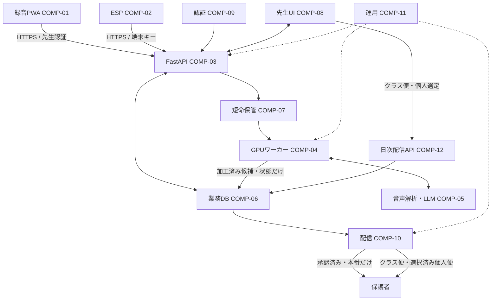

# Small Step システム設計

更新日: 2026-10-06 / 実装対象: `feature/class-digest-delivery`（未コミット）

[要件](requirements.md)を満たす現在の構成と後続の設計判断を整理します。詳細の正本は [既存アーキテクチャ](docs/architecture.md) と領域別文書です。本書は実装済みと提案を区別し、設定値や本番の稼働状態を推測しません。

## 1. 構成と責務

| ID | 構成要素 | 責務・境界 | 主な実装 |
| --- | --- | --- | --- |
| COMP-01 | 録音PWA | 明示開始、区間録音、一時保管、再送、進捗。OSの録音継続は保証しない | `recorder_frontend/src/App.svelte`, `lib/recorder.ts` |
| COMP-02 | ESP端末 | 30秒WAV、低音量抑制、認証付き送信、待避1件。AI推論は行わない | `firmware/esp32-s3-recorder/` |
| COMP-03 | FastAPI | 認証・認可、入力検証、短命保管受付、レビュー、運用API | `app/api/routes.py`, `app/api/dependencies.py` |
| COMP-04 | GPUワーカー | 排他取得、音声解析、人物候補、候補作成、期限切れ清掃 | `app/recorder_worker.py`, `app/cloud_audio_worker.py`, `app/voiceprint_worker.py` |
| COMP-05 | 音声/LLM | Whisper、匿名話者区間、構造化候補、版付きヒアリング指示。人物や出来事の最終確定はしない | `app/edge_audio.py`, `app/speaker_diarization.py`, `app/llm_guidance.py` |
| COMP-06 | 業務DB | 園・先生・園児、加工済み記録、状態、通知。生音声/生文字起こしは保存しない | `app/models.py`, `migrations/` |
| COMP-07 | 短命保管 | 音声をランダムキーで保管し削除。デモ表示は別の暗号化・短期限領域 | `app/recorder.py`, `app/cloud_audio.py`, `app/recorder_demo.py` |
| COMP-08 | 先生用UI | 園児・本文・担当の確認、承認、却下、管理、任意声紋登録 | `frontend/src/lib/features/` |
| COMP-09 | 認証基盤 | Supabaseの先生認証と招待。業務認可はFastAPIの役割/園検証 | `app/api/dependencies.py`, `app/teacher_invitations.py`, `docs/architecture/auth.md` |
| COMP-10 | 配信・履歴 | 承認済み本番記録のLINE配信、保護者アーカイブ、任意Notion | `scripts/send_pending_line_notifications.py`, `docs/architecture/integrations.md` |
| COMP-11 | 運用基盤 | Compose、移行、heartbeat、監視、暗号化退避/復元 | `compose.vrt.yaml`, `scripts/`, `docs/architecture/deployment.md` |
| COMP-12 | クラス配信 | 明示的なクラス名簿、クラス便、日次個人選定、LINE宛先別の安全な再送 | `app/models.py`, `app/api/routes.py`, `scripts/send_pending_line_notifications.py` |
| COMP-13 | クラス配信UI | クラス設定、未所属園児、当日クラス便と個人候補の確認・承認 | `frontend/src/lib/features/class-delivery/` |

園内PCで文字起こし・匿名化を済ませて加工済みテキストだけを送る既存local経路も維持します。VRT音声経路は明示的なcloud有効化に基づく別経路で、音声が園から出ないとは説明しません。

## 2. データフロー

### 2.1 ブラウザ録音からレビュー

1. 先生ログイン・接続確認後、利用者が録音を開始する。
2. 通常60秒ごとに単独再生可能な圧縮音声を確定する。端数も停止時に確定する。
3. IndexedDBへ音声と再送情報を保存し、連続モードは自動送信する。手動モードは送信操作を待つ。
4. APIが所有者とUUIDを検証し、短命ファイルとDBメタデータを登録する。
5. ワーカーがclaim tokenで排他取得し、メモリ上の波形・文字起こし・匿名話者区間を生成する。
6. 園児候補用の一時参照、任意声紋照合、LLMの構造化候補を検証する。
7. 記録対象なら `pending_review` を作る。対象外なら記録なしで正常終了する。音声を削除する。
8. 先生が園児・本文・担当を確認し、承認か却下を行う。

連続モードは各60秒区間が別セッションで、前区間の終端確認後に次を送信します。境界をまたぐ文脈の統合はありません。録音と送信・処理は別であり、表示上の経過時間だけで収音成功を判断しません。

### 2.2 ESP経路

ESPは16kHz・モノラル・16bitのWAVを30秒単位で送信します。低音量区間は送信せず、一時通信失敗時だけ1件を退避して再送します。クラウドジョブワーカーが記録候補を作ります。園児ID未指定なら先生が選択します。

PWA専用の園児・声紋候補機能をESPにも使えるとは扱いません。将来は共通の候補サービスを検討しますが、端末認証と先生認証の範囲を保ち、別の接続タスクとして実装します。

### 2.3 承認と配信

記録は `pending_review -> approved/rejected`、配信成功後は `dispatched`。承認で通知を作り、本番は連携状況により `pending` または `waiting_guardian_link`、試用は `trial` になります。ワーカーは試用園・試用記録を再検証して送信を禁止します。

### 2.4 任意声紋と処理表示

声紋は3回の品質検査後、平均した代表特徴量だけを暗号化保存します。照合への追加同意、園、期限、モデル、有効状態を再検証します。匿名話者ラベルや類似度は本人である確率ではありません。

デモ表示は試用・本人・録音前同意の例外経路です。実際の処理内容を暗号化一時ファイルに置き、終了後保存から5分で取得を拒否・清掃します。内部思考の表示や通常の履歴保存には利用しません。

### 2.5 クラス便・公平な個人便

1. 園管理者が園内クラスを作成し、既存園児を明示的に割り当てる。未所属園児は未所属のまま表示する。
2. クラス管理者が新方式を明示的に有効化し、クラス単位で個人便上限を1人または2人に設定する。既定は無効・1人。
3. 先生が当日のクラス便本文を手入力・編集し、内容と宛先の確認チェック後に承認する。宛先は承認時点のLINE IDを重複排除して固定し、子どもとの紐付けも記録する。
4. 園管理者が当日の承認済み成長記録から個人便候補を作成する。送信受付回数が少なく、次に前回受付が古い園児を優先し、同点は園児IDで固定する。候補作成後に追加承認があれば下書き候補を明示更新する。
5. 先生が園児・記録・宛先を確認し、上限内の候補だけを明示選択して承認する。成長記録の承認だけでは新方式の通知行を作らない。怪我連絡は従来の経路。
6. LINEワーカーは各送信直前に園ロックを取り、試用、取消、在籍、クラス、保護者連携と承認時点スナップショットを再検証する。成功した宛先は再送せず、明示再試行は失敗宛先だけを対象にする。
7. 試用では宛先スナップショットを送信待ちにせず、後の試用解除でも過去便を送らない。

公平性はLINE APIが受付を返した個人便を回数として数える。既読を意味しない。選ばれなかった候補は通知にならず、却下・削除・翌日への持ち越しもしない。内容のない日は0件でよい。クラス便本文は手入力で成立させ、LLM呼び出しや個人記録の自動連結はしない。

## 3. インターフェース契約

パスは `/api/v1` 以下。フィールドとエラー形式の正本は `app/schemas.py` と各ハンドラです。

| 接続 | 契約 | 不変条件 |
| --- | --- | --- |
| PWA -> API | `POST /recorder/sessions`、`PUT /recorder/sessions/{id}/segments/{sequence}`、`POST /recorder/sessions/{id}/finalize` | Bearer認証・録音者所有権・再送ID・音声整合性 |
| PWA -> 進捗 | `GET /recorder/sessions/{id}` | 状態・件数・記録IDのみ。音声は返さない |
| PWA -> デモ | `GET /recorder/sessions/{id}/demo` | 本人・試用・同意・期限を確認 |
| ESP -> API | `POST /edge/audio-jobs`、`POST /edge/heartbeat` | `X-Edge-Api-Key`、音声再送の `X-Edge-Upload-Id` |
| UI -> 人物候補 | `GET /records/{id}/child-suggestion`、`GET /records/{id}/voiceprint-suggestion` | 候補は確定ではない。表示時にも有効性を確認 |
| UI -> 承認 | `POST /records/{id}/approve` | アクセス・園児・確認を検証。試用ガードを維持 |
| UI -> クラス設定 | `/classrooms`, `/children/{id}/classroom` | 園管理者のみ設定・所属変更。園スコープを再検証 |
| UI -> クラス便 | `/class-newsletters` | 当日1クラス1件、本文確認を要求。宛先スナップショットと宛先別状態 |
| UI -> 個人便候補 | `/classrooms/{id}/growth-delivery/propose`, `/growth-delivery-batches/{id}` | 同じ園の先生。各記録の既存閲覧権限を適用し、上限はサーバー検証 |
| ワーカー -> LLM | OpenAI互換ローカル推論API | 実モデル/指示文は設定・コードを正とし、JSON形式を検証 |
| 管理UI -> 招待 | `POST /teachers/{id}/invite` | 管理者のみ。秘密キーはサーバー内のみ |

COMP-05の指示調整は `app/llm_guidance.py` の共通指示と架空例10件（通常8、過去参照2）を毎回systemへ渡す方式です。
`guidance_enabled=False` は比較用CLIのbaselineに限って使い、通常アプリでは有効です。
v2は現在・過去をJSONで分けます。複数参照・未提示参照の拒否は補正としてbaselineにも適用します。
比較対象は指示であり旧バイナリ全体ではありません。LLMの補正前候補も評価し、補正でモデル合格にしません。
DB・LINEを使わない架空テキスト32件の試験は `app/llm_guidance_evaluation.py` と
`scripts/evaluate_llm_guidance.py` が担当します。集計には入力・返答・例外本文を入れず、
分類・人物候補の自動判定と文章の人手確認を区別します。`--case` の部分試験は別ファイルへ保存し、対象IDと件数を記録します。
`--suite` の既定はコア32件を維持し、追加安全例12件と全44件は別レポートと評価例版で集計します。
caseが選択suiteに存在しない場合は推論前に拒否し、コアの期待値や指示例を変更しません。
追加学習や資料検索は追加しません。
詳細は [LLM調整手順](docs/llm-kindergarten-tuning.md) を参照してください。

## 4. データと境界

| データ | 保管先 | 制約 |
| --- | --- | --- |
| 未送信音声 | 端末IndexedDB / ESP待避領域 | PWA最大3セッション・24時間。ESP最大1件 |
| 受付音声 | サーバー短命保管 | 処理後削除・期限清掃。業務DBには入れない |
| 文字起こし・話者区間・一時特徴量 | メモリ | 処理後破棄。通常ログへ出さない |
| 代表声紋 | 暗号化した専用データ | 同意撤回・期限・削除に追従、通常業務バックアップから除外 |
| 候補・承認記録 | 業務DB | 園ID、担当、園児、加工済み本文、状態、試用フラグ |
| クラス配信 | `classrooms`, `class_newsletters`, `class_newsletter_recipients`, `growth_delivery_batches`, `growth_delivery_entries` | 個人通知行とは別のクラス便。承認時の保護者ID/園児IDスナップショット、宛先別状態、選択済み個人候補だけを保存 |
| 人物候補 | 記録メタデータ | 候補IDと実施状態。照合スコアや声特徴量は保存しない |
| 処理表示 | 専用暗号化一時ファイル | 5分の取得期限。端末永続保存・通常バックアップ禁止 |
| 監査/heartbeat | DB | 内容・音声・秘密情報を含めない |

園児名の完全除去やAIの正しさは保証しません。未登録名・誤変換等もあるため、先生の本文確認を安全境界として残します。

## 5. 制約と障害設計

| 障害 | 現在の対応 / 残る確認 |
| --- | --- |
| マイク中断・予期しない停止 | 取得可能な端数を確定し一時停止。明示再開。強制終了前の未確定音声は保証しない |
| オフライン・滞留 | 制限付き端末保管・同一ID再送・3件で一時停止。実機で重複/欠落を測定 |
| 認証・権限エラー | 更新不能なら停止。所有者違いの内容を見せない |
| デコード・推論・形式不正 | 上限付き再試行・失敗状態・部分失敗表示・後片付け |
| ワーカークラッシュ | 進捗停止/期限を検知・claimを検証・音声削除。中間結果の途中再開はしない |
| GPU不足 | 分離バッチとLLM予約量を別々に評価。OOMログが出た処理は遅延と出力品質も確認 |
| DB移行不一致 | 新旧コンテナ・移行を確認し、ready前に録音運用を開始しない |
| SSH鍵不一致 | 独立した管理コンソールで照合。検証を無効化して回避しない |

Safariがマイクを一時停止する場合や区間通知の遅延があるため、Webの60秒分割を厳密な時刻保証にしません。[MDNのMediaRecorder説明](https://developer.mozilla.org/en-US/docs/Web/API/MediaRecorder/dataavailable_event)

ロック中の録音を必須にする場合は、iOSネイティブ録音部分の採用可否を別途設計します。これは提案であり、実装済みではありません。調査起点: [Apple AVAudioSession](https://developer.apple.com/documentation/avfaudio/avaudiosession/category-swift.struct/record)。バックグラウンド収音と定時アップロードの要件は分けて検証します。

## 6. 検証と運用

### クラス配信の全体休止（REQ-10）

`Settings.class_delivery_enabled` は既定falseで、公開auth configから先生シェルのナビと直接URLへ伝えます。
クラスAPIは共通依存で閉じ、通常の記録承認は全体設定とクラス設定の両方が有効な場合だけ新方式を使います。
`app/class_delivery.py` はAPI起動時とLINEワーカーで実行し、園単位の送信と同じロック順で同期します。
休止時はクラス別有効設定を保持しつつ `delivery_enabled_since` をNULLにし、新方式の未送信・失敗予約を取消します。
再開時は有効クラスのNULL切替時刻だけを更新し、休止中に作った従来通知を新方式の迂回通知と誤判定しないようにします。
送信済み通知・試用通知・クラス所属・人数上限・受付回数は保持し、取消済み予約は復活しません。
LINE未設定でも予約取消は実行します。workerのdry-runは切替状態を変更しません。DBスキーマ追加はありません。
新方式の有効化と休止をAPI/workerで混在させないため、運用時はworker停止、API再作成、同じ設定のworker再作成の順にします。

- 個人便は運用開始以降のLINE受付回数が少ない順、前回受付が古い順、園児ID順で提案し、園管理者がクラスごとの人数を1/2人に設定します。
- 候補更新・クラス設定は園管理者のみ。順位付けはクラス全体の適格候補で行い、一般先生への応答は閲覧可能記録に限ります。閲覧権限外の記録が選定済みの場合は管理者確認を要求し、その記録の選択承認は拒否します。閲覧可能な選定だけなら、個人バッチ取消は同じ園の先生にも許可します。承認時は現在のクラス人数上限を再検証します。
- PWA: format/lint/check/unit/build。今回の結果は [tasks.md](tasks.md) に記録します。
- API: 録音、人物候補、声紋、試用、本人/別人/別園アクセス、削除の既存テストを変更範囲に応じて実行。
- 実機: 発話の目印を使い、前面・背景・ロック・通信断・電話中断・再起動を区別して欠落を記録。
- 負荷: 先生1人2〜3時間から、複数台へ段階的に増やす。待ち時間とGPUメモリの実測を保存し、架空の処理保証を置かない。
- 現場: 試用・配信なし・処理表示原則無効。園の説明/同意/中止手順と機材安全を確認して開始。
- デプロイ: コードと設定を取得し、変更範囲のイメージを作成。DB変更時は移行と全関連ワーカーの版をそろえる。healthとreadinessを両方確認。
- 復旧: 音声が残っていない場合の再処理を約束しない。試用ガードを失う旧版への復帰は禁止し、前方修正を優先。
