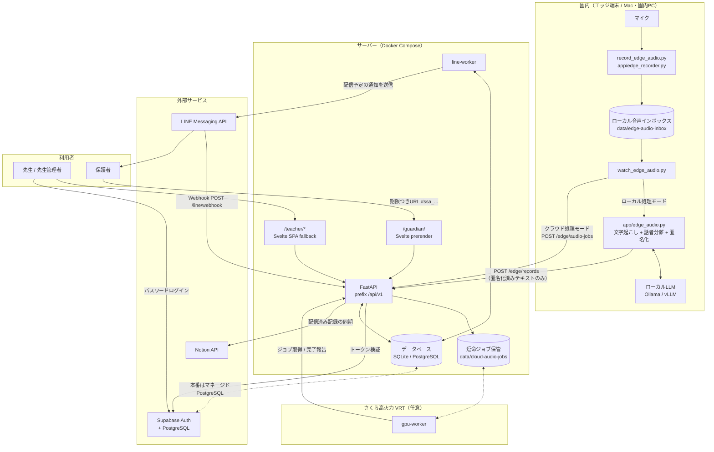

# 技術構成

Small Step（お便りAI）は、園内の音声を **園内で匿名化してから** クラウドへ渡すことを前提にした構成です。
生音声と生の文字起こしは API のデータベースに入りません。

このファイルは索引です。詳細は領域ごとのドキュメントを参照してください。

| 領域 | ドキュメント | 主な内容 |
| --- | --- | --- |
| API サーバー | [architecture/api.md](architecture/api.md) | FastAPI の組み立て、ルーティング、依存性注入、設定 |
| データモデル | [architecture/data-model.md](architecture/data-model.md) | ER 図、状態遷移、監査イベント、マイグレーション |
| 音声パイプライン | [architecture/audio-pipeline.md](architecture/audio-pipeline.md) | 録音、文字起こし、匿名化、話者分離、GPU ワーカー |
| 認証・認可 | [architecture/auth.md](architecture/auth.md) | Supabase JWT、端末 APIキー、アーカイブトークン、園スコープ |
| 外部連携 | [architecture/integrations.md](architecture/integrations.md) | LINE、Notion、保護者アーカイブ |
| フロントエンド | [architecture/frontend.md](architecture/frontend.md) | SvelteKit の route、状態、静的配信、テスト |
| Svelte 移行手順 | [svelte-migration-runbook.md](svelte-migration-runbook.md) | 実装履歴、並列分担、テスト、切り替え、ロールバック |
| デプロイ・運用 | [architecture/deployment.md](architecture/deployment.md) | Docker、Compose、環境変数、運用スクリプト |
| 画面遷移 | [transition.md](transition.md) | 画面一覧と遷移図 |
| 参考デザインシステム | [design-system-digital-agency.md](design-system-digital-agency.md) | デジタル庁デザインシステムへの案内とトークンの値。考え方の原文は [reference/dads/](reference/dads/ABOUT-THIS-COPY.md) に無改変で複製 |

---

## 全体構成

---

## 設計上の前提

1. **生音声と生の文字起こしを API に持ち込まない。** エッジ端末で匿名化を済ませてから送信します。
   クラウド GPU 処理モードでも、音声バイトは短命ジョブ保管に置かれ、処理後に削除されます。
2. **保護者に届く文面は必ず先生が承認する。** 記録は `pending_review` で作られ、承認しない限り配信されません。
3. **資格情報は一度だけ表示する。** 端末 APIキー、招待コード、アーカイブ URL はハッシュ／不透明トークンで保存し、
   再表示はできません。紛失時は再発行し、以前のものを失効させます。
4. **監査ログに秘密情報を残さない。** `audit_events` には操作の種類と対象だけを記録します。
5. **ローカルの既定値のまま本番起動できないようにする。** `app/config.py` が起動時に構成を検証します。

---

## 技術スタック

| レイヤ | 採用技術 |
| --- | --- |
| API | Python 3.11+, FastAPI, Uvicorn, Pydantic v2 |
| ORM / マイグレーション | SQLAlchemy 2.0, Alembic |
| データベース | SQLite（ローカル） / PostgreSQL・Supabase（本番） |
| フロントエンド | Svelte 5 runes、TypeScript、SvelteKit、adapter-static |
| 認証 | Supabase Auth（パスワード） |
| 音声 | faster-whisper, pyannote.audio |
| LLM | OpenAI 互換ローカルサーバー（Ollama / vLLM） |
| 連携 | LINE Messaging API, Notion API, MCP |
| 実行基盤 | Docker Compose、さくらの高火力 VRT（GPU） |

依存は `pyproject.toml` に定義され、用途ごとに extras で分かれています
（`postgres` / `edge-audio` / `speaker-diarization` / `dev`）。
