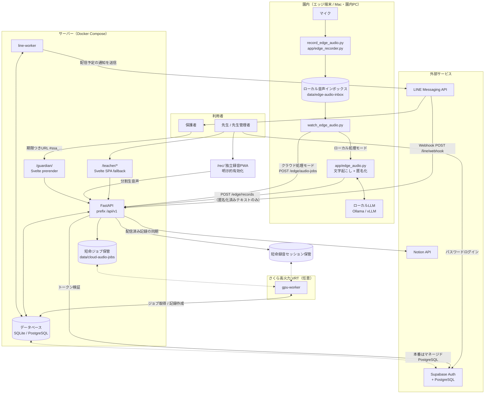

# 技術構成

Small Step（お便りAI）の構成図と領域別仕様の索引です。既定のローカル処理は園内で匿名化し、
加工済みテキストを送ります。明示的に有効化したクラウド音声処理・録音PWAは生音声をAPI経由で
短命ファイルへ一時保管します。音声と生の文字起こしは業務DBへ保存しません。

横断する機能・権限・保存境界は [共通仕様](specification.md)、文書の役割は [文書一覧](README.md)を参照してください。

このファイルは索引です。詳細は領域ごとのドキュメントを参照してください。

| 領域 | ドキュメント | 主な内容 |
| --- | --- | --- |
| API サーバー | [architecture/api.md](architecture/api.md) | FastAPI の組み立て、ルーティング、依存性注入、設定 |
| データモデル | [architecture/data-model.md](architecture/data-model.md) | ER 図、状態遷移、監査イベント、マイグレーション |
| 音声パイプライン | [architecture/audio-pipeline.md](architecture/audio-pipeline.md) | 録音、文字起こし、匿名化、話者分離、GPU ワーカー |
| 認証・認可 | [architecture/auth.md](architecture/auth.md) | Supabase JWT、端末 APIキー、アーカイブトークン、園スコープ |
| 外部連携 | [architecture/integrations.md](architecture/integrations.md) | LINE、Notion、保護者アーカイブ |
| フロントエンド | [architecture/frontend.md](architecture/frontend.md) | SvelteKit の route、状態、静的配信、テスト |
| Svelte 移行履歴 | [svelte-migration-runbook.md](svelte-migration-runbook.md) | 過去の移行計画と検証記録。現行の作業指示とは区別 |
| デプロイ・運用 | [architecture/deployment.md](architecture/deployment.md) | Docker、Compose、環境変数、運用スクリプト |
| 画面遷移 | [transition.md](transition.md) | 画面一覧と遷移図 |
| 参考デザインシステム | [design-system-digital-agency.md](design-system-digital-agency.md) | デジタル庁デザインシステムへの案内とトークンの値。考え方の原文は [reference/dads/](reference/dads/ABOUT-THIS-COPY.md) に無改変で複製 |

---

## 全体構成

---

## 設計上の前提

共通の契約は [共通仕様](specification.md)に集約します。

- 先生の承認と在籍園児の確認を配信の前提にし、試用記録は永久に配信対象外にします。
- 生音声と生の文字起こしの業務DBへの保存を禁止し、クラウド経路の短命ファイルを区別します。
- 発行時だけ資格情報を表示し、監査には本文・秘密情報・対象の内部IDを保存しません。
- 本番設定、DB移行、静的ビルドとワーカーのreadinessを運用前に確認します。

---

## 技術スタック

| レイヤ | 採用技術 |
| --- | --- |
| API | Python 3.11+, FastAPI, Uvicorn, Pydantic v2 |
| ORM / マイグレーション | SQLAlchemy 2.0, Alembic |
| データベース | SQLite（ローカル） / PostgreSQL・Supabase（本番） |
| フロントエンド | Svelte 5 runes、TypeScript、SvelteKit、adapter-static。録音PWAは独立したVite package |
| 認証 | Supabase Auth（パスワード） |
| 音声 | faster-whisper, pyannote.audio |
| LLM | OpenAI 互換ローカルサーバー（Ollama / vLLM） |
| 連携 | LINE Messaging API, Notion API, MCP |
| 実行基盤 | Docker Compose、さくらの高火力 VRT（GPU） |

依存は `pyproject.toml` に定義され、用途ごとに extras で分かれています
（`postgres` / `backup-s3` / `edge-audio` / `speaker-diarization` / `dev`）。
