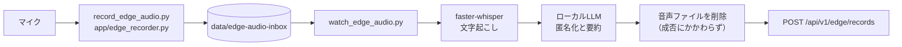
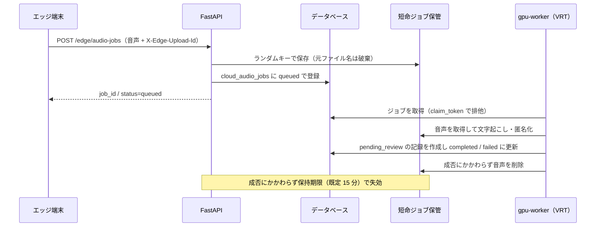

# 音声パイプライン

- 索引: [../architecture.md](../architecture.md)

園内のマイクから記録候補が生まれるまでの流れです。
このパイプラインの目的は「**API に生音声と生の文字起こしを渡さないこと**」の一点に尽きます。

---

## 処理モード

`EDGE_AUDIO_PROCESSING_MODE` で 2 つのモードを切り替えます。

| モード | 文字起こしと匿名化の実行場所 | API へ送るもの | 用途 |
| --- | --- | --- | --- |
| `local`（既定） | 園内のエッジ端末 | 匿名化済みテキストのみ | 常用。音声は園から出ない |
| `cloud` | さくら高火力 VRT の GPU ワーカー | 音声（短命ジョブ）→ 処理後に削除 | エッジ端末の性能が足りないとき |

`cloud` は `CLOUD_AUDIO_ENABLED=true` も必要な、明示的なオプトインです。

---

## ローカル処理モード

話者分離（`app/speaker_diarization.py`）はこの処理経路に含まれず、`scripts/diarize_edge_audio.py` で単体確認する機能です。

| ステップ | 実装 | 補足 |
| --- | --- | --- |
| 録音 | `app/edge_recorder.py` | `EDGE_AUDIO_RECORD_CHUNK_SECONDS`（既定 30 秒）で分割 |
| 監視 | `scripts/watch_edge_audio.py` | `EDGE_AUDIO_WATCH_POLL_SECONDS` ごとに走査。書き込み途中を避けるため `EDGE_AUDIO_WATCH_MIN_AGE_SECONDS` を待つ |
| 文字起こし | `app/edge_audio.py` | faster-whisper。既定は `small` / `cpu` / `int8` |
| 匿名化 | `app/edge_audio.py` → ローカル LLM | OpenAI 互換 API。園児名などを含まない候補文を生成 |
| 送信 | `POST /edge/records` | 端末 APIキーで認証。本文・種別・信頼度・発生時刻を送る |
| 後始末 | `EDGE_AUDIO_DELETE_AFTER_PROCESSING` | 既定 `true`。文字起こし・要約の成否にかかわらず、API へ送る前に音声を削除 |

### 再試行

ローカル処理モードでは再試行しません。既定では処理を始めた音声を削除するため、失敗した音声は残りません。

クラウド処理モードでアップロードに失敗した音声は、端末のインボックスに残したまま指数バックオフで再送します
（`EDGE_AUDIO_RETRY_INITIAL_SECONDS` の 10 秒から `EDGE_AUDIO_RETRY_MAX_SECONDS` の 300 秒まで）。
API が受け付けた応答を確認して初めて削除されます。

### LLM の外部送信ガード

`LLM_ALLOW_EXTERNAL` が `false`（既定）のとき、`LLM_BASE_URL` のホストは
ループバック（`127.0.0.1` / `::1` / `localhost`）に限られ、それ以外は `EdgeAudioError` で拒否されます。
文字起こし結果を誤って外部の LLM サービスへ送ってしまう事故を防ぐためのガードです。

加えて、LLM へ渡す前に `redact_obvious_identifiers()` で明らかな識別子を伏せます。
匿名化は「LLM に任せる」のではなく、送信前の伏せ字と送信後の要約の二段構えです。

---

## クラウド GPU 処理モード

GPU ワーカーは API を呼ばず、API と同じデータベースとジョブ保管ディレクトリを直接使います。

| 仕組み | 実装 | 目的 |
| --- | --- | --- |
| 短命保管 | `app/cloud_audio.py` | ランダムなサーバー側キーで保存。アップロード時のファイル名は残さない |
| 排他取得 | `app/cloud_audio_worker.py` の `claim_token` | 複数ワーカーが同じジョブを処理しない |
| 重複排除 | `X-Edge-Upload-Id`（UUID） | 再送されても同じジョブを返す |
| 期限切れ | `CLOUD_AUDIO_JOB_RETENTION_MINUTES`（既定 15 分） | 処理されなかった音声も必ず消える |
| 処理タイムアウト | `CLOUD_AUDIO_PROCESSING_TIMEOUT_MINUTES`（既定 10 分） | 落ちたワーカーが掴んだジョブを解放 |

データベースには `cloud_audio_jobs` のメタデータだけが入り、音声バイトは一切保存されません。
先生用画面の「音声処理状況」ビューは `GET /audio-jobs` でこのメタデータを表示します。

---

## 話者分離

`app/speaker_diarization.py` は pyannote.audio を使い、**誰の声かを特定しません**。

- 出力は `speaker_01`, `speaker_02` のような、そのファイル内だけで有効な一時ラベルです。
- 声紋（埋め込みベクトル）は保存しません。ファイルをまたいだ同一人物の追跡もしません。
- `SPEAKER_DIARIZATION_LOW_VOLUME_RETRY`（既定 `true`）が有効なとき、
  ffmpeg で音量を均した一時 WAV を作って再試行します（元の音声は変更しません）。
  再試行の結果を採用するのは、話者が増え、かつ増えた話者に十分な発話長がある場合だけです
  （`should_use_low_volume_retry_result()`）。雑音による誤検出を採用しないための条件です。
- モデルの取得には Hugging Face のトークン（`SPEAKER_DIARIZATION_TOKEN`）が必要です。

単体で試すには `scripts/diarize_edge_audio.py` を使います。

### 声紋登録の同意

将来的に話者を識別する機能を入れる場合に備えて、先生ごとの同意を `voice_enrollment_consents` に記録します。
目的・ポリシー版・保持日数・同意日時・失効日時を保持し、先生用画面の「声紋設定」から
同意（`POST /voice-consent/me`）と撤回（`POST /voice-consent/me/revoke`）ができます。
同意がなくても現在の匿名話者分離は動きます。

---

## MCP サーバー

`app/mcp_server.py` は、公開 API ではなくマイクや GPU ワーカーの隣で動かすローカル専用サーバーです。
公開するツールは次の 3 つだけで、録音や LINE 送信のツールはありません。

| ツール | 内容 |
| --- | --- |
| `edge_audio_status` | 秘密情報を返さず、設定の準備状況だけを返す |
| `analyze_audio_file` | インボックス内の音声を匿名化済み候補へ変換する。API へは保存しない |
| `submit_analyzed_audio_file` | 匿名化済み候補を `POST /edge/records` で承認待ち記録として登録する |

既定は標準入出力で起動します。`--streamable-http` を指定した場合、`--host` が `localhost` またはループバック IP でなければ起動を止めます。

---

## 端末の登録と死活監視

| 操作 | エンドポイント / スクリプト |
| --- | --- |
| 端末を登録して APIキーを発行 | `POST /edge-devices` / `scripts/register_edge_device.py` |
| APIキーを再発行 | `POST /edge-devices/{id}/rotate-key` |
| 端末を無効化 | `POST /edge-devices/{id}/disable` |
| 端末側から自分の情報を確認 | `GET /edge/me` / `scripts/verify_edge_device.py` |
| 死活通知 | `POST /edge/heartbeat`（既定 60 秒間隔） |

APIキーは発行・再発行の応答でのみ平文が返り、データベースにはハッシュだけが残ります。
最終通信時刻（`last_seen_at`）は先生用画面の「録音端末」ビューに表示されます。

---

## 関連する設定

キーと既定値の一覧は `.env.example` にあります（`EDGE_AUDIO_*` / `CLOUD_AUDIO_*` /
`SPEAKER_DIARIZATION_*` / `LLM_*`）。ここに写すと部分的な複製になり、片方だけ古くなるため置いていません。
このページの本文で名前を挙げているキーは、そのふるまいを説明する必要があるものだけです。
