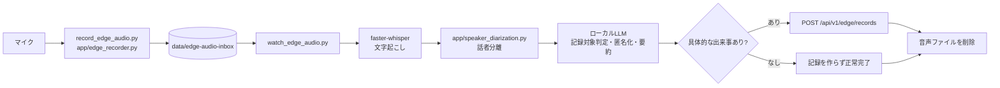
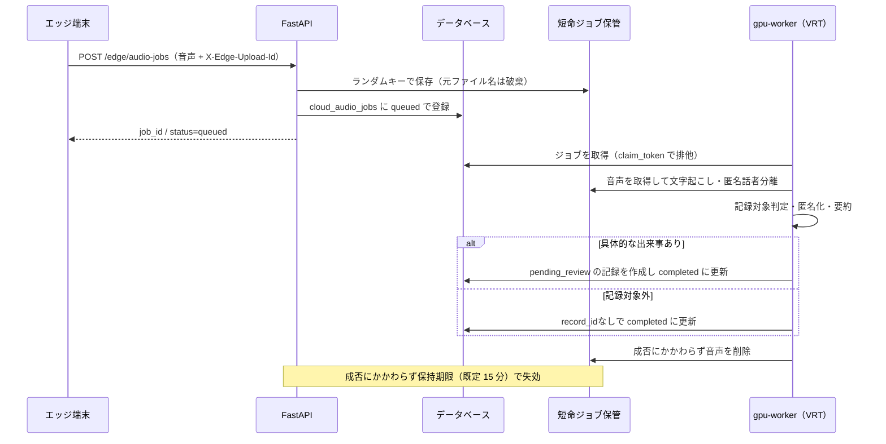

# 音声パイプライン

- 索引: [../architecture.md](../architecture.md)

## `/rec/` 録音セッション

園内の共用スマートフォンは、HTTPSで配信する独立PWA `/rec/` から約1分ごとのMP4/AACまたはWebM/Opusを送信します。
解析側もAPIが受け付ける `.mp4`、`.aac`、`.m4a`、`.webm` の拡張子を許可します。
拡張子の許可はデコード成功を保証するものではなく、不正なファイルは解析時に失敗します。
話者分離は音声を一度デコードして16kHz・モノラルの波形をメモリ上で渡します。
圧縮ファイルの区間読み取りで生じるサンプル数の不一致を避け、波形はDBや別ファイルへ保存しません。
低音量再試行も同じ読み込み経路を使い、既存の一時WAV削除と元音声削除の方針は維持します。
`SPEAKER_DIARIZATION_BATCH_SIZE`（既定4、範囲1〜128）は分割推論と声特徴抽出のバッチ数の上限です。
モデルの元設定がより小さい場合は増やしません。声紋登録の品質検査にも適用します。
vLLMとGPUを共有する場合の一時メモリ使用を抑える目的で、処理時間が延びる可能性があります。
GPUメモリ不足の解消や精度の同一性は実機で確認します。vLLMの予約量はこの設定では変わりません。
APIは先生認証と録音者本人の所有権を検証し、音声をDBへ入れず `RECORDER_SESSION_DIR` にランダム名で短期保存します。
手動モードは停止後の送信操作、連続モードは各60秒区間の自動送信で `draft` から `queued` に確定し、既存 `gpu-worker` が `app/recorder_worker.py` で
排他的に取得します。ファイルを連番で文字起こし・匿名化し、匿名化済み候補だけを段階統合して、
録音者の担当・園児未選択の `pending_review` 記録を1セッションあたり最大1件作成します。
連続モードは60秒ごとに別セッションを作り、録音を続けながら前の区間を処理します。
真のストリーミング認識ではなく、区間の録音時間と推論時間だけ結果が遅れます。
セッションをまたぐ会話の文脈や候補統合は行わず、出来事が境界で途切れたり、重複した候補が生じたりするため、
先生による内容確認・園児選択・承認は必須です。自動承認・自動LINE配信は追加しません。

音声・生の文字起こし・区間別の候補はDBへ保存しません。集約候補はメモリ上で長さを制限し、処理後に破棄します。
各区間の解析・統合は最大2回試し、処理が終わった区間の音声を削除します。無発話・具体的な出来事なしは
正常終了（記録なし）です。区間の処理に失敗しても残りを処理し、作成できた記録には `audio_processing_incomplete=true`
を付けて承認前の確認を促します。既知のけがを含む候補の統合に失敗した場合は安全側でセッション全体を失敗にします。

任意の `RECORDER_CHILD_MATCHING_ENABLED` は `recorder_children.py` で同じ園の表示名・明示登録の呼び名を
読み込み、NFKCとひらがなへの正規化後、名前境界のある一致を一時参照へ置換してLLMに渡します。
推測した姓・読み方・曖昧検索は使いません。LLMが記録対象の具体的行動に根拠のある匿名参照を返した場合だけ
一人の園児IDを候補にします。呼びかけ・質問・指示だけ、同名（退園者を含む）、複数園児、
対象不明、部分失敗は候補なしです。区間ごとに参照の有効性を確認し、確定前に園児一覧の変化も再検証します。
候補は `records.candidate_child_id` に保持し、実際の `child_id` は承認時までNULLです。
LLM出力から既知の名前・参照を除去し、名前辞書と対応表は処理後にメモリから破棄します。
未登録名・誤変換の完全除去は保証せず、先生の本文確認が必須です。名前や文字起こしを診断ログへ出しません。
これは `/rec/` のみで、ESPや既存の園児ID付きジョブの選択動作は変更しません。

別スレッドのメンテナンスが期限切れと10分間進捗のない処理を終了し、残存音声を削除します。
成功・失敗・破棄後の削除も再試行し、DB未登録のUUIDディレクトリは保管期限後に削除します。
削除済み区間の中間結果を永続化しないため、クラッシュした処理の途中再開は行わず、再録音を必要とします。
`claim_token` の一致を最終確定でも確認し、期限切れの処理結果が遅れて登録されることを防ぎます。

本番では `CLOUD_AUDIO_ENABLED=true` と録音処理用の生存確認が必須です。VRTではAPIとGPUワーカーが
`api_data` の `/app/data/recorder-sessions` を共有します。実機確認までは `RECORDER_ENABLED=false` を維持し、
[録音デモ導入手順](../recorder-vrt-runbook.md)で試験します。担当はログインした先生のままで、任意の声紋照合は担当候補だけを追加します。

園内のマイクから記録候補が生まれるまでの流れです。
このパイプラインの目的は「**API に生音声と生の文字起こしを渡さないこと**」の一点に尽きます。

---

## 処理モード

`EDGE_AUDIO_PROCESSING_MODE` で 2 つのモードを切り替えます。

| モード | 文字起こしと匿名化の実行場所 | API へ送るもの | 用途 |
| --- | --- | --- | --- |
| `local`（既定） | 園内のエッジ端末 | 匿名化済みテキストのみ | 常用。音声は園から出ない |
| `cloud` | さくら高火力 VRT の GPU ワーカー | 音声（短命ジョブ）→ 処理後に削除 | エッジ端末の性能が足りないとき |

`cloud` は `CLOUD_AUDIO_ENABLED=true` も必要な、明示的なオプトインです。

---

## ローカル処理モード

話者分離（`app/speaker_diarization.py`）はトークン設定時だけ処理経路へ加わり、匿名の話者ラベルと集計値だけを扱います。

| ステップ | 実装 | 補足 |
| --- | --- | --- |
| 録音 | `app/edge_recorder.py` | `EDGE_AUDIO_RECORD_CHUNK_SECONDS`（既定 30 秒）で分割 |
| 監視 | `scripts/watch_edge_audio.py` | `EDGE_AUDIO_WATCH_POLL_SECONDS` ごとに走査。書き込み途中を避けるため `EDGE_AUDIO_WATCH_MIN_AGE_SECONDS` を待つ |
| 文字起こし | `app/edge_audio.py` | faster-whisper。既定は `small` / `cpu` / `int8` |
| 話者分離 | `app/speaker_diarization.py` | トークン設定時だけpyannoteを実行。Whisperの単語時刻を`speaker_01`形式の一時ラベルへ対応付ける |
| 対象判定・匿名化 | `app/edge_audio.py` → ローカル LLM | 無音はLLMを呼ばず対象外にする。発話があっても具体的な出来事がある場合だけ候補文を生成 |
| 送信 | `POST /edge/records` | 端末 APIキーで認証。本文・種別・信頼度・発生時刻を送る |
| 後始末 | `EDGE_AUDIO_DELETE_AFTER_PROCESSING` | 既定 `true`。文字起こし・要約の成否にかかわらず、API へ送る前に音声を削除 |

### 再試行

ローカル処理モードでは再試行しません。既定では処理を始めた音声を削除するため、失敗した音声は残りません。

クラウド処理モードでアップロードに失敗した音声は、端末のインボックスに残したまま指数バックオフで再送します
（`EDGE_AUDIO_RETRY_INITIAL_SECONDS` の 10 秒から `EDGE_AUDIO_RETRY_MAX_SECONDS` の 300 秒まで）。
API が受け付けた応答を確認して初めて削除されます。

### LLM の外部送信ガード

`LLM_ALLOW_EXTERNAL` が `false`（既定）のとき、`LLM_BASE_URL` のホストは
ループバック（`127.0.0.1` / `::1` / `localhost`）に限られ、それ以外は `EdgeAudioError` で拒否されます。
文字起こし結果を誤って外部の LLM サービスへ送ってしまう事故を防ぐためのガードです。

加えて、LLM へ渡す前に `redact_obvious_identifiers()` で明らかな識別子を伏せます。
匿名化は「LLM に任せる」のではなく、送信前の伏せ字と送信後の要約の二段構えです。

---

## クラウド GPU 処理モード

GPU ワーカーは API を呼ばず、API と同じデータベースとジョブ保管ディレクトリを直接使います。

| 仕組み | 実装 | 目的 |
| --- | --- | --- |
| 短命保管 | `app/cloud_audio.py` | ランダムなサーバー側キーで保存。アップロード時のファイル名は残さない |
| 排他取得 | `app/cloud_audio_worker.py` の `claim_token` | 複数ワーカーが同じジョブを処理しない |
| 重複排除 | `X-Edge-Upload-Id`（UUID） | 再送されても同じジョブを返す |
| 連続区間の統合 | `app/cloud_audio_worker.py` | 同じ園児・端末・種別で2分以内の未承認候補がほぼ同文なら、既存記録へまとめる |
| 期限切れ | `CLOUD_AUDIO_JOB_RETENTION_MINUTES`（既定 15 分） | 処理されなかった音声も必ず消える |
| 処理タイムアウト | `CLOUD_AUDIO_PROCESSING_TIMEOUT_MINUTES`（既定 10 分） | 落ちたワーカーが掴んだジョブを解放 |
| 稼働確認 | `worker_heartbeats`（既定 30 秒ごと、90 秒で停止判定） | 長時間のGPU処理中もバックグラウンドで生存を通知 |

データベースには `cloud_audio_jobs` のメタデータだけが入り、音声バイトは一切保存されません。
精度評価用に、完了時の検出話者数と音量差補正を採用したかどうかを匿名の集計値として残します。
話者ラベル、話者区間、声紋、文字起こしは保存しません。
先生用画面の「音声処理状況」ビューは `GET /audio-jobs` でこのメタデータを表示します。
`completed` かつ `record_id` がないジョブは、失敗ではなく「記録対象外」と表示します。

園児ID付きのジョブでは、同じ園児の直近5件の承認済み・配信済み記録を各500文字まで取得し、
匿名の参考情報としてローカルLLMへ渡します。現在の音声と過去記録の両方に根拠がある場合だけ、
以前との変化を候補文へ含めます。園児名・ID、未承認記録、別園児の履歴は渡しません。

AIが返した信頼度が70%未満でも候補自体は捨てません。先生画面で「要確認」として強調し、
承認時にも再確認を促します。誤配信を抑えながら、聞き取りづらい場面の見逃しを避けるためです。

---

## 話者分離

`app/speaker_diarization.py` は pyannote.audio を使い、**誰の声かを特定しません**。

- 出力は `speaker_01`, `speaker_02` のような、そのファイル内だけで有効な一時ラベルです。
- 匿名話者分離では声紋（埋め込みベクトル）を保存せず、ファイルをまたいだ同一人物の追跡もしません。
  任意の本人確認用声紋は、先生本人の同意と操作がある場合だけ別経路で暗号化保存します。
- `SPEAKER_DIARIZATION_LOW_VOLUME_RETRY`（既定 `true`）が有効なとき、
  ffmpeg で音量を均した一時 WAV を作って再試行します（元の音声は変更しません）。
  再試行の結果を採用するのは、話者が増え、かつ増えた話者に十分な発話長がある場合だけです
  （`should_use_low_volume_retry_result()`）。雑音による誤検出を採用しないための条件です。
- モデルの取得には Hugging Face のトークン（`SPEAKER_DIARIZATION_TOKEN`）が必要です。
- トークンが設定されている場合だけ通常の文字起こしへ自動統合し、未設定時は話者分離を省略します。
- Whisperの単語時刻と話者区間を突き合わせた後、LLMへ渡すのは匿名ラベル付き本文だけです。時刻と区間は保存しません。

VRTの実音声評価では、ジョブへ匿名の話者数、音量差補正の使用有無、候補の分類だけを保存します。
評価レポートは候補判定の誤検出・見逃し、分類精度、処理時間、先生による生成文の合否を集計し、
音声、文字起こし、生成文、人物名、ファイル名、ジョブID、記録IDを含めません。

単体で試すには `scripts/diarize_edge_audio.py` を使います。

### 声紋の登録と本人確認

`RECORDER_VOICEPRINT_MATCHING_ENABLED` が有効な `/rec/` 録音では、`recorder_voiceprint.py` が
同じ園の有効な声紋・有効な追加同意（`allows_recorder_identification`）・有効な先生だけを対象に
1対多照合します。既存の同意は追加同意なしには使用しません。`edge_audio.py` のメモリ上の話者分離結果を
observerへ渡し、再度話者分離は行いません。exclusive結果が隠す重なりも通常の分離結果から除外します。
話者ごとに3〜10秒の発話、最大8話者に制限し、声量・音割れ・数値の検査後に登録と同じモデルで特徴量を抽出します。
既定の類似度0.85と次点との差0.1を満たす一致を集約し、先生が1人だけの場合に限って候補にします。
この基準は未校正の初期値であり精度保証ではありません。不明な声は特定せず、複数先生・曖昧・照合失敗・
一部処理失敗では候補なしです。音声の記録候補作成は照合障害だけでは失敗させません。
DBトランザクションを推論中には保持しません。確定時とAPI表示時にも資格を再検証し、担当や承認状態は変更しません。
特徴量・波形はfinallyで消去し、保存するのは記録に対する候補先生IDと照合実施有無だけです。
ESP音声ジョブは引き続き匿名話者分離だけです。

任意の声紋機能では、先生ごとの同意を `voice_enrollment_consents` に記録し、同意中の先生だけが
10〜15秒の登録音声3件、または本人確認音声1件を投入できます。GPUワーカーは録音時間、発話時間、声量、
雑音、音割れ、複数話者を検査し、不合格時は理由と該当する録音番号だけを返します。合格した3件は
`pyannote.audio` で特徴量を抽出して平均化し、Fernetで暗号化した代表声紋1件だけを
`teacher_voiceprints` に保存します。個別特徴量は平均化直後にメモリから消去します。本人確認時は同じ先生の
登録済み代表声紋とコサイン類似度を計算する1対1照合だけを行います。

元音声は録音ごとに別のランダム名で非公開領域へ短時間だけ置き、成功・品質不合格・失敗・期限切れのいずれでも全件削除します。
同意の取消、声紋削除、先生アカウントの利用停止では、その先生の特徴量、処理ジョブ、一時音声を削除します。
同意の保存期限を過ぎた特徴量と、保持期限を過ぎた登録・照合ジョブもGPUワーカーが定期削除します。
`teacher_voiceprints` と `voiceprint_jobs` のデータ行は通常の業務DBバックアップから除外します。
この機能は既定で無効で、匿名話者分離やSupabaseログインとは独立しています。

---

## MCP サーバー

`app/mcp_server.py` は、公開 API ではなくマイクや GPU ワーカーの隣で動かすローカル専用サーバーです。
公開するツールは次の 3 つだけで、録音や LINE 送信のツールはありません。

| ツール | 内容 |
| --- | --- |
| `edge_audio_status` | 秘密情報を返さず、設定の準備状況だけを返す |
| `analyze_audio_file` | インボックス内の音声を匿名化済み候補へ変換する。API へは保存しない |
| `submit_analyzed_audio_file` | 匿名化済み候補を `POST /edge/records` で承認待ち記録として登録する |

既定は標準入出力で起動します。`--streamable-http` を指定した場合、`--host` が `localhost` またはループバック IP でなければ起動を止めます。

---

## 端末の登録と死活監視

| 操作 | エンドポイント / スクリプト |
| --- | --- |
| 端末を登録して APIキーを発行 | `POST /edge-devices` / `scripts/register_edge_device.py` |
| APIキーを再発行 | `POST /edge-devices/{id}/rotate-key` |
| 端末を無効化 | `POST /edge-devices/{id}/disable` |
| 端末側から自分の情報を確認 | `GET /edge/me` / `scripts/verify_edge_device.py` |
| 死活通知 | `POST /edge/heartbeat`（既定 60 秒間隔） |

APIキーは発行・再発行の応答でのみ平文が返り、データベースにはハッシュだけが残ります。
最終通信時刻（`last_seen_at`）は先生用画面の「録音端末」ビューに表示されます。

### ESP32-S3 実機

`firmware/esp32-s3-recorder` は、EV_INMP621-FXのPDM音声をESP32-S3内で
16 kHz・モノラル・16 bit PCMへ変換し、30秒単位のWAVとしてクラウドGPU処理モードへ送ります。
園児を音声から推測せず、通常は園児IDを空のまま送って先生のレビュー時に選択します。

録音中のPCMはPSRAMだけに置き、無音判定を通った区間だけHTTPSで送信します。
VRTが受理した場合は端末へ音声を保存しません。通信失敗時だけ1件をSPIFFSへ待避し、
保存済みの`X-Edge-Upload-Id`を変えずに再送します。待避中は新しい録音を止めるため、
古い音声を上書きしたり、停止中に端末内へ音声が増え続けたりしません。

端末は通信切断、HTTP `408`・`425`・`429`・`5xx`だけを一時障害として再送します。
認証失敗や不正な入力など、その他のHTTP `4xx`は恒久的な拒否として音声を端末から削除し、
設定不備のまま個人情報を保持し続けたり、新しい録音を永久に止めたりしません。

Wi-Fi、公開URL、端末APIキーはGit管理外の`main/secrets.h`だけに設定します。
配線・書き込み・実機確認の手順は
[`../../firmware/esp32-s3-recorder/README.md`](../../firmware/esp32-s3-recorder/README.md)を参照します。

---

## 関連する設定

キーと既定値の一覧は `.env.example` にあります（`EDGE_AUDIO_*` / `CLOUD_AUDIO_*` /
`SPEAKER_DIARIZATION_*` / `LLM_*`）。ここに写すと部分的な複製になり、片方だけ古くなるため置いていません。
このページの本文で名前を挙げているキーは、そのふるまいを説明する必要があるものだけです。
