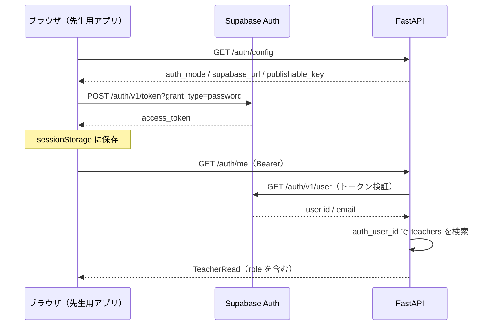
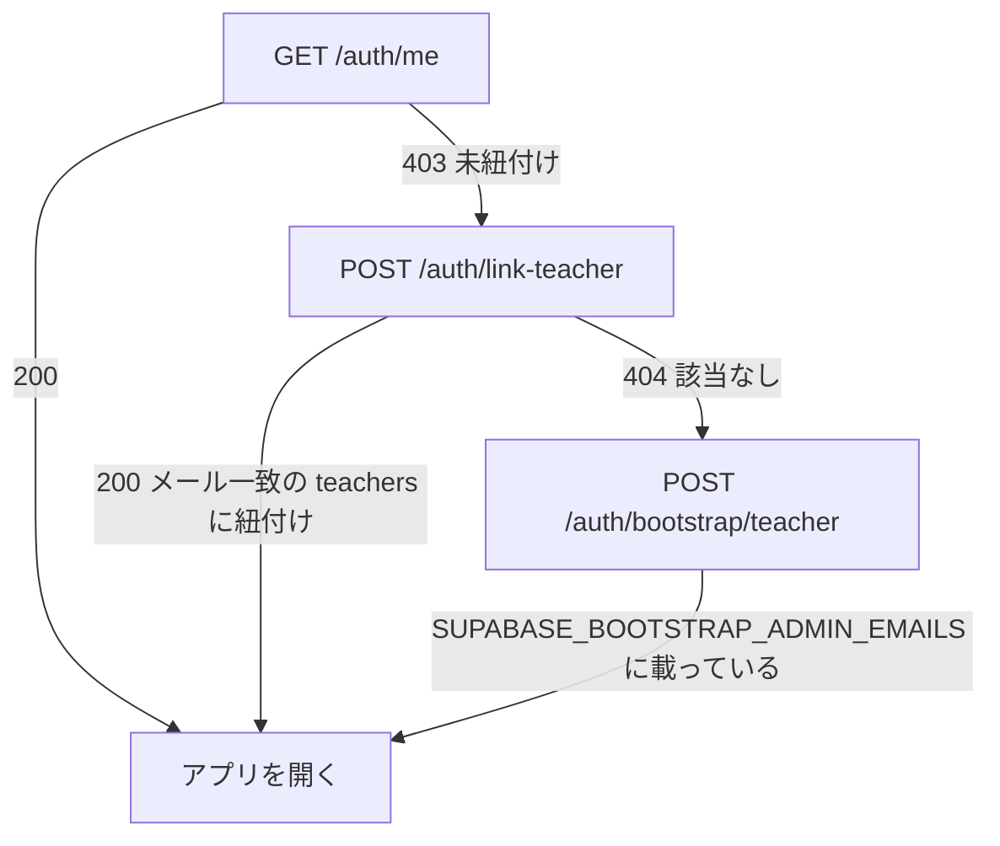

# 認証・認可

- 索引: [../architecture.md](../architecture.md)

利用者の種類ごとに別々の資格情報を使います。1 つの認証方式で全経路をまかなうのではなく、
「先生」「録音端末」「保護者」「LINE」をそれぞれ独立させることで、
1 つが漏れても他の経路に波及しないようにしています。

---

## 4 つの経路

| 経路 | 資格情報 | ヘッダー | 検証 |
| --- | --- | --- | --- |
| 先生用アプリ | Supabase の access token（JWT） | `Authorization: Bearer` | Supabase の `/auth/v1/user` に問い合わせ |
| 録音端末 | 端末ごとの APIキー | `X-Edge-Api-Key` | SHA-256 ハッシュで `edge_devices` を照合 |
| 保護者アーカイブ | 不透明トークン `ssa_...` | `Authorization: Bearer` | SHA-256 ハッシュで `guardian_archive_links` を照合 |
| LINE Webhook | チャネルシークレットによる署名 | `X-Line-Signature` | JSON をパースする前に生ボディで検証 |

---

## 先生の認証

### 管理画面からの先生招待

`TEACHER_INVITATIONS_ENABLED=true` の場合、APIだけが `SUPABASE_SECRET_KEY` を使って
Supabase Authの `/auth/v1/invite` を呼びます。`POST /teachers/{id}/invite` は本人ログインした
同じ園の管理者に限定し、停止中・認証連携済み・メール未登録の先生を拒否します。
送信先はDBのメール、リダイレクト先は検証済みサーバー設定だけを使用します。
秘密キー・プロバイダーの応答・招待トークンは返しません。`user_metadata` で権限を決めません。
DBへ送信試行時刻を先に予約し、同じ先生への並列送信・再起動後の再送を60秒制限します。
招待メールから `/teacher/` に届く `type=invite` のアクセストークンは直ちにURLから除き、
パスワード設定前はメモリだけに保持します。既存のログイン状態はクリアし、本人がSupabaseへ
直接パスワードを設定した後で既存の先生紐付け処理を行います。離脱・再読み込みでは設定待ちトークンを失います。
詳細は [先生招待の導入手順](../teacher-invitations.md)。

### ログインの流れ



要点:

- **API は JWT を自前で検証しません。** Supabase の `/auth/v1/user` に問い合わせて検証を委譲します。
  共有シークレット方式と非対称鍵方式のどちらの署名でも動くため、最初のデプロイが簡単になります。
  代償として認証ごとに 1 回の外部通信（タイムアウト 5 秒）が発生します。
- Supabase に到達できないときは 503、トークンが無効なときは 401 を返します。
- ブラウザ側はトークンを `sessionStorage`（キー `small-step.access-token`）に置きます。
  タブを閉じると破棄されるので、共用端末で残りにくい設計です。

### Supabase ユーザーと `teachers` の紐付け

Supabase のアカウントと `teachers` 行は `auth_user_id` で 1 対 1 に対応します。
紐付いていないアカウントは 403 になり、フロントエンドがそれを合図に初回設定へ進みます。



| エンドポイント | 役割 |
| --- | --- |
| `POST /auth/link-teacher` | 招待済み（`teachers` にメールがある）先生を Supabase アカウントへ紐付ける |
| `GET /auth/bootstrap/schools` | 初回設定で選べる園の一覧 |
| `POST /auth/bootstrap/teacher` | 最初の先生管理者を作る。`SUPABASE_BOOTSTRAP_ADMIN_EMAILS` に載ったメールのみ |

`is_bootstrap_admin()` が `SUPABASE_BOOTSTRAP_ADMIN_EMAILS`（カンマ区切り）と照合します。
最初の 1 人だけは画面から作れるようにしつつ、誰でも管理者になれる穴は開けない、という妥協点です。

---

## 認可

### 園スコープ

`assert_school_access(current_teacher, school_id)` を各ハンドラの冒頭で呼び、
自分の園以外のデータに触れないことを保証します。ミドルウェアではなく明示的な呼び出しにしているのは、
どのエンドポイントがどの園を対象にするかをコード上で追えるようにするためです。

### 役割

| 役割 | できること |
| --- | --- |
| `teacher` | 自分が担当する記録のレビュー・承認・却下・履歴と通知状況、手入力、園児一覧、本人の録音と声紋操作 |
| `school_admin` | 上記すべてに加えて、園児・先生・端末・園の設定・監査ログ・通知の再送や取り消し・CSV 書き出し |

`assert_record_access` は一般の先生の記録を担当本人に限定します。記録・通知の一覧も担当で絞り込みます。
録音セッションの一覧は一般先生が本人分、管理者が園全体です。単一取得・音声送信・確定・破棄・
処理表示は管理者でも録音者本人だけです。

`assert_school_admin(current_teacher)` が管理者限定の操作を守ります。
フロントエンドも `state.isSchoolAdmin` で該当 UI を隠しますが、**画面の非表示は補助でしかなく、
実際の判定はすべてサーバー側**で行います。

### 無効化された先生

`teachers.is_active` が `false` の場合、`get_current_teacher` が 403 を返します。
アカウント削除ではなくソフトデリートなので、過去の記録や監査ログの参照関係は壊れません。
先生管理者は `POST /teachers/{id}/restore` で復帰させられます。

---

## 録音端末の認証

```
X-Edge-Api-Key: <平文キー>
   ↓ hash_edge_api_key()（SHA-256）
edge_devices.api_key_hash と照合 → is_active を確認
```

- 平文のキーが返るのは発行（`POST /edge-devices`）と再発行（`POST /edge-devices/{id}/rotate-key`）の応答のみです。
- 紛失した場合は再発行します。再発行すると以前のキーは使えなくなります。
- 無効化（`POST /edge-devices/{id}/disable`）した端末は即座に 401 になります。
- 端末は `POST /edge/heartbeat` で死活を通知し、`last_seen_at` が画面に表示されます。

---

## 保護者アーカイブのトークン

`app/guardian_archive.py` が `ssa_` 接頭辞つきの不透明トークンを生成します。

| 性質 | 内容 |
| --- | --- |
| 保存形式 | SHA-256 ハッシュのみ（`guardian_archive_links.token_hash`） |
| 有効期限 | `GUARDIAN_ARCHIVE_LINK_TTL_HOURS`（既定 168 時間 = 7 日） |
| 失効 | `POST /guardian-archive-links/{id}/revoke` で即時無効化 |
| 配布方法 | URL のフラグメント（`#ssa_...`）。サーバーのアクセスログに残らない |
| 閲覧範囲 | その園児の**送信済み**通知のみ。音声も文字起こし原文も返さない |

保護者用ページは受け取ったトークンを `sessionStorage` に移し、
SvelteKit の `$app/navigation.replaceState` でルーター初期化後にURLからフラグメントを消します。
ページには `<meta name="referrer" content="no-referrer">` も付けています。

---

## LINE Webhook の検証

`POST /api/v1/line/webhook` は、**JSON をパースする前に**生のリクエストボディと
`X-Line-Signature` を `LINE_CHANNEL_SECRET` で検証します（`app/line.py`）。
署名が合わないリクエストは処理しません。`LINE_CHANNEL_SECRET` が未設定なら 503 を返します。

招待コードもチャネルシークレットを混ぜてハッシュ化して保存するため、
データベースが読まれてもコードそのものは復元できません。

---

## 開発モード

`AUTH_MODE=development`（既定）では次のようになります。

- `get_authenticated_user` が固定の `development-user` を返し、Supabase へは問い合わせません。
- `get_current_teacher` は `teachers` 行を持たない「開発中の先生」を返します。
- `assert_school_access` は素通しになり、`isSchoolAdmin` も `true` 扱いです。
- フロントエンドはログイン画面自体を表示しません。

**この状態で外部公開してはいけません。** `APP_ENV=production` のときは
`app/config.py` が `AUTH_MODE=supabase` を強制し、そうでなければ起動を止めます
（[api.md](api.md) の「本番構成の検証」を参照）。
