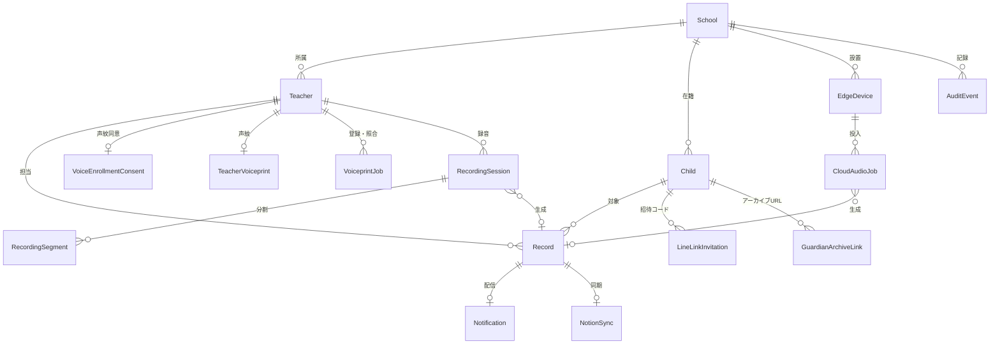
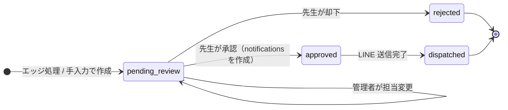

# データモデル

- 索引: [../architecture.md](../architecture.md)

SQLAlchemy 2.0 の宣言スタイル（`Mapped` / `mapped_column`）で `app/models.py` に定義しています。
主キーはすべて UUID の文字列（`String(36)`）、日時はタイムゾーン付きで UTC 保存です。

---

## 全体像

---

## テーブル一覧

| テーブル | 役割 | 注記 |
| --- | --- | --- |
| `schools` | 園 | `timezone` と `digest_time` を園ごとに保持 |
| `teachers` | 先生 | `auth_user_id` で Supabase ユーザーと 1 対 1。無効化はソフトデリート |
| `children` | 園児 | `guardian_line_user_id` が保護者の LINE 連携先。退園はアーカイブ扱い |
| `edge_devices` | 録音端末 | APIキーは `api_key_hash` のみ保存。`last_seen_at` で死活を表示 |
| `records` | 匿名化済みの記録候補 | 本文は `summary` / `conversation_prompt` / `anonymized_context` |
| `notifications` | 保護者への配信 | `record_id` に一意制約（1 記録 1 通知） |
| `line_link_invitations` | 保護者連携の招待コード | `code_hash` のみ保存。使用・失効を日時で記録 |
| `guardian_archive_links` | 配信アーカイブの URL | `token_hash` のみ保存。期限つき・失効可能 |
| `cloud_audio_jobs` | クラウド GPU 処理ジョブ | メタデータのみ。音声本体はファイルシステム上の短命保管 |
| `recording_sessions` | `/rec/` の録音セッション | 所有者、状態、期限、結果記録ID、claim token、処理済み・失敗区間数。音声と文字起こしは保存しない |
| `recording_segments` | 約1分ごとの分割音声メタデータ | 連番、時間、サイズ、SHA-256、MIME、ランダム保存キー。音声本体は短命ファイル |
| `voice_enrollment_consents` | 声紋登録の同意 | 目的・ポリシー版・保持日数・失効を記録 |
| `teacher_voiceprints` | 先生の声紋 | 暗号化した特徴量だけを先生ごとに1件保存。元音声は保存しない |
| `voiceprint_jobs` | 声紋登録・本人確認ジョブ | 一時音声のランダムキーと処理結果。本人以外には返さない |
| `notion_syncs` | Notion 同期の結果 | `record_id` に一意制約。ページ ID と URL |
| `audit_events` | 操作履歴 | 音声・文字起こし・秘密情報を含めない |

---

## 状態遷移

| テーブル | カラム | 状態 |
| --- | --- | --- |
| `records` | `status` | `pending_review` → `approved` / `rejected` → `dispatched` |
| `notifications` | `status` | `waiting_guardian_link` → `pending`（保護者連携）→ `sent` / `failed`。`failed` → `pending`（再送予約）。`pending` / `waiting_guardian_link` → `cancelled` |
| `cloud_audio_jobs` | `status` | `queued` → `processing` → `completed` / `failed` / `expired` |
| `voiceprint_jobs` | `status` | `queued` → `processing` → `completed` / `failed` / `expired` |
| `recording_sessions` | `status` | `draft` → `queued` → `processing` → `completed` / `failed`。別経路は `discarded` / `expired` |
| `teachers` | `role` | `teacher` / `school_admin` |
| `records` | `category` | `growth`（成長の記録） / `injury`（けがの記録） |

### 通知の状態が決まる条件

承認時（`POST /records/{id}/approve`）に `notifications` が 1 行作られます。

| 条件 | 初期状態 |
| --- | --- |
| 園児に `guardian_line_user_id` がある | `pending`（送信ワーカーが配信） |
| 園児はいるが LINE 未連携 | `waiting_guardian_link` |
| 園児が未指定 | `pending` |

配信予定時刻（`scheduled_for`）の既定値:

- **けがの記録** … 承認と同時（即時）
- **成長の記録** … 園の `digest_time`（既定 17:00 / `Asia/Tokyo`）に合わせた次回時刻

先生管理者は `PATCH /notifications/{id}/schedule` で予定時刻を後から変更できます。

---

## 重複と競合の防止

| 対象 | 仕組み |
| --- | --- |
| 同じ音声から記録が二重に作られる | `records` に `(school_id, source_event_id)` の一意制約 |
| 同じ音声が二重にアップロードされる | `cloud_audio_jobs` の `(device_id, edge_upload_id)` を照合して既存ジョブを返す |
| 1 記録に通知が二重に作られる | `notifications.record_id` に一意制約 |
| 複数の GPU ワーカーが同じジョブを取る | `claim_token` による排他取得 |
| 同じ録音セッションを二重に作る | `recording_sessions(teacher_id, client_session_id)` の一意制約 |
| 同じ録音から記録を二重生成する | queued→processingの原子的UPDATEと最終確定のclaim token照合 |

録音セッションの中間要約はDBへ保存しません。処理停止は失敗として音声を削除し、途中区間だけの再実行はしません。
部分失敗の記録は `records.audio_processing_incomplete=true` で先生へ明示します。
現在の発生日時はサーバーのセッション受付日時であり、端末側の実録音開始日時とは一致しない場合があります。
| 同じ分割番号を二重に保存する | `recording_segments(session_id, sequence)` の一意制約とSHA-256照合 |
| 招待コードが複数有効になる | 新規発行時に同じ園児の未使用コードを失効 |
| 同じ記録を Notion へ二重投稿する | `notion_syncs.record_id` に一意制約 |

---

## 監査イベント

`audit_events` は「誰が」「いつ」「どの種類の操作を」「どの種別の対象に」行ったかだけを残します。
本文・園児名・トークン・音声は入りません。記録される操作は次の 25 種類です。

| 分類 | `action` |
| --- | --- |
| 記録 | `record_reassigned`, `record_approved`, `record_rejected`, `manual_record_created`, `record_history_exported` |
| 通知 | `notification_retry_scheduled`, `notification_cancelled`, `notification_rescheduled` |
| 保護者連携 | `line_link_invitation_issued`, `guardian_line_linked`, `guardian_line_unlinked` |
| アーカイブ | `guardian_archive_issued`, `guardian_archive_revoked` |
| 園児 | `child_updated`, `child_archived`, `child_restored` |
| 先生 | `teacher_disabled`, `teacher_restored`, `teacher_role_changed` |
| 園・端末 | `school_digest_time_changed`, `edge_device_created`, `edge_device_key_rotated`, `edge_device_disabled` |
| 連携 | `notion_synced`, `audit_history_exported` |

先生管理者は画面の「操作履歴」から閲覧と CSV 書き出しができます（書き出し自体も監査対象です）。

---

## データベースとマイグレーション

| 環境 | データベース | 移行の適用方法 |
| --- | --- | --- |
| ローカル開発 | SQLite（`./data/otayori.db`） | アプリ起動時に自動適用（`app/database_migrations.py`） |
| 本番 / VRT | PostgreSQL（Supabase など） | `scripts/prepare_database.py` を明示実行（Compose では `migrate` サービス） |

- 移行ファイルは `migrations/` に置き、Alembic（`alembic.ini`）で管理します。
- SQLite の自動適用は「ゼロ設定で試せる」ことを優先した割り切りで、本番では使いません。
- SQLite から Supabase への移行には `scripts/migrate_sqlite_to_supabase.py` を用意しています。
