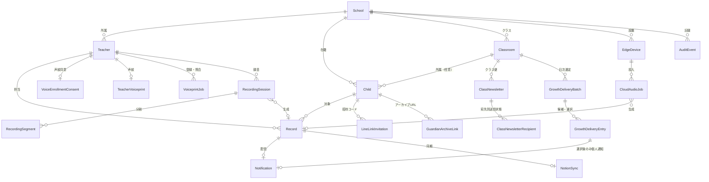
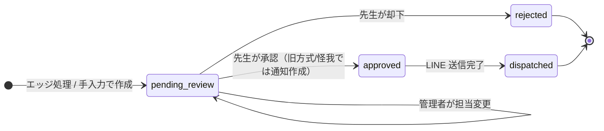

# データモデル

クラス配信の全体休止ではスキーマを変更しません。有効クラスの `delivery_enabled_since=NULL` を休止状態の境界として使い、
再開時にその時刻だけを更新します。`delivery_enabled`、人数上限、所属、受付済み通知の履歴を保持します。
新方式の未送信・失敗通知と未完了の承認済み便は取消状態にし、再開しても復活させません。

- 索引: [../architecture.md](../architecture.md)

## 試用記録の配信防止

`0027_school_trial_mode` は `schools.trial_mode`、`records.is_trial`、`recording_sessions.is_trial`、
`cloud_audio_jobs.is_trial` と通知状態 `trial` を追加します。既存行はfalseとして現在の運用を保持します。
APIの新規園はtrueです。直接SQLで作成する管理処理は既定falseなので、試用園では明示trueを指定します。
試用の録音・ジョブから作成した記録にも試用フラグを引き継ぎ、後の本番切り替えでは消しません。
試用への切り替えは未承認記録、処理前・処理中の録音、送信待ち・連携待ち・失敗通知を永久に試用扱いにします。
試用通知は送信先なしの終端状態で、記録は承認済みのままです。保護者の配信アーカイブには載りません。
本番の要約用過去履歴からも試用記録を除外し、重複判定は同じ試用フラグの記録だけに限定します。
配信防止列の削除で誤送信を起こさないよう、この移行のdowngradeは拒否します。

SQLAlchemy 2.0 の宣言スタイル（`Mapped` / `mapped_column`）で `app/models.py` に定義しています。
主キーはすべて UUID の文字列（`String(36)`）、日時はタイムゾーン付きで UTC 保存です。

---

## 全体像

---

## テーブル一覧

| テーブル | 役割 | 注記 |
| --- | --- | --- |
| `schools` | 園 | `timezone` と `digest_time` を園ごとに保持 |
| `teachers` | 先生 | `auth_user_id` で Supabase ユーザーと 1 対 1。無効化はソフトデリート |
| `children` | 園児 | `guardian_line_user_id` が保護者の LINE 連携先。`classroom_id` は手動所属でNULL可。`guardian_line_linked_at` は再連携時刻 |
| `classrooms` | 園のクラス | 園内で名前一意。新方式は無効既定、個人日次上限1/2、明示有効化時刻 |
| `class_newsletters` | 手入力クラス便 | 1クラス・対象日で1件。本文、当日配信予約、承認・取消・試用状態 |
| `class_newsletter_recipients` | クラス便の宛先別送信状態 | 承認時のLINE IDと子どもIDスナップショット、送信・失敗・取消、冪等キー |
| `growth_delivery_batches` | 個人成長便の日次選定 | 1クラス・対象日で1件。quota、下書き/承認/取消、予約・試用状態 |
| `growth_delivery_entries` | 選定候補 | バッチ内の記録・園児を一意化。`selected=true`のみ通知候補になる |
| `edge_devices` | 録音端末 | APIキーは `api_key_hash` のみ保存。`last_seen_at` で死活を表示 |
| `records` | 匿名化済みの記録候補 | 本文は `summary` / `conversation_prompt` / `anonymized_context` |
| `notifications` | 個人記録の保護者配信 | `record_id` に一意制約。日次個人便は承認選択後のみ `growth_delivery_entry_id` を付与 |
| `line_link_invitations` | 保護者連携の招待コード | `code_hash` のみ保存。使用・失効を日時で記録 |
| `guardian_archive_links` | 配信アーカイブの URL | `token_hash` のみ保存。期限つき・失効可能 |
| `cloud_audio_jobs` | クラウド GPU 処理ジョブ | メタデータのみ。音声本体はファイルシステム上の短命保管 |
| `recording_sessions` | `/rec/` の録音セッション | 所有者、状態、期限、結果記録ID、claim token、処理済み・失敗区間数。音声と文字起こしは保存しない |
| `recording_segments` | 約1分ごとの分割音声メタデータ | 連番、時間、サイズ、SHA-256、MIME、ランダム保存キー。音声本体は短命ファイル |
| `voice_enrollment_consents` | 声紋登録の同意 | 目的・ポリシー版・保持日数・失効、録音照合への追加同意（既定false）を記録 |
| `teacher_voiceprints` | 先生の声紋 | 暗号化した特徴量だけを先生ごとに1件保存。元音声は保存しない |
| `voiceprint_jobs` | 声紋登録・本人確認ジョブ | 一時音声のランダムキーと処理結果。本人以外には返さない |
| `notion_syncs` | Notion 同期の結果 | `record_id` に一意制約。ページ ID と URL |
| `audit_events` | 操作履歴 | 音声・文字起こし・秘密情報を含めない |

先生招待の移行 `0028_teacher_invitations` は `teachers.invitation_attempted_at`（送信予約・60秒制限）と
`invitation_sent_at`（Supabase送信受付時刻）を追加します。既存行はNULLです。キーや招待トークンは保存しません。

`records.voiceprint_candidate_teacher_id` は照合による提案であり、実際の担当 `teacher_id` と別です。
`voiceprint_matching_checked` は照合実施有無です。候補はIDだけで、声紋・類似度・話者区間は保持しません。
候補IDはAPIの通常のRecordReadには含めず、別の園スコープ付きAPIで同意・期限・有効先生を確認して返します。
これらの列と追加同意は `0025_recorder_voiceprint` で追加し、既存の同意・記録はfalse/NULLで移行します。

`children.recording_names` は管理者が登録する敬称なしの呼び名・読み方（最大5件）です。既存園児は空配列です。
`records.candidate_child_id` は録音の園児提案メタデータで、実際の対象 `child_id` と別です。
`0026_recorder_child_suggestions` で追加し、既存の記録はNULLです。通常RecordReadには含めず、
閲覧権限・園・在籍・未承認を確認する専用APIで返します。名前変更・登録・退園・復園は園の未承認候補を消去します。
提案だけでは通知を作りません。録音由来の承認は明示した園児と確認フラグが必要です。

---

## 状態遷移

| テーブル | カラム | 状態 |
| --- | --- | --- |
| `records` | `status` | `pending_review` → `approved` / `rejected` → `dispatched` |
| `notifications` | `status` | `waiting_guardian_link` → `pending`（保護者連携）→ `sent` / `failed`。`failed` → `pending`（再送予約）。`pending` / `waiting_guardian_link` → `cancelled` |
| `cloud_audio_jobs` | `status` | `queued` → `processing` → `completed` / `failed` / `expired` |
| `voiceprint_jobs` | `status` | `queued` → `processing` → `completed` / `failed` / `expired` |
| `recording_sessions` | `status` | `draft` → `queued` → `processing` → `completed` / `failed`。別経路は `discarded` / `expired` |
| `teachers` | `role` | `teacher` / `school_admin` |
| `records` | `category` | `growth`（成長の記録） / `injury`（けがの記録） |

### 通知の状態が決まる条件

承認時（`POST /records/{id}/approve`）に `notifications` が 1 行作られます。

| 条件 | 初期状態 |
| --- | --- |
| 園児に `guardian_line_user_id` がある | `pending`（送信ワーカーが配信） |
| 園児はいるが LINE 未連携 | `waiting_guardian_link` |
| 園児が未指定 | `pending` |

配信予定時刻（`scheduled_for`）の既定値:

- **けがの記録** … 承認と同時（即時）
- **成長の記録** … 園の `digest_time`（既定 17:00 / `Asia/Tokyo`）に合わせた次回時刻

先生管理者は `PATCH /notifications/{id}/schedule` で予定時刻を後から変更できます。

クラス配信が無効なクラスでは、この既存経路を変えません。有効なクラスの成長記録は承認で`records`だけを承認済みにし、`notifications`を作りません。日次バッチの候補に選ばれ、先生が対象日・園児・本文を確認して承認した時だけ通知を作ります。怪我記録はクラス設定に関係なく従来の承認後即時経路を維持します。

クラス便は `draft -> approved -> cancelled` を持ち、実送信状況は宛先行ごとに `pending / sent / failed / cancelled / trial` を管理します。承認は本文確認フラグを要求し、当日以外を承認できません。同じ保護者LINE IDが複数園児に紐付く場合は1宛先に統合します。承認後に新しく紐付けられた園児や、承認後に再連携された園児だけを根拠として古いクラス便を送ることはありません。

個人便の日次バッチは `draft -> approved / cancelled`。候補は承認済み成長記録・在籍・クラス・保護者連携・当日・試用外の条件を満たす場合に限ります。バッチの園児ごとに候補1件まで。quotaを超える選択、同一園児の複数通知、候補外記録はAPIとDB制約で拒否します。送信受付済み回数は選択エントリに結びつく通知の`sent`数で数え、失敗・予約・承認・試用・クラス便は含めません。

---

## 重複と競合の防止

| 対象 | 仕組み |
| --- | --- |
| 同じ音声から記録が二重に作られる | `records` に `(school_id, source_event_id)` の一意制約 |
| 同じ音声が二重にアップロードされる | `cloud_audio_jobs` の `(device_id, edge_upload_id)` を照合して既存ジョブを返す |
| 1 記録に通知が二重に作られる | `notifications.record_id` に一意制約 |
| 1個人選定で同じ園児を重ねる | `growth_delivery_entries(batch_id, child_id)` 一意制約 |
| 同じクラス便の同一LINE宛先が重複 | `class_newsletter_recipients(newsletter_id, recipient_line_user_id)` 一意制約 |
| 個人配信エントリから通知を複数生成する | `notifications.growth_delivery_entry_id` 一意制約 |
| 同日同クラスの便/選定が競合する | クラス・対象日の一意制約、園行ロック、トランザクション |
| 複数の GPU ワーカーが同じジョブを取る | `claim_token` による排他取得 |
| 同じ録音セッションを二重に作る | `recording_sessions(teacher_id, client_session_id)` の一意制約 |
| 同じ録音から記録を二重生成する | queued→processingの原子的UPDATEと最終確定のclaim token照合 |

録音セッションの中間要約はDBへ保存しません。処理停止は失敗として音声を削除し、途中区間だけの再実行はしません。
部分失敗の記録は `records.audio_processing_incomplete=true` で先生へ明示します。
現在の発生日時はサーバーのセッション受付日時であり、端末側の実録音開始日時とは一致しない場合があります。
| 同じ分割番号を二重に保存する | `recording_segments(session_id, sequence)` の一意制約とSHA-256照合 |
| 招待コードが複数有効になる | 新規発行時に同じ園児の未使用コードを失効 |
| 同じ記録を Notion へ二重投稿する | `notion_syncs.record_id` に一意制約 |

---

## 監査イベント

`audit_events` は「誰が」「いつ」「どの種類の操作を」「どの種別の対象に」行ったかだけを残します。
本文・園児名・トークン・音声は入りません。記録される操作は次の 25 種類です。

| 分類 | `action` |
| --- | --- |
| 記録 | `record_reassigned`, `record_approved`, `record_rejected`, `manual_record_created`, `record_history_exported` |
| 通知 | `notification_retry_scheduled`, `notification_cancelled`, `notification_rescheduled` |
| 保護者連携 | `line_link_invitation_issued`, `guardian_line_linked`, `guardian_line_unlinked` |
| アーカイブ | `guardian_archive_issued`, `guardian_archive_revoked` |
| 園児 | `child_updated`, `child_archived`, `child_restored` |
| 先生 | `teacher_disabled`, `teacher_restored`, `teacher_role_changed` |
| 園・端末 | `school_digest_time_changed`, `edge_device_created`, `edge_device_key_rotated`, `edge_device_disabled` |
| 連携 | `notion_synced`, `audit_history_exported` |

先生管理者は画面の「操作履歴」から閲覧と CSV 書き出しができます（書き出し自体も監査対象です）。

---

## データベースとマイグレーション

| 環境 | データベース | 移行の適用方法 |
| --- | --- | --- |
| ローカル開発 | SQLite（`./data/otayori.db`） | アプリ起動時に自動適用（`app/database_migrations.py`） |
| 本番 / VRT | PostgreSQL（Supabase など） | `scripts/prepare_database.py` を明示実行（Compose では `migrate` サービス） |

- 移行ファイルは `migrations/` に置き、Alembic（`alembic.ini`）で管理します。
- SQLite の自動適用は「ゼロ設定で試せる」ことを優先した割り切りで、本番では使いません。
- SQLite から Supabase への移行には `scripts/migrate_sqlite_to_supabase.py` を用意しています。
