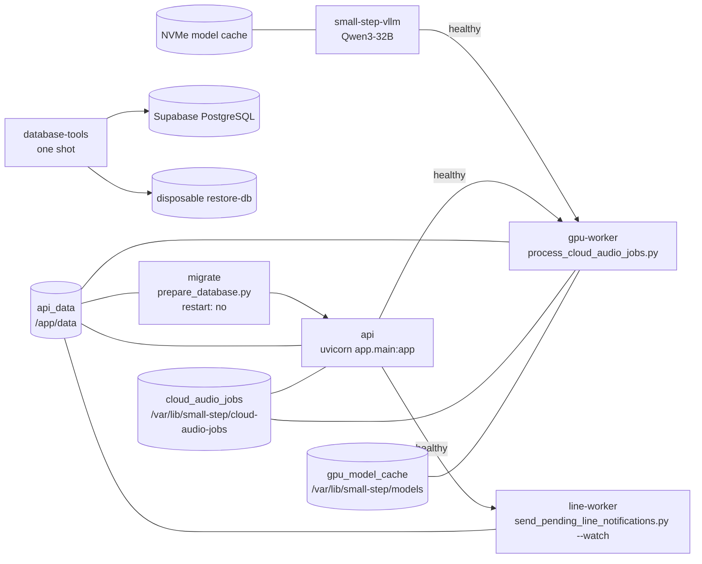

# デプロイ・運用

- 索引: [../architecture.md](../architecture.md)

ローカル開発は SQLite + 単一プロセス、本番は PostgreSQL + Docker Compose です。
GPU が必要なのはクラウド音声処理モードのワーカーだけで、API 自体は CPU イメージで動きます。

---

## イメージ

| ファイル | ベース | 用途 |
| --- | --- | --- |
| `Dockerfile` | `python:3.12-slim` | API と CPU 側ワーカー（`migrate` / `line-worker`）に共用 |
| `Dockerfile.gpu` | `nvidia/cuda:12.6.3-cudnn-runtime-ubuntu24.04` | GPU ワーカー専用 |
| `Dockerfile.database-tools` | `postgres:18.6-bookworm` | PostgreSQLバックアップと復元リハーサル専用 |

API用とGPU用の2イメージは UID 10001 の非 root ユーザー `appuser` で動きます。
GPU イメージだけが `edge-audio` / `speaker-diarization` の extras を入れるため、
API イメージは小さいまま保てます。

`database-tools`は一度だけ起動し、ホスト側に所有者だけが読めるバックアップを作るためrootで動きます。
ルートファイルシステムは読み取り専用、権限昇格は禁止し、書き込み先を`/backups`と`/tmp`だけに限定します。

| イメージ | インストールする extras |
| --- | --- |
| `Dockerfile` | `postgres` |
| `Dockerfile.gpu` | `postgres`, `edge-audio`, `speaker-diarization` |

---

## Compose 構成

`compose.yaml` が最小構成、`compose.vrt.yaml` が高火力 VRT 用の重ね合わせです。

```bash
# ローカル最小構成（api のみ）
docker compose up -d --build

# VRT（migrate + gpu-worker + line-worker つき）
docker compose -f compose.yaml -f compose.vrt.yaml up -d --build
```



| サービス | 役割 | 再起動 |
| --- | --- | --- |
| `api` | FastAPI（ポート 8000）。先生用・保護者用の静的配信も担う | `unless-stopped` |
| `migrate` | 起動前に一度だけ移行を適用。完了を `api` が待つ | `no` |
| `small-step-vllm` | Qwen3-32BをOpenAI互換APIとして提供 | `unless-stopped` |
| `gpu-worker` | 短命ジョブの音声を処理（`gpus: all`） | `unless-stopped` |
| `line-worker` | 配信予定を過ぎた通知を LINE へ送信 | `unless-stopped` |
| `database-tools` | `public`スキーマのバックアップ・検証・復元確認。`operations`プロファイルで一度だけ実行 | `no` |
| `restore-db` | 復元リハーサル専用。非公開ネットワークとtmpfs上でのみ起動 | `no` |

依存関係は `condition: service_healthy` / `service_completed_successfully` で表現しています。
移行が終わる前に API が立ち上がったり、API が応答する前にワーカーがポーリングを始めたりしません。

### ボリューム

| ボリューム | 内容 | 共有するサービス |
| --- | --- | --- |
| `api_data` | SQLite ファイル、エッジ音声インボックス | 全サービス |
| `cloud_audio_jobs` | 短命の音声ジョブ | `api`, `gpu-worker` |
| `gpu_model_cache` | Hugging Face のモデルキャッシュ | `gpu-worker` |

`gpu_model_cache` を分けているのは、コンテナを作り直すたびに音声モデルを再取得しないためです。
Qwenのモデルとコンパイルキャッシュは、既定でNVMe上の
`/mnt/small-step-cache/huggingface`と`/mnt/small-step-cache/vllm`をバインドします。
保存場所は`VLLM_MODEL_CACHE_DIR`と`VLLM_COMPILE_CACHE_DIR`で変更できます。

データベースバックアップはモデルキャッシュと分離し、既定でホストの
`./data/database-backups`へ保存します。Compose内では`/backups`として見えます。
バックアップには個人データが含まれるためGit管理せず、復元確認後に暗号化された外部保管先へ複製します。
`restore-db`のデータ領域はtmpfsなので、コンテナを削除すると復元したデータも消えます。

### ヘルスチェック

`api` サービスのDockerヘルスチェックは `GET /api/v1/health` を10秒間隔で叩きます
（タイムアウト5秒、6回まで、起動猶予15秒）。DB接続とAPI応答だけを見る軽量な確認で、
この結果を待って `gpu-worker` と `line-worker` が起動します。

`GET /api/v1/readiness` は運用開始判断用です。DB移行、一時音声保存、LLM設定に加えて、
GPU音声処理とLINE送信処理の最終heartbeatが既定90秒以内かを確認します。
先生用画面の「稼働準備チェック」と `scripts/check_runtime_readiness.py` はこの結果を使います。
LINEが未設定の開発環境ではLINEワーカーを必須にせず、LINE設定済みの環境では稼働を必須にします。

`worker_heartbeats` に保存するのは固定のワーカー名と最終確認時刻だけです。SupabaseのData APIからは
参照できないよう、移行時にRLSを有効化して `anon`、`authenticated`、`service_role` の権限を取り消します。

APIのホスト側ポートは `127.0.0.1:8000` に限定します。外部端末には直接公開せず、
本番認証を有効にしたうえでHTTPSのリバースプロキシを唯一の入口にします。

### Docker内部ネットワーク上の LLM を使う

`gpu-worker` とCompose管理の `small-step-vllm` は外部ネットワーク `small-step-ai` に参加し、
`LLM_BASE_URL=http://small-step-vllm:8000/v1` で参照します。
ホスト側の公開は `127.0.0.1:8001:8000` に限定し、LLMをインターネットへ公開しません。
MacのOllamaを使う場合は、従来どおり `host.docker.internal:host-gateway` も利用できます。

vLLMは初回起動にモデル読込とGPU最適化で数分かかるため、ヘルスチェックには5分の起動猶予を
設けています。`gpu-worker` はvLLMとAPIの両方がHealthyになってから起動します。

---

## 環境による切り替え

| 設定 | ローカル開発 | 本番 |
| --- | --- | --- |
| `APP_ENV` | `development` | `production` |
| `AUTH_MODE` | `development`（認証なし） | `supabase` を強制 |
| `DATABASE_URL` | `sqlite:///./data/otayori.db` | 非 SQLite を強制 |
| `EDGE_AUDIO_PROCESSING_MODE` | `local` | `local` / `cloud` |
| `CLOUD_AUDIO_ENABLED` | `false` | 必要なときだけ `true` |
| `GUARDIAN_ARCHIVE_BASE_URL` | `http://127.0.0.1:8000` | HTTPS を強制 |
| 移行の適用 | アプリ起動時に自動（SQLite のみ） | `migrate` サービスで明示適用 |

`APP_ENV=production` のときは `app/config.py` の `reject_unsafe_production_configuration()` が
構成を検証し、条件を満たさなければ起動を止めます。
ローカルの既定値のまま公開デプロイする事故を防ぐためのものです。
詳細は [api.md](api.md) の「設定」を参照してください。

設定項目の一覧は `.env.example` にあります。

---

## ローカルでの起動

```bash
python -m venv .venv
.venv/Scripts/activate        # Windows。macOS / Linux は source .venv/bin/activate
pip install -e ".[dev]"
uvicorn app.main:app --reload
```

- 先生用画面 … <http://127.0.0.1:8000/teacher>
- 保護者用画面 … <http://127.0.0.1:8000/guardian>
- API ドキュメント … <http://127.0.0.1:8000/docs>

SQLite の移行は起動時に自動適用されるため、事前準備は不要です。
テストは `pytest`（`testpaths = ["tests"]`）で実行します。

---

## 運用スクリプト

どんなコマンドがあるかは `scripts/` を直接見てください。使い方の手順は `README.md` にあります。
ここに挙げるのは、**ファイル名からは分からない「常駐させるもの」だけ**です。

| スクリプト | 用途 |
| --- | --- |
| `send_pending_line_notifications.py --watch` | LINE 送信ワーカー（Compose の `line-worker`） |
| `process_cloud_audio_jobs.py` | GPU ワーカー（Compose の `gpu-worker`） |
| `watch_edge_audio.py` | エッジ音声インボックスの監視（園内で常駐） |
| `record_edge_audio.py` | マイクからの連続録音（園内で常駐） |
| `monitor_operations.py --watch` | VRT内の障害監視と運用責任者へのLINE通知 |
| `schedule_database_backups.py --watch` | 検証済みPostgreSQLバックアップの日次作成 |

残りは一度きりの管理コマンドです。

`operations-monitor`は`monitoring`プロファイルで明示的に起動します。API停止中にも検知できるよう
`depends_on`を持たず、Dockerソケットにもアクセスしません。APIの秘密情報を返さないreadiness、vLLMの
health、バックアップのSHA-256、マウント済み領域の空き容量だけを確認します。監視状態には問題コード、
時刻、LINEの再試行キーだけを専用ボリュームへ保存し、園児・音声・通知本文・接続先は含めません。
バックアップを読める権限は持ちますが、業務DB、Supabase、話者分離の認証情報は渡しません。

---

## 起動の順序

新しい環境を立ち上げるときの順序です。

1. `.env` を用意する（`.env.example` を基に）
2. `prepare_database.py` で移行を適用する
3. 園を作る（`POST /api/v1/schools`）
4. `bootstrap_admin.py`、または画面の初回設定パネルで最初の先生管理者を作る
5. `register_edge_device.py` で録音端末を登録し、APIキーを端末へ設定する
6. LINE のチャネル設定と Webhook URL を登録する
7. `check_runtime_readiness.py` で不足している設定を確認する
8. 画面の「稼働準備チェック」がすべて緑になったら運用開始
9. `backup-worker`と`operations-monitor`を各プロファイルで起動する

手順の詳細は `README.md` に記載しています。
