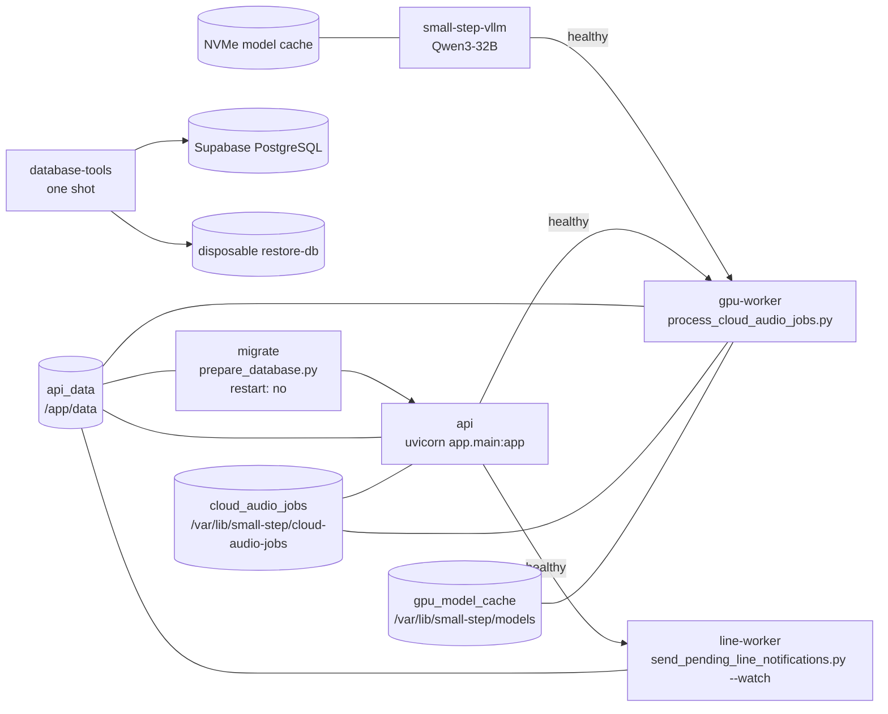

# デプロイ・運用

園別試用モードには `0027_school_trial_mode` とAPI・GPU・LINEワーカーの同時更新が必要です。
旧ワーカーを動かしたまま移行しないでください。停止順、バックアップ、再起動、切り替え確認は
[園別試用モード導入手順](../school-trial-runbook.md)を参照します。

録音の園児候補は `RECORDER_CHILD_MATCHING_ENABLED=false` が既定です。有効化には録音有効化、
`0026_recorder_child_suggestions` のDB移行、API・GPUワーカーの更新が必要です。
移行中は録音を停止し、処理中セッションの完了を確認してください。手順は[録音導入手順](../recorder-vrt-runbook.md#任意の園児候補)を参照します。

- 索引: [../architecture.md](../architecture.md)

ローカル開発は SQLite + 単一プロセス、本番は PostgreSQL + Docker Compose です。
GPUは音声ワーカーとVRT構成のvLLMに使います。APIとLINEワーカーはCPUイメージです。

---

## イメージ

| ファイル | ベース | 用途 |
| --- | --- | --- |
| `Dockerfile` | `node:24.19.0-bookworm-slim` → `python:3.12-slim` | SvelteKit を検証・ビルドし、生成物を含む API / CPU ワーカーを作成 |
| `Dockerfile.gpu` | `nvidia/cuda:12.6.3-cudnn-runtime-ubuntu24.04` | GPU ワーカー専用 |
| `Dockerfile.database-tools` | `postgres:18.6-bookworm` | PostgreSQLバックアップと復元リハーサル専用 |

`Dockerfile` は multi-stage build です。既存 `frontend/` と録音用 `recorder_frontend/` の独立したNode stageで
`npm ci`、`format:check`、lint、check、unit、buildを実行し、`app/frontend_dist/` と `app/recorder_dist/` だけを
Python runtime stageへコピーします。Node.jsと `node_modules` はruntime imageに含めません。
API用とGPU用の2イメージは UID 10001 の非 root ユーザー `appuser` で動きます。
GPU イメージだけが `edge-audio` / `speaker-diarization` の extras を入れるため、
API イメージは小さいまま保てます。

`database-tools`は一度だけ起動し、ホスト側に所有者だけが読めるバックアップを作るためrootで動きます。
ルートファイルシステムは読み取り専用、権限昇格は禁止し、書き込み先を`/backups`と`/tmp`だけに限定します。
外部退避を有効にした場合は、`age`公開鍵で暗号化してからS3互換の非公開バケットへ送ります。復号用の
秘密鍵はコンテナにもVRTにも渡しません。

| イメージ | インストールする extras |
| --- | --- |
| `Dockerfile` | `postgres` |
| `Dockerfile.gpu` | `postgres`, `edge-audio`, `speaker-diarization` |
| `Dockerfile.database-tools` | `postgres`, `backup-s3`（OSパッケージの`age`も使用） |

---

## Compose 構成

`compose.yaml` が最小構成、`compose.vrt.yaml` が高火力 VRT 用の重ね合わせです。

```bash
# ローカル最小構成（api のみ）
docker compose up -d --build

# VRT（migrate + gpu-worker + line-worker つき）
docker compose -f compose.yaml -f compose.vrt.yaml up -d --build
```



| サービス | 役割 | 再起動 |
| --- | --- | --- |
| `api` | FastAPI（ポート 8000）。先生用・保護者用の静的配信も担う | `unless-stopped` |
| `migrate` | 起動前に一度だけ移行を適用。完了を `api` が待つ | `no` |
| `small-step-vllm` | Qwen3-32BをOpenAI互換APIとして提供 | `unless-stopped` |
| `gpu-worker` | 短命ジョブの音声を処理（`gpus: all`） | `unless-stopped` |
| `line-worker` | 配信予定を過ぎた通知を LINE へ送信 | `unless-stopped` |
| `database-tools` | `public`スキーマのバックアップ・検証・復元確認。`operations`プロファイルで一度だけ実行 | `no` |
| `restore-db` | `recovery`プロファイルの復元リハーサル専用。非公開ネットワークとtmpfs | `no` |
| `backup-worker` | `backup`プロファイルの日次バックアップ・外部退避 | `unless-stopped` |
| `operations-monitor` | `monitoring`プロファイルの内部障害監視 | `unless-stopped` |

依存関係は `condition: service_healthy` / `service_completed_successfully` で表現しています。
移行が終わる前に API が立ち上がったり、API が応答する前にワーカーがポーリングを始めたりしません。

### ボリューム

| ボリューム | 内容 | 共有するサービス |
| --- | --- | --- |
| `api_data` | SQLite、録音PWAの短命セッション保管 | `api`, `migrate`, `gpu-worker`, `line-worker` |
| `cloud_audio_jobs` | 短命の音声ジョブ | `api`, `gpu-worker` |
| `gpu_model_cache` | Hugging Face のモデルキャッシュ | `gpu-worker` |

`gpu_model_cache` を分けているのは、コンテナを作り直すたびに音声モデルを再取得しないためです。
Qwenのモデルとコンパイルキャッシュは、既定でNVMe上の
`/mnt/small-step-cache/huggingface`と`/mnt/small-step-cache/vllm`をバインドします。
保存場所は`VLLM_MODEL_CACHE_DIR`と`VLLM_COMPILE_CACHE_DIR`で変更できます。

データベースバックアップはモデルキャッシュと分離し、既定でホストの
`./data/database-backups`へ保存します。Compose内では`/backups`として見えます。
バックアップには個人データが含まれるためGit管理せず、復元確認後に暗号化された外部保管先へ複製します。
日次ワーカーは外部オブジェクトのサイズ、平文と暗号文の検証値、指定したサービス側暗号化を`HEAD`で
確認した後だけ外部保存成功として記録します。外部送信だけ失敗した場合は新しいDBダンプを重複作成せず、
最新の検証済み世代を次回の確認時に再送します。保持世代の削除は外部保存成功後だけ実行します。
`restore-db`のデータ領域はtmpfsなので、コンテナを削除すると復元したデータも消えます。

### ヘルスチェック

`api` サービスのDockerヘルスチェックは `GET /api/v1/health` を10秒間隔で叩きます
（タイムアウト5秒、6回まで、起動猶予15秒）。DB接続とAPI応答だけを見る軽量な確認で、
この結果を待って `gpu-worker` と `line-worker` が起動します。

`GET /api/v1/readiness` は運用開始判断用です。DB移行、一時音声保存、LLM設定に加えて、
GPU音声処理とLINE送信処理の最終heartbeatが既定90秒以内かを確認します。
先生用画面の「稼働準備チェック」と `scripts/check_runtime_readiness.py` はこの結果を使います。
LINEが未設定の開発環境ではLINEワーカーを必須にせず、LINE設定済みの環境では稼働を必須にします。

`worker_heartbeats` に保存するのは固定のワーカー名と最終確認時刻だけです。SupabaseのData APIからは
参照できないよう、移行時にRLSを有効化して `anon`、`authenticated`、`service_role` の権限を取り消します。

APIのホスト側ポートは `127.0.0.1:8000` に限定します。外部端末には直接公開せず、
本番認証を有効にしたうえでHTTPSのリバースプロキシを唯一の入口にします。

### Docker内部ネットワーク上の LLM を使う

`gpu-worker` とCompose管理の `small-step-vllm` は外部ネットワーク `small-step-ai` に参加し、
`LLM_BASE_URL=http://small-step-vllm:8000/v1` で参照します。
ホスト側の公開は `127.0.0.1:8001:8000` に限定し、LLMをインターネットへ公開しません。
ホスト側LLMを参照する場合は `host.docker.internal:host-gateway` も利用できます。
サービス名・ホスト名はループバックではないため `LLM_ALLOW_EXTERNAL=true` の明示が必要です。
これは許可先への通信を認めるガードで、LLMを公開する設定ではありません。

vLLMは初回起動にモデル読込とGPU最適化で数分かかるため、ヘルスチェックには5分の起動猶予を
設けています。`gpu-worker` はvLLMとAPIの両方がHealthyになってから起動します。

---

## 環境による切り替え

| 設定 | ローカル開発 | 本番 |
| --- | --- | --- |
| `APP_ENV` | `development` | `production` |
| `AUTH_MODE` | `development`（認証なし） | `supabase` を強制 |
| `DATABASE_URL` | `sqlite:///./data/otayori.db` | 非 SQLite を強制 |
| `EDGE_AUDIO_PROCESSING_MODE` | `local` | `local` / `cloud` |
| `CLOUD_AUDIO_ENABLED` | `false` | 必要なときだけ `true` |
| `RECORDER_ENABLED` | `false` | 既存GPUワーカー・HTTPS・実機試験が揃った後だけ `true` |
| `RECORDER_WORKER_HEARTBEAT_REQUIRED` | `true` | 録音有効時は `true` を強制 |
| `RECORDER_PROCESSING_TIMEOUT_MINUTES` | `10` | 区間間の進捗更新が途絶えた処理を失敗にする |
| `VOICEPRINT_ENABLED` | `false` | 同意済み先生の登録・本人確認を行うときだけ `true` |
| `GUARDIAN_ARCHIVE_BASE_URL` | `http://127.0.0.1:8000` | アーカイブ有効時は HTTPS を強制 |
| 移行の適用 | アプリ起動時に自動（SQLite のみ） | `migrate` サービスで明示適用 |

`APP_ENV=production` のときは `app/config.py` の `reject_unsafe_production_configuration()` が
構成を検証し、条件を満たさなければ起動を止めます。
ローカルの既定値のまま公開デプロイする事故を防ぐためのものです。
詳細は [api.md](api.md) の「設定」を参照してください。

設定項目の一覧は `.env.example` にあります。

録音セッションは既存GPUワーカーが通常音声・声紋ジョブと順番に処理します。
APIとGPUワーカーの両方へ同じ `RECORDER_ENABLED` を渡し、共有ディレクトリは
`/app/data/recorder-sessions` に固定します。録音有効時のreadinessは `gpu_audio` と `recorder_audio` の
生存確認を必要とします。全停止中は削除処理も停止するため、期限監視のためにGPUワーカーを稼働させてください。
有効化の再作成順はGPUワーカー→APIです。詳細は [VRT録音デモ導入手順](../recorder-vrt-runbook.md)を参照します。

声紋機能を有効にする場合は `CLOUD_AUDIO_ENABLED=true`、`SPEAKER_DIARIZATION_TOKEN`、
Fernet形式の `VOICEPRINT_ENCRYPTION_KEY` が必要です。鍵が欠けている、形式が不正、またはGPU音声処理が
無効な構成は起動時に拒否します。登録・照合は既存の `gpu-worker` が処理し、一時音声には既存の
`cloud_audio_jobs` ボリューム内の専用ディレクトリを使います。

---

## ローカルでの起動

FastAPI が配信する Svelte 生成物は事前ビルドが必須です。Node.js 24.19.0 を使います。
`APP_ENV=production` では生成物が欠けていると起動時に失敗し、旧 UI へは自動で戻りません。

```bash
cd frontend
npm ci
npm run format:check
npm run lint
npm run check
npm run test:unit
npm run build
cd ..
```

```bash
python -m venv .venv
.venv/Scripts/activate        # Windows。macOS / Linux は source .venv/bin/activate
pip install -e ".[dev]"
uvicorn app.main:app --reload
```

- 先生用画面 … <http://127.0.0.1:8000/teacher>
- 保護者用画面 … <http://127.0.0.1:8000/guardian>
- API ドキュメント … <http://127.0.0.1:8000/docs>

`/teacher/*` は `app/frontend_dist/200.html` への先生用限定 SPA fallback、`/guardian/` は prerender 済み静的ページ、
`/_app/immutable/*` は content hash 付き asset です。HTML は `no-cache`、immutable asset は 1 年 cache で配信します。
API、欠損 asset、`/guardian/` 配下の不明なパスを SPA fallback へ渡してはいけません。

現在の配備先の結果は [実機・外部サービス確認](../operations/acceptance.md)で別途記録します。
[Svelte移行手順](../svelte-migration-runbook.md)は過去の記録で、現在の試用ガードを含む全機能の復旧手順には使いません。

SQLite の移行は起動時に自動適用されるため、事前準備は不要です。
テストは `pytest`（`testpaths = ["tests"]`）で実行します。

---

## 運用スクリプト

コマンドは `scripts/`、初期設定は [初期設定手順](../operations/setup.md)、音声・MCPは
[音声手順](../operations/audio.md)、バックアップ・監視は [運用手順](../operations/backup-monitoring.md)を参照します。
ここに挙げるのは、**ファイル名からは分からない「常駐させるもの」だけ**です。

| スクリプト | 用途 |
| --- | --- |
| `send_pending_line_notifications.py --watch` | LINE 送信ワーカー（Compose の `line-worker`） |
| `process_cloud_audio_jobs.py` | GPU ワーカー（Compose の `gpu-worker`） |
| `watch_edge_audio.py` | エッジ音声インボックスの監視（園内で常駐） |
| `record_edge_audio.py` | マイクからの連続録音（園内で常駐） |
| `monitor_operations.py --watch` | VRT内の障害監視と運用責任者へのLINE通知 |
| `schedule_database_backups.py --watch` | 検証済みPostgreSQLバックアップの日次作成、公開鍵暗号化、外部退避 |

残りは一度きりの管理コマンドです。

`operations-monitor`は`monitoring`プロファイルで明示的に起動します。API停止中にも検知できるよう
`depends_on`を持たず、Dockerソケットにもアクセスしません。APIの秘密情報を返さないreadiness、vLLMの
health、バックアップのSHA-256、外部退避の完了状態、マウント済み領域の空き容量だけを確認します。監視状態には問題コード、
時刻、LINEの再試行キーだけを専用ボリュームへ保存し、園児・音声・通知本文・接続先は含めません。
バックアップを読める権限は持ちますが、業務DB、Supabase、話者分離の認証情報は渡しません。

VRT自体が停止すると内部監視も止まるため、`.github/workflows/external-vrt-monitor.yml`がGitHub Actionsから
公開HTTPS経由の`/api/v1/health`を確認します。外部監視はAPIとDBの到達性だけを扱い、障害ごとに1件のIssueを
状態記録として使います。通知文とIssueには監視先URL、園児、音声、認証情報を含めません。LINE通知を有効にした場合は、
Issue番号から決まる同一の再試行キーで初回障害を送り、復旧通知後にIssueを閉じます。

---

## 起動の順序

録音の任意声紋照合の追加では、`0025_recorder_voiceprint` を適用してから新API・GPUワーカーを起動します。
`RECORDER_VOICEPRINT_MATCHING_ENABLED=true` は `RECORDER_ENABLED=true` と `VOICEPRINT_ENABLED=true` が
揃わない場合、設定検証で起動を拒否します。先生本人の追加同意と登録済み声紋が必要で、機能設定だけでは
既存声紋を照合対象にしません。1対多照合の既定閾値0.85・次点との差0.1は実音声で評価してください。
導入時は誤一致だけでなく未特定率、音声処理の遅延、vLLMとの共有GPUメモリも確認します。

新しい環境を立ち上げるときの順序です。

1. `.env`に本番認証・DB・HTTPSと必要な機能設定を用意する。
2. 静的ビルドを含むイメージを作り、移行をAPI起動前に適用する。Composeのmigrate完了を確認する。
3. APIを起動し、APIとDBのhealthを確認する。VRTのvLLM・GPU・LINEワーカーの起動を確認する。
4. bootstrap_admin.py、または認証済みAPI／画面の初回設定で園と最初の管理者を作る。
5. 園児・先生・端末を登録し、LINE設定と連携を準備する。新規園は試用のままテストする。
6. バックアップ・復元確認と監視を準備し、各プロファイルのワーカーを起動する。
7. APIコンテナでcheck_runtime_readiness.pyを実行し、移行・設定・必要なheartbeatを確認する。
8. 対象端末と外部サービスで試験する。運用開始の確認後、管理者が園を本番へ切り替える。

既存環境の更新では録音停止・バックアップ・全旧ワーカー停止を含む
[試用導入手順](../school-trial-runbook.md)を確認します。
初期設定のコマンドは [初期設定](../operations/setup.md)、実機の合否は [確認一覧](../operations/acceptance.md)にあります。
