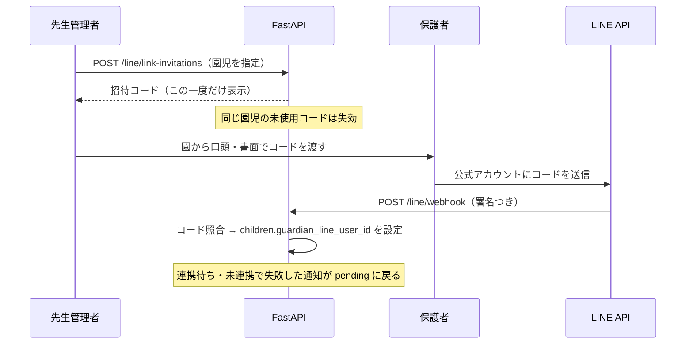
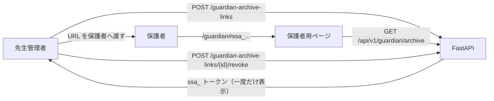

# 外部連携

- 索引: [../architecture.md](../architecture.md)

保護者への配信（LINE）、園内の記録共有（Notion）、保護者向けの閲覧ページ（配信アーカイブ）の 3 つです。

---

## LINE Messaging API

### 通知の送信

送信は API プロセスではなく、別プロセスのワーカーが行います。ワーカーは API を呼ばず、
API と同じデータベースを直接読み書きするため、先生のアクセストークンを必要としません。

```
scripts/send_pending_line_notifications.py [--watch] [--dry-run] [--retry-failed]
  ├ DB から scheduled_for を過ぎた pending を取得（--retry-failed なら failed も）
  ├ app/line.py push_text_message()          … LINE へ push
  └ DB に送信結果を記録                        … 成功なら sent（record は dispatched へ）、失敗なら failed
```

- `--watch` で常駐し、`LINE_WORKER_POLL_SECONDS`（既定 15 秒）ごとにポーリングします。
  Compose の VRT 構成では `line-worker` サービスとして常駐します。
- `--dry-run` は LINE への push を行いません。ただし、送信先または対応する記録がない期限到来通知は
  `failed`（`guardian_not_linked`）へ更新するため、データベースに対して完全な読み取り専用ではありません。
- `X-Line-Retry-Key` に通知 ID を渡します。再送予約でも同じ通知 ID を使うため、LINE 側で同じ再試行キーとして扱われます。
- 本文は `build_notification_text()` が `summary` と `conversation_prompt` から組み立て、
  `truncate_line_text()` が LINE の上限（UTF-16 コードユニット単位）に収まるよう切り詰めます。
- 失敗した通知は `failed` になり、`last_failure_kind` と `delivery_attempts` が残ります。通常の実行では自動再送しません。
  先生管理者は画面から `failed` の再送予約（`POST /notifications/{id}/retry`）、
  `pending` / `waiting_guardian_link` の取り消し（`POST /notifications/{id}/cancel`）と
  日時変更（`PATCH /notifications/{id}/schedule`）ができます。
- 送信先の LINE ユーザー ID がない `pending` 通知は、送信せずに `failed`（`guardian_not_linked`）にします。

### 保護者アカウントの紐付け

保護者の LINE ユーザー ID は、園が発行した一度きりの招待コードを保護者自身が送ることで登録されます。



Webhook（`POST /api/v1/line/webhook`）の扱い:

1. `X-Line-Signature` を生ボディで検証する（JSON パースより前）。不一致なら 401。
2. イベント配列を走査し、テキストメッセージから `parse_link_code()` で招待コードらしき文字列だけを取り出す。
3. `hash_link_code(code, channel_secret)` で、未使用・未失効・期限内の招待コードと照合する。
   **保護者が送ったメッセージ本文は一切保存しません。**
4. 一致し、園児が在園中なら `children.guardian_line_user_id` を設定し、`line_link_invitations.used_at` を埋める。
5. その園児の `waiting_guardian_link` の通知と、`guardian_not_linked` で `failed` になった通知を `pending` に戻す。
6. `guardian_line_linked` を監査ログに残す。

| 操作 | エンドポイント | 権限 |
| --- | --- | --- |
| 招待コードの発行 | `POST /line/link-invitations` | `school_admin` |
| 有効な招待コードの一覧 | `GET /line/link-invitations/active` | `school_admin`（コード自体は返さない） |
| LINE 連携の解除 | `DELETE /children/{id}/guardian-line-link` | `school_admin` |

有効な招待コードの一覧はコードの値を返しません。紛失したら再発行するしかなく、
再発行すると以前のコードは失効します。資格情報を二度見せないための設計です。

### 設定

| キー | 説明 |
| --- | --- |
| `LINE_CHANNEL_SECRET` | Webhook の署名検証と招待コードのハッシュ化に使用。未設定なら関連機能は 503 |
| `LINE_CHANNEL_ACCESS_TOKEN` | push 送信に使用 |
| `LINE_API_TIMEOUT_SECONDS` | 既定 10 秒 |
| `LINE_WORKER_POLL_SECONDS` | 既定 15 秒 |

---

## 保護者向け配信アーカイブ

LINE のトーク履歴を遡らなくても、過去のお知らせを一覧で読めるようにする機能です。
`GUARDIAN_ARCHIVE_ENABLED=true` のときだけ有効になります。



| 性質 | 内容 |
| --- | --- |
| 対象 | LINE 連携済みの園児のみ |
| 本番の制約 | `GUARDIAN_ARCHIVE_BASE_URL` は HTTPS 必須 |
| 再発行 | 新しい URL を発行すると、同じ園児の既存 URL はすべて失効 |

トークンの形式・有効期限・返す範囲は [auth.md](auth.md) の「保護者アーカイブのトークン」にあります。

保護者用ページの実装は [frontend.md](frontend.md)、
画面の状態遷移は [../transition.md](../transition.md) を参照してください。

---

## Notion

配信済みの記録を園の Notion データベースへ写し、園内での振り返りに使えるようにします。

```
POST /api/v1/records/{record_id}/notion-sync   （school_admin のみ）
  ├ 対象は record が dispatched かつ通知が sent の記録だけ（それ以外は 409）
  ├ app/notion.py が Notion API へページを作成
  └ notion_syncs にページ ID と URL を保存（record_id に一意制約）
```

- 同期は自動ではなく、先生管理者が画面の「通知状況」から明示的に実行します。
  保護者へ届いていない下書きが園の共有スペースに出ないようにするためです。
- `notion_syncs.record_id` の一意制約により、同じ記録は二重投稿されません。
- 同期済みの記録には Notion ページへのリンクが画面に表示されます。
- 同期の実施は `notion_synced` として監査ログに残ります。

| キー | 説明 |
| --- | --- |
| `NOTION_API_TOKEN` | インテグレーションのトークン |
| `NOTION_DATA_SOURCE_ID` | 追記先のデータソース |
| `NOTION_API_TIMEOUT_SECONDS` | 既定 10 秒 |

データソースは `scripts/create_notion_database.py` で作成できます。
