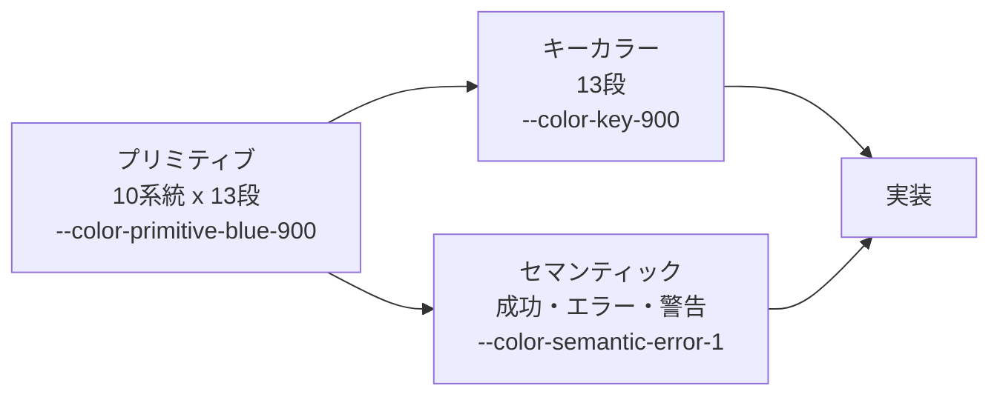

# デジタル庁デザインシステム

配色・書体・余白・角丸・影を検討するときの外部の参照点です。
Small Step が採用を決めた記録ではありません。

**このファイルは案内と値の一覧です。考え方の本文は要約せず、原文をそのまま
[`reference/dads/`](reference/dads/ABOUT-THIS-COPY.md) に置いています。**
以前ここに置いていた要約は、原文 223 KB を 7 KB まで落としたうえ、
8領域のうち4領域に一切触れていませんでした。欠落が読み手から見えないため取りやめています。

| | |
| --- | --- |
| 公式サイト | [デジタル庁デザインシステムβ版](https://design.digital.go.jp/dads/) |
| 考え方の原文 | [`reference/dads/`](reference/dads/ABOUT-THIS-COPY.md)（2026-08-19版・無改変） |
| トークンの値 | [digital-go-jp/design-tokens](https://github.com/digital-go-jp/design-tokens) v2.0.1（コミット `cde7dfe`） |
| デザインデータ | [Figma Community](https://www.figma.com/community/file/1377880368787735577)（CC BY 4.0） |

出典：デジタル庁デザインシステムウェブサイト https://design.digital.go.jp/dads/

下半分のトークン表は公式の `tokens.css` から機械的に転記したものです。
表の並べ替えと日本語の見出しづけを Small Step 側で行っているため、この部分は加工にあたります。
デジタル庁による記述ではありません。

---

## どこに何が書いてあるか

原文は [`reference/dads/`](reference/dads/ABOUT-THIS-COPY.md) に `foundations/`（基本デザイン8領域）、
`guidance/`、`introduction/` の3ディレクトリで入っています。**どこに何があるかは各ファイルを直接見てください。**
ここに目次を写すと、原文を新しい版へ差し替えたときに黙って古くなります。

---

## Small Step から見て関係が深い箇所

要約はしません。読むべき場所と、なぜそこが効くのかだけ示します。

| 原文の場所 | Small Step での関わり |
| --- | --- |
| [カラー](reference/dads/foundations/color/index.md) の「共通カラー」 | 枠線・ディバイダーは背景に対して 3:1 以上、という規定。現行の `--line`（`#d6dbe0` / 1.39:1）は 32 箇所の枠線に使われているが、これを満たしていない |
| [カラー](reference/dads/foundations/color/index.md) の「機能カラー」 | リンク色・**フォーカスカラー**・検索ハイライト・UIステートの規定。Small Step は `:focus-visible` に `#ffbf00` を使っており、突き合わせる価値がある |
| [カラー](reference/dads/foundations/color/index.md) の「コントラスト要件」「色覚多様性への配慮」 | 達成基準 1.4.3 / 1.4.6 / 1.4.11 の扱いと、色以外の手がかりの持たせ方 |
| [カラー](reference/dads/foundations/color/index.md) の「キーカラー」 | プライマリー / セカンダリー / ターシャリー / バックグラウンドの4役割と、役割ごとの必要コントラスト比 |
| [タイポグラフィ](reference/dads/foundations/typography/index.md) の「テキストスタイルの種類」 | Display / Standard / Dense / Oneline / Mono という命名済みスタイル体系。Small Step は名前つきの本文スタイルを持たない |
| [余白](reference/dads/foundations/spacing/index.md) の「余白のルールの考え方」 | 基準単位 8 CSS px、スケールは3〜5段階。Small Step の `--space-1` 〜 `--space-8` と同じ考え方。トークンとして配布しないのは各サービスに委ねる方針のため |
| [レイアウト](reference/dads/foundations/layout/index.md) | ブレークポイントと配置の指針。現行のブレークポイントは 767px と 1024px の 2 点のみ |
| [エレベーション](reference/dads/foundations/elevation/index.md) | 影の使い分け。Small Step は `--shadow-card` の1段しか持たない |
| [角の形状](reference/dads/foundations/corner-shapes/index.md) | 同じ半径でも図形サイズで印象が変わるため、コンポーネントごとに調整するという指針 |
| [アクセシビリティ](reference/dads/guidance/accessibility/index.md) | 準拠する基準（JIS X 8341-3:2016 = WCAG 2.0、および WCAG 2.2）の関係 |

---

# デザイントークン（値の一覧）

ここから先は `@digital-go-jp/design-tokens` v2.0.1 に含まれる値です。
`examples/tokens.css` から機械的に転記しており、手で書き写してはいません。
パッケージ全体は220個（色 177 / 書体まわり 27 / 角丸 8 / エレベーション 8）です。

**表にするのは、名前から値を導けないものだけです。** キーカラーと不透明度グレーは規則が単純なので
規則だけ書いています。White（`--color-neutral-white`）と Black（`--color-neutral-black`）も、
名前のとおりの純白・純黒なので表に出しません。表にあるのは残る193個です。

## トークンの3層

デジタル庁のトークンは3層に分かれています。実装から直接プリミティブを参照せず、
キーカラーとセマンティックカラーを経由するのが前提の作りです。

キーカラーは既定で blue 系統を指しています。ここを差し替えると、
実装側を触らずに配色全体の系統を切り替えられる構造です。

白背景に置いたときの各段階のコントラスト比は次のとおりで、
文字色に使えるのは 600 以降です。

| 段階 | 500 | 600 | 700 | 800 | 900 | 1000 |
| --- | --- | --- | --- | --- | --- | --- |
| 値 | `#4979f5` | `#3460fb` | `#264af4` | `#0031d8` | `#0017c1` | `#00118f` |
| 白背景比 | 3.93:1 | 4.99:1 | 6.23:1 | 8.64:1 | 11.10:1 | 14.22:1 |

---

## 色

### キーカラー

参照先を変えるだけで全体の色味が変わる層です。既定は blue。
`--color-key-50` から `--color-key-1200` までの13段が、同じ段の `--color-primitive-blue-*` を
1対1で指しているだけなので、値は[プリミティブ](#プリミティブ)の `blue` 列を見てください。
ここを別系統へ向けると、実装を触らずに配色全体が入れ替わります。

### セマンティックカラー

状態を表す色。すべてプリミティブへの参照です。

| トークン | 参照先 |
| --- | --- |
| `--color-semantic-success-1` | `var(--color-primitive-green-600)` |
| `--color-semantic-success-2` | `var(--color-primitive-green-800)` |
| `--color-semantic-error-1` | `var(--color-primitive-red-800)` |
| `--color-semantic-error-2` | `var(--color-primitive-red-900)` |
| `--color-semantic-warning-yellow-1` | `var(--color-primitive-yellow-700)` |
| `--color-semantic-warning-yellow-2` | `var(--color-primitive-yellow-900)` |
| `--color-semantic-warning-orange-1` | `var(--color-primitive-orange-600)` |
| `--color-semantic-warning-orange-2` | `var(--color-primitive-orange-800)` |

`-1` は非テキスト用（3:1 以上）、`-2` はテキスト用（4.5:1 以上）という使い分けです。
実際に白背景に対する比を計算すると、規定どおりの位置に置かれていることが確認できます。

| 用途 | -1 | 白背景比 | -2 | 白背景比 |
| --- | --- | --- | --- | --- |
| 成功 | `#259d63` | 3.45:1 | `#197a4b` | 5.35:1 |
| エラー | `#ec0000` | 4.60:1 | `#ce0000` | 5.79:1 |
| 警告（黄） | `#b78f00` | 3.02:1 | `#927200` | 4.54:1 |
| 警告（橙） | `#fb5b01` | 3.18:1 | `#c74700` | 4.85:1 |

黄の 3.02 と 4.54 を見ると、閾値をぎりぎり超える位置に置いているのが分かります。
アイコンや枠線には `-1`、文字色には `-2` を使う、という使い分けが前提です。

### ニュートラル（不透明グレー）

純粋な無彩色です。色味を持たせていません。

| トークン | 値 |
| --- | --- |
| `--color-neutral-solid-gray-50` | `#f2f2f2` |
| `--color-neutral-solid-gray-100` | `#e6e6e6` |
| `--color-neutral-solid-gray-200` | `#cccccc` |
| `--color-neutral-solid-gray-300` | `#b3b3b3` |
| `--color-neutral-solid-gray-400` | `#999999` |
| `--color-neutral-solid-gray-420` | `#949494` |
| `--color-neutral-solid-gray-500` | `#7f7f7f` |
| `--color-neutral-solid-gray-536` | `#767676` |
| `--color-neutral-solid-gray-600` | `#666666` |
| `--color-neutral-solid-gray-700` | `#4d4d4d` |
| `--color-neutral-solid-gray-800` | `#333333` |
| `--color-neutral-solid-gray-900` | `#1a1a1a` |

`420` と `536` という中途半端な段階があるのは、コントラスト比の閾値をまたぐ境界値だからです。
白背景に対して計算すると次のようになります。

| 段階 | 値 | 白背景比 | 満たす基準 |
| --- | --- | --- | --- |
| 300 | `#b3b3b3` | 2.10:1 | なし |
| 400 | `#999999` | 2.85:1 | なし |
| **420** | `#949494` | **3.03:1** | UI部品 3:1 |
| 500 | `#7f7f7f` | 4.00:1 | UI部品 3:1 |
| **536** | `#767676` | **4.54:1** | 本文 4.5:1 |
| 600 | `#666666` | 5.74:1 | 本文 4.5:1 |

100刻みの等間隔スケールの間に、基準を満たす最小の色を割り込ませた形です。
「薄くしたいが基準は落としたくない」ときの上限がこの2つになります。

### ニュートラル（不透明度グレー）

背景を透かすグレー。区切り線やオーバーレイに使います。不透明グレーと同じ12段（`50` / `100` /
`200` / `300` / `400` / `420` / `500` / `536` / `600` / `700` / `800` / `900`）で、
値はいずれも `rgba(0, 0, 0, 段階 ÷ 1000)` を小数第2位に丸めたものです
（`--color-neutral-opacity-gray-536` なら `rgba(0, 0, 0, 0.54)`）。規則が単純なので表は持ちません。

### プリミティブ

10系統 × 13段。実装から直接参照するのではなく、キーカラーとセマンティックカラーの供給元です。

| 段階 | `blue` | `light-blue` | `cyan` | `green` | `lime` | `yellow` | `orange` | `red` | `magenta` | `purple` |
| --- | --- | --- | --- | --- | --- | --- | --- | --- | --- | --- |
| 50 | `#e8f1fe` | `#f0f9ff` | `#e9f7f9` | `#e6f5ec` | `#ebfad9` | `#fbf5e0` | `#ffeee2` | `#fdeeee` | `#f3e5f4` | `#f1eafa` |
| 100 | `#d9e6ff` | `#dcf0ff` | `#c8f8ff` | `#c2e5d1` | `#d0f5a2` | `#fff0b3` | `#ffdfca` | `#ffdada` | `#ffd0ff` | `#ecddff` |
| 200 | `#c5d7fb` | `#c0e4ff` | `#99f2ff` | `#9bd4b5` | `#c0f354` | `#ffe380` | `#ffc199` | `#ffbbbb` | `#ffaeff` | `#ddc2ff` |
| 300 | `#9db7f9` | `#97d3ff` | `#79e2f2` | `#71c598` | `#ade830` | `#ffd43d` | `#ffa66d` | `#ff9696` | `#ff8eff` | `#cda6ff` |
| 400 | `#7096f8` | `#57b8ff` | `#2bc8e4` | `#51b883` | `#9ddd15` | `#ffc700` | `#ff8d44` | `#ff7171` | `#f661f6` | `#bb87ff` |
| 500 | `#4979f5` | `#39abff` | `#01b7d6` | `#2cac6e` | `#8cc80c` | `#ebb700` | `#ff7628` | `#ff5454` | `#f137f1` | `#a565f8` |
| 600 | `#3460fb` | `#008bf2` | `#00a3bf` | `#259d63` | `#7eb40d` | `#d2a400` | `#fb5b01` | `#fe3939` | `#db00db` | `#8843e1` |
| 700 | `#264af4` | `#0877d7` | `#008da6` | `#1d8b56` | `#6fa104` | `#b78f00` | `#e25100` | `#fa0000` | `#c000c0` | `#6f23d0` |
| 800 | `#0031d8` | `#0066be` | `#008299` | `#197a4b` | `#618e00` | `#a58000` | `#c74700` | `#ec0000` | `#aa00aa` | `#5c10be` |
| 900 | `#0017c1` | `#0055ad` | `#006f83` | `#115a36` | `#507500` | `#927200` | `#ac3e00` | `#ce0000` | `#8b008b` | `#5109ad` |
| 1000 | `#00118f` | `#00428c` | `#006173` | `#0c472a` | `#3e5a00` | `#806300` | `#8b3200` | `#a90000` | `#6c006c` | `#41048e` |
| 1100 | `#000071` | `#00316a` | `#004c59` | `#08351f` | `#2c4100` | `#6e5600` | `#6d2700` | `#850000` | `#500050` | `#30016c` |
| 1200 | `#000060` | `#00234b` | `#003741` | `#032213` | `#1e2d00` | `#604b00` | `#541e00` | `#620000` | `#3b003b` | `#21004b` |

---

## タイポグラフィ

### 書体

| トークン | 値 |
| --- | --- |
| `--font-family-sans` | `'Noto Sans JP', -apple-system, BlinkMacSystemFont, sans-serif` |
| `--font-family-mono` | `'Noto Sans Mono', monospace` |

### サイズ

数字がそのまま px を表します。1rem = 16px 換算。

| トークン | 値 |
| --- | --- |
| `--font-size-14` | `0.875rem` |
| `--font-size-16` | `1rem` |
| `--font-size-17` | `1.0625rem` |
| `--font-size-18` | `1.125rem` |
| `--font-size-20` | `1.25rem` |
| `--font-size-22` | `1.375rem` |
| `--font-size-24` | `1.5rem` |
| `--font-size-26` | `1.625rem` |
| `--font-size-28` | `1.75rem` |
| `--font-size-32` | `2rem` |
| `--font-size-36` | `2.25rem` |
| `--font-size-45` | `2.8125rem` |
| `--font-size-48` | `3rem` |
| `--font-size-57` | `3.5625rem` |
| `--font-size-64` | `4rem` |

### 行送り

| トークン | 値 |
| --- | --- |
| `--line-height-100` | `1` |
| `--line-height-120` | `1.2` |
| `--line-height-130` | `1.3` |
| `--line-height-140` | `1.4` |
| `--line-height-150` | `1.5` |
| `--line-height-160` | `1.6` |
| `--line-height-170` | `1.7` |
| `--line-height-175` | `1.75` |

### ウェイト

| トークン | 値 |
| --- | --- |
| `--font-weight-400` | `400` |
| `--font-weight-700` | `700` |

400 と 700 の2段階だけです。中間ウェイトは持ちません。

---

## 角丸

| トークン | 値 |
| --- | --- |
| `--border-radius-4` | `0.25rem` |
| `--border-radius-6` | `0.375rem` |
| `--border-radius-8` | `0.5rem` |
| `--border-radius-12` | `0.75rem` |
| `--border-radius-16` | `1rem` |
| `--border-radius-24` | `1.5rem` |
| `--border-radius-32` | `2rem` |
| `--border-radius-full` | `624.9375rem` |

`--border-radius-full` の 624.9375rem（9999px）は、
高さが変わっても常に完全な丸を保つための慣用的な指定です。

---

## エレベーション

影を8段階で持ちます。いずれも「広く薄い影」と「狭く濃い影」の2枚重ねです。

| トークン | 値 |
| --- | --- |
| `--elevation-1` | `0 2px 8px 1px rgba(0,0,0,0.1), 0 1px 5px 0 rgba(0,0,0,0.3)` |
| `--elevation-2` | `0 2px 12px 2px rgba(0,0,0,0.1), 0 1px 6px 0 rgba(0,0,0,0.3)` |
| `--elevation-3` | `0 4px 16px 3px rgba(0,0,0,0.1), 0 1px 6px 0 rgba(0,0,0,0.3)` |
| `--elevation-4` | `0 6px 20px 4px rgba(0,0,0,0.1), 0 2px 6px 0 rgba(0,0,0,0.3)` |
| `--elevation-5` | `0 8px 24px 5px rgba(0,0,0,0.1), 0 2px 10px 0 rgba(0,0,0,0.3)` |
| `--elevation-6` | `0 10px 30px 6px rgba(0,0,0,0.1), 0 3px 12px 0 rgba(0,0,0,0.3)` |
| `--elevation-7` | `0 12px 36px 7px rgba(0,0,0,0.1), 0 3px 14px 0 rgba(0,0,0,0.3)` |
| `--elevation-8` | `0 14px 40px 7px rgba(0,0,0,0.1), 0 3px 16px 0 rgba(0,0,0,0.3)` |

---

## 参照

- 複製した原文について: [reference/dads/ABOUT-THIS-COPY.md](reference/dads/ABOUT-THIS-COPY.md)
- 公式サイト: <https://design.digital.go.jp/dads/>
- 利用上の注意事項: [reference/dads/introduction/notices/index.md](reference/dads/introduction/notices/index.md)
- フロントエンドの実装方針: [architecture/frontend.md](architecture/frontend.md)
- 技術構成の索引: [architecture.md](architecture.md)
