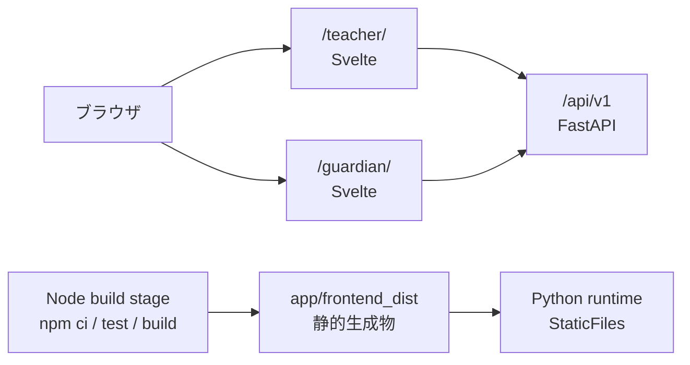

# Svelte 移行作業手順書

## 目的

`app/web/`（先生用）と `app/guardian/`（保護者用）を Svelte 5 / SvelteKit へ段階的に移行する。
API、認証、利用者向け文言の契約を保ちながら、先生用の各画面とレビュー待ち日誌 1 件ごとに URL を割り当て、巨大な単一 JavaScript ファイルをテスト可能な機能単位へ分割する。

この手順では、実装をコーディネーター自身が抱え込まない。コーディネーターは契約の固定、下位サブエージェントの並列起動、統合、受け入れ判定を担当し、プロダクションコードは所有範囲を明示した下位サブエージェントに実装させる。

## 完了時の構成

- Svelte 5 の runes モードと TypeScript を使う。
- SvelteKit のファイルベースルーティングで、先生用の各画面とレビュー待ち日誌 1 件ごとの URL を持つ。
- `@sveltejs/adapter-static` で静的 asset と SPA fallback を生成する。先生用は認証付き CSR、保護者用は静的ページとして扱う。
- FastAPI が生成物を配信し、ブラウザから `/api/v1` を同一オリジンで呼ぶ。
- Node.js は開発時とビルド時だけ必要とし、本番の Python ランタイムイメージには含めない。
- `/teacher/review/{recordId}/` を直接開いた場合も、認証・認可後に対象の日誌を復元できる。
- `/guardian/#ssa_...` のハッシュは保護者アーカイブトークン専用のまま維持する。ハッシュルーターには使わない。
- 旧 UI は切り替え後も 1 リリースだけ残し、ロールバック可能にする。



## 変更しない契約

移行中に次を変更しない。変更が必要になった場合は、Svelte 移行とは別の設計・コミット・レビューに分ける。

| 契約 | 維持する内容 |
| --- | --- |
| API | 既存 API のパス、HTTP メソッド、入出力、エラーコード。例外として読み取り専用の `GET /api/v1/records/{record_id}` だけを追加する |
| 先生認証 | Supabase password login、`Authorization: Bearer`、`sessionStorage` の `small-step.access-token` |
| 保護者認証 | `/guardian/#ssa_...`、`small-step.guardian-archive-token`、URL からハッシュを消してから API を呼ぶ流れ |
| 権限 | `teacher` と `school_admin`。UI の非表示は補助であり、認可の本体は FastAPI |
| 秘密情報 | 端末 API キー、招待コード、保護者 URL は一度だけ表示し、少なくとも園切り替え・ログアウト・次の発行／再発行操作で既存どおり消す |
| プライバシー | 生音声と生の文字起こしを API のデータベースへ持ち込まない |
| ネットワーク | 先生画面は外部 CDN、外部フォント、テレメトリを一切呼ばない |
| UI | 日本語文言、キーボード操作、フォーカス復帰、`aria-live`、確認ダイアログのキャンセル優先動作 |

関連設計は [フロントエンド](architecture/frontend.md)、[認証・認可](architecture/auth.md)、[画面遷移](transition.md) を参照する。

## 採用方針

### SvelteKit を画面ルーター兼静的ビルダーとして使う

公式は新規 Svelte アプリに SvelteKit を推奨している。本プロジェクトでは SvelteKit のサーバー機能へ業務ロジックを移さず、ファイルベースルーティングと `adapter-static` によるビルドを使う。バックエンドと認可の本体は引き続き FastAPI とする。

先生用画面は `sessionStorage` の token を使う認証済みアプリであり、日誌 ID は実行時に増える。そのため `/teacher/*` は CSR の SPA とし、`adapter-static` が生成する `200.html` を FastAPI から teacher の深い URL にだけ返す。保護者用 `/guardian/` は静的生成し、`#ssa_...` は router ではなく既存の archive token として扱う。

SvelteKit の生成物にはページ、`200.html`、共有 asset の `/_app/` が含まれる。FastAPI は API、実在 asset、guardian の静的ページを優先し、最後に `/teacher/*` だけを `200.html` へ fallback する。欠損した `/_app/*.js`、`/api/*`、`/guardian/*` を `200.html` へ fallback してはならない。

### URL 設計

| 画面 | 本番 URL |
| --- | --- |
| ホーム | `/teacher/` |
| レビュー待ち一覧 | `/teacher/review/` |
| 日誌 1 件のレビュー | `/teacher/review/{recordId}/` |
| 日誌の手入力 | `/teacher/review/new/` |
| 記録履歴 | `/teacher/records/` |
| 通知状況 | `/teacher/notifications/` |
| 音声処理状況 | `/teacher/audio-jobs/` |
| 園児・保護者 | `/teacher/children/` |
| 声紋設定 | `/teacher/voice-consent/` |
| 園の設定 | `/teacher/settings/` |
| 先生管理 | `/teacher/teachers/` |
| 録音端末 | `/teacher/devices/` |
| 稼働準備チェック | `/teacher/readiness/` |
| 操作履歴 | `/teacher/audit/` |
| 保護者アーカイブ | `/guardian/#ssa_...` |

管理者専用 URL を一般先生が開いた場合は、認証後に `/teacher/` へ戻して案内を表示する。これは UI の補助であり、API は従来どおりサーバー側で権限を拒否する。URL に園児名、本文、LINE ID を入れず、日誌の UUID だけを使う。

配信契約は基盤実装の最初に次の表で固定する。

| 段階 | URL | 配信元 | FastAPI の順序 |
| --- | --- | --- | --- |
| preview | `/api/v1/*`、`/docs` | 既存 FastAPI route | 最初 |
| preview | `/teacher/`、`/guardian/` | 旧 `app/web`、`app/guardian` | API の後 |
| preview | `/teacher-next/*` | SvelteKit の `200.html` | 実在 asset の後に teacher-next 限定 fallback |
| preview | `/guardian-next/`、`/_app/*` | SvelteKit の生成ルート `app/frontend_dist` | API と旧 UI の後 |
| cutover | `/api/v1/*`、`/docs` | 既存 FastAPI route | 最初 |
| cutover | `/guardian/`、`/_app/*` | `app/frontend_dist` | API の後 |
| cutover | `/teacher/*` | SvelteKit の `200.html` | 実在 asset の後に teacher 限定 fallback |

preview 中の SvelteKit route directory と FastAPI fallback prefix は `teacher-next` と `guardian-next` にする。切り替えコミットで directory と prefix を `teacher` と `guardian` へ rename し、旧 2 mount を外す。各段階で HTML 内の `/_app/` 参照を抽出し、全 asset が 200 になる配信契約テストを実行する。

想定する主要設定は次のとおり。

```ts
// frontend/src/routes/+layout.ts
export const trailingSlash = 'always';
```

```ts
// frontend/src/routes/teacher-next/+layout.ts（preview 中）
export const ssr = false;
export const prerender = false;
```

```ts
// frontend/src/routes/guardian-next/+page.ts（preview 中）
export const prerender = true;
```

```js
// frontend/svelte.config.js（概略）
import adapter from '@sveltejs/adapter-static';

export default {
  kit: {
    adapter: adapter({
      pages: '../app/frontend_dist',
      assets: '../app/frontend_dist',
      fallback: '200.html',
      strict: true
    })
  }
};
```

生成先の正確なパスは基盤担当が Windows、Docker、CI の 3 環境で検証してから固定する。`app/frontend_dist/` は生成物専用とし、手書きファイルを置かない。

### Svelte 5 の実装規約

- 新規コードは runes モードだけを使う。`$state`、`$derived`、`$props`、`onclick` など現在の構文を使い、`$:`、`export let`、`on:click` などの legacy API は持ち込まない。
- `$state` は UI を実際に更新する値だけに使う。API 応答を丸ごと差し替える配列・大きなオブジェクトは `$state.raw` を優先する。
- 件数、選択中データ、フィルター結果などは `$derived` / `$derived.by` で表す。派生値を `$effect` から書き戻さない。
- `$effect` は外部システムとの同期や後始末が必要な場合の最終手段にする。ユーザー操作はイベントハンドラー、初期取得は明示的な初期化関数、派生値は `$derived` に置く。
- API 応答、認証状態、UI の一時状態を分ける。全状態を 1 個の巨大 store に戻さない。
- 共有状態はグローバルな singleton ではなく、型付き context または画面ごとの状態クラスに閉じ込める。
- プリレンダー中には `window`、`location`、`history`、`sessionStorage` がない。これらへ module top-level からアクセスせず、ブラウザ側の初期化関数を `onMount` から呼ぶ。
- `{#each}` は安定した ID をキーにする。配列 index をキーにしない。
- DOM を直接組み立てず、セマンティック HTML と Svelte コンポーネントで表現する。`{@html}` は使わない。
- コンポーネントは見た目の断片ではなく、独立してテストできる責務で分ける。巨大な `+page.svelte` を作らない。
- 実験的な async 機能は、移行の完了条件に含めない。

### 推奨ディレクトリ

```text
frontend/
  src/
    lib/
      api/                 # client、error、型
      auth/                # teacher / guardian のセッション処理
      components/          # Button、Icon、Notice、ConfirmDialog など
      design/              # DADS に対応するトークン
      features/
        records/
        notifications/
        children/
        teachers/
        devices/
        operations/
        voice-consent/
      state/               # school context と画面単位の状態
    routes/
      teacher-next/               # preview 中。cutover で teacher へ rename
        +layout.svelte            # 認証、園選択、ナビ、共通シェル
        +layout.ts                # ssr=false / prerender=false
        +page.svelte              # ホーム
        review/
          +page.svelte            # レビュー待ち一覧
          new/+page.svelte        # 手入力
          [recordId]/+page.svelte # 日誌 1 件のレビュー
        records/+page.svelte
        notifications/+page.svelte
        audio-jobs/+page.svelte
        children/+page.svelte
        voice-consent/+page.svelte
        settings/+page.svelte
        teachers/+page.svelte
        devices/+page.svelte
        readiness/+page.svelte
        audit/+page.svelte
      guardian-next/              # preview 中。cutover で guardian へ rename
        +page.ts                  # prerender=true
        +page.svelte
      +layout.ts
    app.css
  tests/
    e2e/
  package.json
  package-lock.json
  svelte.config.js
  vite.config.ts
```

### ルート直下の変更範囲

| 場所 | 変更内容 |
| --- | --- |
| `frontend/` | 新規。SvelteKit、TypeScript、unit/component/E2E test、全画面と routing |
| `app/main.py` | Svelte asset、guardian 静的ページ、teacher 限定 SPA fallback の配信 |
| `app/api/routes.py` | 読み取り専用の `GET /api/v1/records/{record_id}` を追加 |
| `tests/` | 日誌単体取得の認可テストと FastAPI 配信契約テスト |
| `docs/` | URL、フロントエンド、デプロイ、移行手順を更新 |
| `Dockerfile` | Node build stage を追加し、生成物だけを Python runtime へ copy |
| `.dockerignore` | `node_modules`、ローカル生成物を除外 |
| `.gitignore` | `.svelte-kit`、`node_modules`、`app/frontend_dist` を除外 |
| `README.md` | frontend の開発、テスト、build、起動手順を追加 |

`compose.yaml` は原則変更しない。開発用 frontend service を明示的に追加すると決めた場合だけ対象にする。`migrations/`、`scripts/`、`data/`、DB model、既存 schema、LINE、Notion、音声処理は変更対象外とする。

## サブエージェント運用

### 原則

1. コーディネーターは最初に URL、API、storage key、公開型、共有コンポーネントの契約を文書化する。
2. 各下位サブエージェントには、担当ディレクトリと「触ってはいけない共有ファイル」を明示する。
3. 並列作業は別ブランチ・別 worktree で行う。同一 worktree で並列に `git commit` しない。
4. `package.json`、`package-lock.json`、Svelte/Vite 設定、共通 API client は基盤担当だけが所有する。
5. サブエージェントはテストを追加し、担当テストが green の小さなコミット列として引き渡す。
6. コーディネーターはコミットを順に取り込み、取り込みごとに回帰テストを行う。競合解消や接着コードが必要な場合は、該当担当または統合専任の下位サブエージェントへ戻す。未検証の作業ツリーをまとめてコミットしない。
7. サブエージェントには「他の担当者も同じリポジトリで作業している。担当外の変更を戻さず、共有契約の変更が必要なら停止して報告する」と必ず伝える。

### worktree の準備例

開始前に現在の未コミット変更を確認し、ユーザーの変更を勝手に退避・破棄しない。作業ツリーが clean であることを確認できた場合だけ、次のように分ける。

最初は scaffold 用だけを作る。

```powershell
git worktree add -b feat/svelte-foundation ..\small-step-fe-foundation
```

scaffold を統合して `BASE_COMMIT` を記録した後、その同じ commit から並列担当を分岐する。

```powershell
git worktree add -b feat/svelte-api ..\small-step-fe-api BASE_COMMIT
git worktree add -b feat/svelte-design ..\small-step-fe-design BASE_COMMIT
git worktree add -b feat/record-detail-api ..\small-step-record-detail-api BASE_COMMIT
```

worktree の作成や削除はコーディネーターだけが行う。削除時は対象の絶対パスと未コミット変更がないことを確認する。

### 依頼テンプレート

```text
Small Step の Svelte 移行を担当してください。

所有範囲:
- <担当ディレクトリ/ファイル>

禁止:
- 担当外ファイルを編集しない
- API、URL、sessionStorage key、日本語文言を変更しない
- 他担当者の変更を revert しない
- legacy Svelte API と {@html} を使わない

必須:
- CLAUDE.md と関連設計文書を先に読む
- Svelte 5 runes + TypeScript で実装する
- loading / empty / error / 権限差分をテストする
- 実装とテストを同じ小さなコミットに含める
- 各コミット前に npm run check と担当テストを実行する
- 完了時にコミット一覧、実行したテスト、残課題を報告する

他の担当者も同じリポジトリで作業しています。共有契約の変更が必要なら、
独断で変更せずコーディネーターへ報告してください。
```

## 実施手順

### 0. ベースラインを固定する

担当: 調査サブエージェント 2 名を並列起動し、コーディネーターが結果を照合する。

1. 現在の作業ツリーとテスト結果を記録する。

   ```powershell
   git status --short
   .\.venv\Scripts\python.exe -m pytest
   ```

2. 現行画面の機能一覧を [画面遷移](transition.md) と照合する。最低でも次を一覧化する。
   - 認証、初回紐付け、bootstrap、ログアウト
   - URL 設計表にある先生用全画面と、画面入場時の再取得
   - 一般先生と管理者の表示差分
   - 一度きりの秘密表示と、現行実装で実際に消去される条件
   - CSV、確認ダイアログ、タイムアウト、503 readiness の特例
   - 保護者トークンの hash → sessionStorage → URL 消去
3. 主要画面を desktop / mobile、loading / empty / error、`teacher` / `school_admin` で記録する。
4. 移行中に修正する既知バグと、見た目を維持する項目を分ける。フレームワーク移行と無関係な仕様変更を混ぜない。ビュー離脱だけで一度きりの秘密を消す強化を採用する場合も、現行パリティではなく独立したセキュリティ改善として別コミットにする。

終了条件:

- 現行 `pytest` の結果が記録されている。
- 機能パリティ表と受け入れシナリオが作られている。
- API、URL、認証、storage、秘密情報の契約が固定されている。

### 1. 基盤を依存順に作り、共通実装を並列化する

基盤は依存関係があるため 2 段階で進める。scaffold のない branch で component test を書き始めない。

#### 1-A. scaffold と配信基盤

A を単独で起動し、次を実装・テスト・コミットさせる。

| 担当 | 所有範囲 | 成果物 |
| --- | --- | --- |
| A: toolchain / delivery | `frontend/package*.json`、Svelte/Vite 設定、`app/main.py`、新規 `tests/test_frontend_delivery.py`、Docker、ignore | SvelteKit scaffold、固定 Node 版、`npm ci`、multi-stage build、teacher 限定 fallback、preview 配信 |

A は unit/component test、Playwright、axe を含む、この手順で必要になる依存と設定を先に揃える。以後、A だけが package と lockfile を所有する。追加依存が必要になった場合も、機能担当が直接変更せず A に追補コミットを依頼する。

生成物のライフサイクルも A が固定する。

- `app/frontend_dist/` は `.gitignore` 対象とし、生成物を commit しない。
- preview 期間は、必要な index と `/_app/` が揃っている場合だけ Svelte 生成物を mount する。生成物がない clean checkout でも旧 UI と Python-only test は動く。
- production の cutover 後は生成物を必須とし、不足時は起動時に明確なエラーを出す。
- frontend の配信契約テストは `npm run build` 後にだけ実行し、生成物がなければ skip ではなく失敗させる。
- Docker は Node build stage で `npm ci`、check、test、build を実行し、Python runtime stage へ `app/frontend_dist` だけを copy する。
- CI は frontend build → 配信契約 pytest → backend 全 pytest → E2E → Docker smoke の順にする。
- local の Svelte 開発サーバーは `/api/v1` を FastAPI へ proxy する。FastAPI だけを触るテストは frontend build を要求しない。
- preview の時点で、HTML は no-cache/短期 cache、content hash 付き asset は長期 immutable とし、header test を追加する。

A のコミットを取り込み、format、check、空ページの unit、build、clean checkout 相当の Python test、Docker build が通った commit を `BASE_COMMIT` として記録する。

#### 1-B. 共通コードを並列実装

`BASE_COMMIT` から B、C、D の worktree を作り、3 サブエージェントを同時に起動する。

| 担当 | 所有範囲 | 成果物 |
| --- | --- | --- |
| B: API / state contract | `frontend/src/lib/api/`、`auth/`、`state/` と単体テスト | 型付き API client、日誌単体取得、timeout、安全な error、Bearer、204、session、横断更新契約 |
| C: design / test primitives | `components/`、`design/` と component test | Icon、Button、Notice、Loading、ConfirmDialog、StatusBadge、DADS tokens |
| D: record detail API | `app/api/routes.py`、新規 `tests/test_record_detail_api.py` | `GET /api/v1/records/{record_id}`、既存認可の再利用、API 回帰テスト |

B は後続の機能が独自の再取得処理を持たないよう、次の公開契約を先に用意する。

- `SchoolContext`: 選択中の園と、園変更時の状態初期化。
- `NavigationIntent`: feature から別 route へ移る要求。URL、履歴、フォーカス移動を一貫させる。
- `InvalidationScope`: `records`、`notifications`、`children`、`invitations`、`audioJobs` など、更新後に再取得する領域を型で指定する。
- `AppController.refresh(scopes)`: 複数領域を重複なく再取得し、home の派生件数も更新する。
- `getRecord(recordId)`: 一覧を探索せず、日誌単体取得 API から直接 URL の対象を復元する。

園児の退園・復帰、LINE 解除、承認など複数 feature に影響する操作は、各 feature が共有 state を直接書き換えず、この契約へ更新範囲を通知する。

D は既存の `RecordRead`、`require_entity`、`assert_record_access` を再利用し、DB model、schema、migration を増やさない。固定 route の `/records/export.csv` を動的 route が横取りしないよう、`GET /records/{record_id}` は export route より後に定義する。最低でも次をテストする。

- 同じ園の管理者は取得できる。
- 一般先生は自分の記録だけ取得でき、同じ園の別の先生の記録は 403 になる。
- 別の園の記録は拒否され、存在しない ID は 404 になる。
- `pending_review` だけでなく承認済み・却下済みも直接 URL から再取得できる。
- 応答は既存の `RecordRead` と一致し、token や一度きりの秘密を含まない。

基盤で用意する npm script:

```text
npm run format:check
npm run lint
npm run check
npm run test:unit
npm run test:e2e
npm run build
```

API client のテストでは次を固定する。

- token がある場合だけ Bearer を付ける。
- 204 は `null` として扱う。
- API エラーの `detail` は文字列の場合だけ表示し、未知の本文や HTML を画面へ出さない。
- 15 秒タイムアウトとキャンセルを区別できる。
- CSV/blob と readiness の 503 JSON を扱える。
- ログに token、園児名、通知文、LINE ID を出さない。
- session helper は import 時に `window` や storage へ触れず、`onMount` から呼べる browser-only API としてテストする。

コミット例:

```text
chore(frontend): scaffold static SvelteKit build
test(frontend): add API client contract tests
feat(frontend): add typed API client and session helpers
feat(frontend): add accessible shared UI primitives
feat(api): add authorized record detail endpoint
build: serve preview Svelte assets from FastAPI
```

終了条件:

- `/guardian-next/` は prerender され、`/teacher-next/*` は `200.html` から CSR で起動する。
- `/teacher-next/review/<recordId>/` を直接要求すると teacher-next 限定 fallback が HTML を返し、`GET /api/v1/records/{record_id}` で対象を復元できる。
- 旧 `/teacher/` と `/guardian/` はまだ変更されていない。
- `npm run check && npm run test:unit && npm run build` が成功する。
- HTML が参照する `/_app/` asset がすべて FastAPI 経由で 200 になる。
- 生成物がない clean checkout 相当でも backend の Python-only test が動き、production では生成物不足が明示的に失敗する。
- cache header の契約テストが preview URL で成功する。
- Docker の Python runtime layer に Node.js と `node_modules` が残らない。

### 2. 保護者画面を先に縦切りで移す

担当: guardian サブエージェント。

保護者画面は小さいため、Svelte、静的生成、FastAPI 配信、同一オリジン API の結合を早く検証できる。

1. `/guardian-next/` に実装する。
2. `onMount` から browser-only 初期化を呼び、`location.hash` から `ssa_...` を取得して、即座に `history.replaceState` で URL から消す。module top-level と import 時には browser API へ触れない。
3. token を既存 key で `sessionStorage` に保存する。
4. `/api/v1/guardian/archive` を Bearer 付きで取得する。
5. loading、0 件、成功、期限切れ・失効、ネットワーク失敗を実装する。
6. 失敗時は token を消し、「園から届いた最新の URL」を案内する既存文言を保つ。
7. `<meta name="referrer" content="no-referrer">` を維持する。

必須テスト:

- hash が API 呼び出し前にアドレスバーから消える。
- token を DOM、ログ、エラー文へ出さない。
- 有効・無効・空の archive を描画できる。
- 再読み込み時は sessionStorage の token を使える。
- prerender build が成功し、SSR 中に `window is not defined` などを起こさない。

コミット例:

```text
test(guardian): cover archive token lifecycle
feat(guardian): migrate archive page to Svelte
```

### 3. 先生用の認証とシェルを移す

担当: teacher-shell サブエージェント。

1. `/teacher-next/` に login、bootstrap、AppShell、ナビゲーション、園選択を実装する。
2. development mode はログインを省略し、既存どおり管理者として開始する。
3. Supabase login → `/auth/me` → link → bootstrap の分岐を再現する。
4. `onMount` から browser-only session 初期化を呼ぶ。token は既存 key の sessionStorage だけに置き、localStorage、cookie、永続 store へコピーしない。
5. ログアウト時は token に加え、API 応答、一度きりの秘密、選択・編集中状態を明示的に消す。
6. 管理者専用 route は DOM に描画しない。一般先生が URL を直接開いた場合も、認証後に `/teacher-next/` へ移動して案内する。
7. URL 表に対応する route の空ページを用意し、ナビゲーションは SvelteKit の link / `goto` に統一する。`activeView` のようなメモリ内状態で画面を切り替えない。
8. reload、Back、Forward で同じ画面を復元し、編集中に別 route へ移る場合は未保存変更の確認を出す。

必須テスト:

- development、Supabase success、401、403 link、404 bootstrap、logout。
- `teacher` の DOM に管理者専用ナビ・ビューが存在しない。
- 園切り替え時に選択、編集中、一度きりの秘密が消える。
- 現在地の `aria-current="page"` とフォーカス移動が正しい。
- 各 route の直接表示、reload、Back、Forward が正しい。
- 不明な teacher route はアプリ内の「ページが見つかりません」へ着地し、管理者専用 route は権限確認前に内容を描画しない。

コミット例:

```text
test(teacher): cover auth and role transitions
feat(teacher): add Svelte authentication flow
feat(teacher): add accessible application shell
```

### 4. 先生用機能を 3 系統で並列移行する

手順 3 が統合され green になり、手順 1-B の `NavigationIntent`、`InvalidationScope`、`AppController.refresh` を shell から利用できることを component test で確認してから、次の 3 サブエージェントを同時に起動する。route family を重複なく所有させ、Playwright 設定、共通 layout、共有 component は編集させない。統合は各担当の公開 component / controller / route をコーディネーターが取り込んだ後、専任の統合サブエージェントに行わせる。

| 担当 | 所有する機能と route | 特に守ること |
| --- | --- | --- |
| E: records | `features/records/`、`review/**`、`records/**` | 一覧・`[recordId]`・手入力・履歴・CSV、承認／却下前の確認、4,000 文字、配信時刻 |
| F: people / admin | `features/children/`、`teachers/`、`devices/` と `children/**`、`teachers/**`、`devices/**`、`settings/**` | 一度きりの code/key/URL、自分自身の無効化禁止、管理者限定 |
| G: operations | `features/notifications/`、`operations/`、`voice-consent/` と `notifications/**`、`audio-jobs/**`、`readiness/**`、`audit/**`、`voice-consent/**` | 503 特例、CSV、再送・取消・再予定、同意取消 |

各機能は次の順で移す。

1. API 型と service。
2. 読み取り表示の loading / empty / error。
3. filter、選択、フォームの UI 状態。
4. 更新操作と成功後の再取得。
5. 破壊的操作の ConfirmDialog。
6. `teacher` / `school_admin` 差分。
7. service の unit test と component test。Playwright E2E は page へ統合されてから手順 5 で追加する。

records 担当 E は `/teacher-next/review/` の一覧から `/teacher-next/review/{recordId}/` へ遷移させ、route parameter を `getRecord(recordId)` に渡す。承認・却下後は次のレビュー待ち日誌へ進み、残件がなければ一覧へ戻す。404、403、既にレビュー済みの状態をそれぞれ表示し、一覧取得の先頭 100/200 件を探して詳細を復元する実装にはしない。

1 機能を大きな 1 コミットにしない。「service + test」「read-only UI + test」「mutation + test」のように、失敗時に 1 つずつ戻せる単位でコミットする。

終了条件:

- [画面遷移](transition.md) の全ビュー・全操作がパリティ表で完了している。
- 複数 feature へ影響する操作が `InvalidationScope` を通り、home、records、notifications、children などを漏れなく更新する。
- すべての list は ID を使った keyed each になっている。
- `document.querySelector`、`innerHTML`、`{@html}` に依存していない。
- 一度きりの秘密が、現行と同じ園変更・ログアウト・次の発行／再発行操作で消える。ビュー離脱でも消す強化を入れた場合は、別コミットとテストで確認する。
- URL から日誌 1 件を直接開け、URL には UUID 以外の園児名、本文、LINE ID が含まれない。

### 5. 統合とデザイン適合を行う

統合と共有コンポーネントの修正は同じ DOM を触るため、ここは無理に並列化しない。H の統合を green にしてから I を起動する。

#### 5-A. 機能統合と E2E

| 担当 | 所有範囲 |
| --- | --- |
| H: integration / E2E | `routes/teacher-next/+page.svelte`、`tests/e2e/functional/`、横断シナリオ |

H は E/F/G の route と公開 component を shell に接続し、`NavigationIntent` と `InvalidationScope` の横断シナリオを Playwright で検証する。H は共有 component の内部や CSS を変更せず、不足があれば元の担当へ戻す。

#### 5-B. accessibility / DADS

H の統合後、I を起動する。

| 担当 | 所有範囲 |
| --- | --- |
| I: accessibility / DADS | CSS、共有 component、`tests/e2e/a11y/`、キーボード・contrast・responsive 検証 |

I は変更前に、該当する DADS 原文を直接読む。

- [カラー](reference/dads/foundations/color/index.md)
- [余白](reference/dads/foundations/spacing/index.md)
- [タイポグラフィ](reference/dads/foundations/typography/index.md)
- [レイアウト](reference/dads/foundations/layout/index.md)
- [角の形状](reference/dads/foundations/corner-shapes/index.md)
- [アクセシビリティ](reference/dads/guidance/accessibility/index.md)

最低限の検証項目:

- 本文 4.5:1、識別に必要な枠線・アイコン 3:1。
- 色だけで状態を表さず、アイコンまたは文言を併用する。
- `:focus-visible` は Yellow-300 `#ffd43d` と Black の 2 重構造を維持する。
- 余白は 8px 基準、実効スケールは 3〜5 段階へ整理する。
- Noto Sans JP / Noto Sans Mono、weight 400 / 700。
- skip link、見出し階層、label、`aria-live`、dialog の ESC / cancel / 背景 click。
- `forced-colors: active` と `prefers-reduced-motion: reduce`。
- 767px 以下と 1024px 以上を含む responsive 表示。
- 先生画面の HTML、CSS、JS に外部 origin が含まれない。

I は A が導入済みの axe 依存と Playwright 設定を使い、package / lockfile / 共通設定を変更しない。修正後は a11y だけでなく H の functional E2E も全件再実行する。

DADS の既知差分修正は、機能移行コミットと分ける。

```text
fix(a11y): restore DADS focus indicator
fix(design): align border contrast with DADS tokens
refactor(styles): reduce spacing scale to DADS rhythm
```

### 6. テストを段階的に置き換える

現在の `tests/test_api.py` は旧 HTML の ID や旧 JavaScript 関数名を文字列で多数検査している。Svelte 化後にそれらを新 bundle の文字列へ置き換えてはならない。責務別に次へ移す。

#### unit / component

Vitest と Svelte Testing Library を使い、利用者に見える振る舞いを検査する。

- API client: header、204、timeout、401/403、unknown error、CSV/blob。
- state/controller: derived count、filter、選択、園変更、logout cleanup。
- component: loading、empty、error、role、disabled、確認 dialog、フォーカス復帰。
- guardian: hash と sessionStorage の token lifecycle。

#### E2E

Playwright で次の最小シナリオを自動化する。

1. development mode で起動し、home からレビュー待ちへ移動して URL が変わる。
2. レビュー待ち一覧から 1 件を開き、`/teacher/review/{recordId}/` の直接表示、reload、Back、Forward で同じ日誌を復元する。
3. 手入力記録を作成し、編集して承認する。承認後は次の未レビュー日誌または一覧へ移る。
4. 記録を却下し、キャンセル時には実行されないこと、既に処理済みの日誌を再表示できることを確認する。
5. 通知の filter、再予定、取消、CSV を確認する。
6. 園児の作成・編集・退園・復帰と、一度きりの秘密表示を確認する。
7. guardian の有効 token、期限切れ token、再読み込みを確認する。
8. keyboard only、mobile viewport、axe の重大違反なしを確認する。

development mode は常に管理者なので、一般先生の DOM 差分は component test または Supabase 認証を mock した E2E で確認する。

#### FastAPI 配信契約

Python 側は次だけを検査する。

- `/teacher` と `/guardian` の末尾 slash 契約。
- `/teacher/` と `/guardian/` が 200 と HTML を返す。
- `/teacher/review/<recordId>/` の直接要求が teacher 限定 fallback から HTML を返す。
- HTML から参照される hashed JS/CSS が 200 かつ正しい Content-Type である。
- 不明な `/teacher/*` はアプリ shell を返した後に client-side 404 を表示する。
- 欠損 `/_app/*`、`/api/*`、`/guardian/*`、teacher 外の未定義 URL は fallback せず 404 になる。
- `GET /api/v1/records/{record_id}` が SPA fallback に奪われず、JSON と既存の認可結果を返す。
- 先生用 HTML/asset に外部 origin がない。
- `/api/v1/health` と `/api/v1/readiness` が従来どおり動く。

#### テストゲート

| タイミング | 必須コマンド |
| --- | --- |
| 各コミット前 | `npm run check`、担当 Vitest |
| サブエージェント引き渡し前 | format、lint、check、unit、build |
| 各 feature 統合後 | frontend 全 unit、該当 pytest、Playwright smoke |
| 各 wave 完了時 | frontend 全件、Python 全件、production build |
| 切り替え前 | 上記すべて、Docker build、Docker 上の E2E smoke |

Windows での実行例:

```powershell
Push-Location frontend
npm ci
npm run format:check
npm run lint
npm run check
npm run test:unit
npm run build
Pop-Location

.\.venv\Scripts\python.exe -m pytest
docker compose up -d --build
```

テスト失敗を抱えたまま次のコミットへ進まない。環境要因で実行できないテストは「未実施」としてコマンドと理由を引き渡し報告に残し、成功扱いにしない。

### 7. preview から本番 URL へ切り替える

1. `/teacher-next/` と `/guardian-next/` で受け入れテストを完了する。
2. route directory と FastAPI の限定 fallback prefix を `/teacher/` と `/guardian/` に変更し、旧 UI の 2 mount を外して Svelte build へ切り替える。
3. URL 切り替えだけを独立コミットにする。機能、API、DB migration を混ぜない。
4. `docker compose up -d --build` で新規イメージを作り、コンテナ内の静的生成物を確認する。
5. teacher login、record review、guardian token の smoke test を実行する。
6. 手順 1-A で検証済みの cache header が本番 URL でも同じで、HTML と asset の世代が混ざらないことを確認する。この段階で新しい middleware は追加しない。
7. README、`docs/architecture/frontend.md`、`docs/architecture/deployment.md`、`docs/transition.md` を実装に合わせて更新する。

切り替えコミット例:

```text
build(frontend): switch teacher and guardian routes to Svelte
docs(frontend): document Svelte development and deployment
```

### 8. ロールバックを確認する

切り替え前に、直前の Docker image tag と戻すコミットを記録する。

ロールバック条件:

- login または guardian token 解決ができない。
- 承認・却下・通知操作でデータ契約の回帰がある。
- 一般先生に管理者 UI が出る。
- token が DOM やログへ出る。または API key、招待コード、保護者 URL が対象画面を離れた後、園変更後、ログアウト後にも DOM や状態へ残る。
- 主要ブラウザで画面が起動しない。
- `/teacher/review/{recordId}/` の直接表示、reload、Back、Forward のいずれかで対象の日誌を復元できない。
- SPA fallback が API や欠損 asset を HTML に置き換える。

ロールバック手順:

1. 新 UI での更新操作を止める。
2. mount 切り替えコミットを revert するか、直前の Docker image を再デプロイする。
3. `/teacher/`、`/guardian/#ssa_...`、`/api/v1/health` を確認する。
4. 失敗した操作と時刻だけを記録し、秘密情報や園児の内容をログへ残さない。
5. 原因修正は新しい小コミットで行い、同じ受け入れゲートを通す。

旧 `app/web/` と `app/guardian/` は切り替え後 1 リリース保持する。問題がないことを確認してから、旧資産削除を独立コミットで行う。

## コミット・統合規約

- 1 コミットは 1 つの説明可能な変更にする。生成基盤、機能、デザイン修正、URL 切り替えを混ぜない。
- テストは対象実装と同じコミット、または実装より先の red テストコミットに含める。
- `git add .` を避け、所有範囲のファイルだけを stage する。
- commit 前後に `git diff --check` と `git status --short` を確認する。
- merge commit を大量に作らず、コーディネーターが検証済みの小コミットを順序どおり cherry-pick する。
- 競合解消後は、競合した機能の targeted test を必ず再実行する。
- lockfile の競合を手編集で寄せ集めない。基盤担当の `package.json` を正として `npm install` で再生成し、`npm ci` で検証する。
- コミットメッセージは `feat(teacher): ...`、`test(guardian): ...`、`build(frontend): ...` のように範囲を明示する。

## Definition of Done

- URL 設計表の全 teacher route と `/guardian/#ssa_...` が利用できる。
- `/teacher/review/{recordId}/` を直接開いて認証・認可後に同じ日誌を復元でき、reload、Back、Forward も動く。
- 画面遷移図の全機能がパリティ表で完了している。
- Svelte 5 runes / TypeScript で構成され、legacy API、`{@html}`、巨大な global store がない。
- API、sessionStorage、権限、一度きりの秘密、外部通信禁止の契約を守っている。
- `GET /api/v1/records/{record_id}` は既存 `RecordRead` と `assert_record_access` を再利用し、DB schema / migration を変更していない。
- DADS と WCAG の主要基準を自動・手動で確認している。
- frontend の format、lint、check、unit、build、E2E が成功している。
- Python 全テストと Docker smoke test が成功している。
- Node.js が本番 Python runtime image に含まれていない。
- README と architecture / deployment / transition 文書が実装と一致している。
- ロールバック方法と直前 image tag が記録されている。
- 旧 UI の削除は安定稼働を 1 リリース確認した後の別コミットになっている。

## 公式資料

- [Svelte: Getting started](https://svelte.dev/docs/svelte/getting-started)
- [Svelte: Best practices](https://svelte.dev/docs/svelte/best-practices)
- [Svelte: Testing](https://svelte.dev/docs/svelte/testing)
- [SvelteKit: Static site generation](https://svelte.dev/docs/kit/adapter-static)
- [SvelteKit: Single-page apps](https://svelte.dev/docs/kit/single-page-apps)
