# 画面遷移図

> **状態: Svelte 切り替え実装済み（2026-09-14）**
>
> この文書の前半は現在の Svelte 画面と canonical URL を示します。実運用環境へのデプロイ確認は未完了です。
> 後半の「参考: 移行前の現行実装」はロールバック判断のために残す履歴であり、現在はマウントされていません。

## 1. 移行後の全体構成

先生用アプリは SvelteKit のファイルベースルーティングを使い、画面ごとに URL を持ちます。FastAPI は API と静的 asset を先に処理し、実在しない `/teacher/*` だけを SvelteKit の SPA fallback へ渡します。保護者用アプリは静的ページのままとし、URL の hash はルーティングではなく既存のアーカイブトークンに使います。

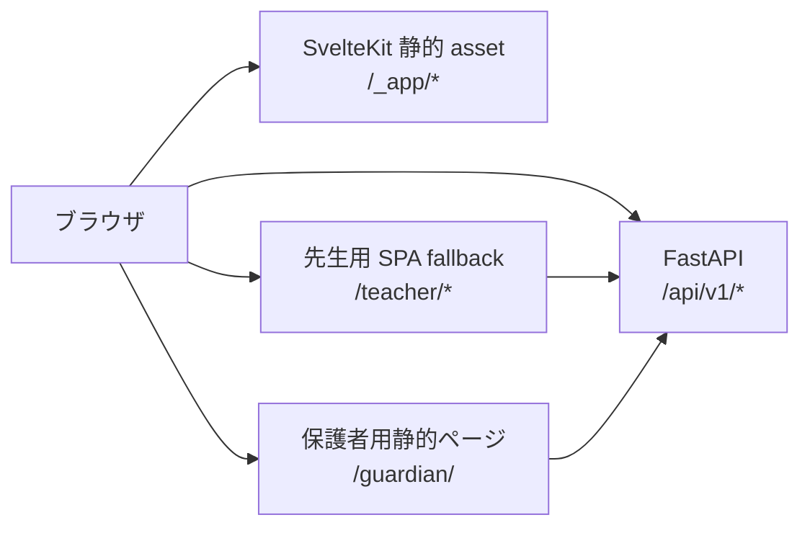

配信の優先順位は次のとおりです。

1. `/api/v1/*` と `/docs` を既存の FastAPI route で処理する。
2. `/_app/*` と実在する静的ファイルを返す。
3. `/guardian/` の生成済みページを返す。
4. 上記に一致しない `/teacher/*` だけを `200.html` へ fallback する。
5. 欠損 asset、API、guardian、teacher 外の不明な URL は 404 にする。

## 2. 先生用アプリのURLと画面遷移

共通の AppShell が認証、園選択、ナビゲーションを担当します。各画面は独立した URL を持ち、サイドバーから 1 ホップで移動できます。

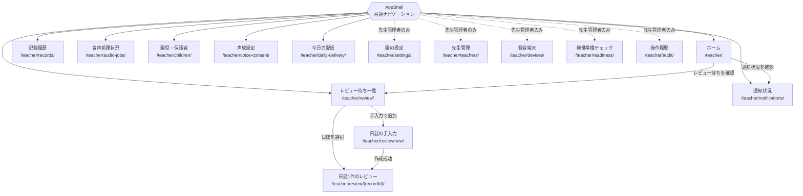

URL には日誌の不透明な UUID だけを使用し、園児名、本文、LINE ID、token を含めません。

### 共通操作

- サイドバーは通常の link または SvelteKit の `goto` で URL を変更します。
- Back、Forward、ブックマーク、再読み込みで同じ画面を復元します。
- ナビゲーション後はページ見出しへフォーカスを移し、現在地に `aria-current="page"` を付けます。
- 園セレクタは現在の route を保って再取得します。ただし、園に属する選択状態、編集中データ、一度きりの秘密は消去します。
- 再読み込みは現在の route に必要なデータを取得し直し、全画面分を無条件に読み込みません。
- 日誌の詳細と手入力では、未保存の編集がある状態で「一覧へ戻る」操作、ページの再読み込み、タブを閉じる操作をすると確認します。サイドバーなど他の route への移動では確認しません。

### サイドパネルとモバイルナビの通知数

認証と園選択が完了すると、AppShell は `GET /api/v1/navigation-badges?school_id=...` を呼び、
デスクトップのサイドパネルとモバイルナビの両方へ同じ集計値を表示します。

| タブ | 表示する数 | 対象権限 | 表示方法 |
| --- | --- | --- | --- |
| レビュー待ち | `pending_review` の日誌 | 一般の先生は自分の担当分、先生管理者は園全体 | 通常バッジ |
| 通知状況 | 失敗、または保護者 LINE 連携待ちの通知 | 一般の先生は自分の担当分、先生管理者は園全体 | `!` 付き warning バッジ |
| 音声処理状況 | 失敗したクラウド音声ジョブ | 一般の先生は自分の担当分、先生管理者は園全体 | `!` 付き warning バッジ |
| 園児・保護者 | 在園中で、LINE 未連携かつ有効な招待コードがない園児 | 先生管理者のみ | 通常バッジ |
| 稼働準備チェック | DB、migration、有効なクラウド音声機能の blocking check | 先生管理者のみ | `!` 付き warning バッジ |

0 件のバッジは表示しません。100 件以上は見た目を `99+` に省略しますが、読み上げ用ラベルには正確な件数を
残します。園の変更、route の移動、関連する更新操作の成功後に再取得します。取得に失敗した場合は全バッジを
隠し、現在の画面とナビゲーションはそのまま利用できるようにします。

## 3. 起動・認証・直接URL表示

利用者はホームだけでなく、任意の先生用 URL から開始できます。認証前の要求 URL は `/teacher/*` 内に限って保持し、認証・認可後にその画面へ戻します。

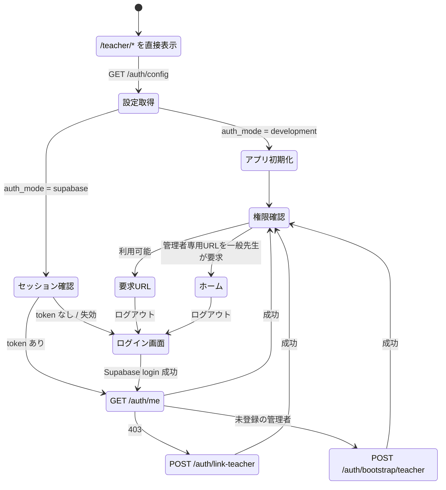

- 認証中は管理者専用画面や日誌本文を先に描画しません。
- 一般先生が管理者専用 URL を開いた場合は `/teacher/` へ移動し、利用できない旨を案内します。
- UI の非表示や redirect は補助です。API の認可は従来どおり FastAPI が行います。
- ログアウト時は token、API 応答、編集中状態、一度きりの秘密、復帰先 URL を消去します。

## 4. レビュー待ち日誌の遷移

現行の「左の一覧と右のフォームを同じ URL で切り替える」構造を、一覧・日誌詳細・手入力の 3 route に分けます。

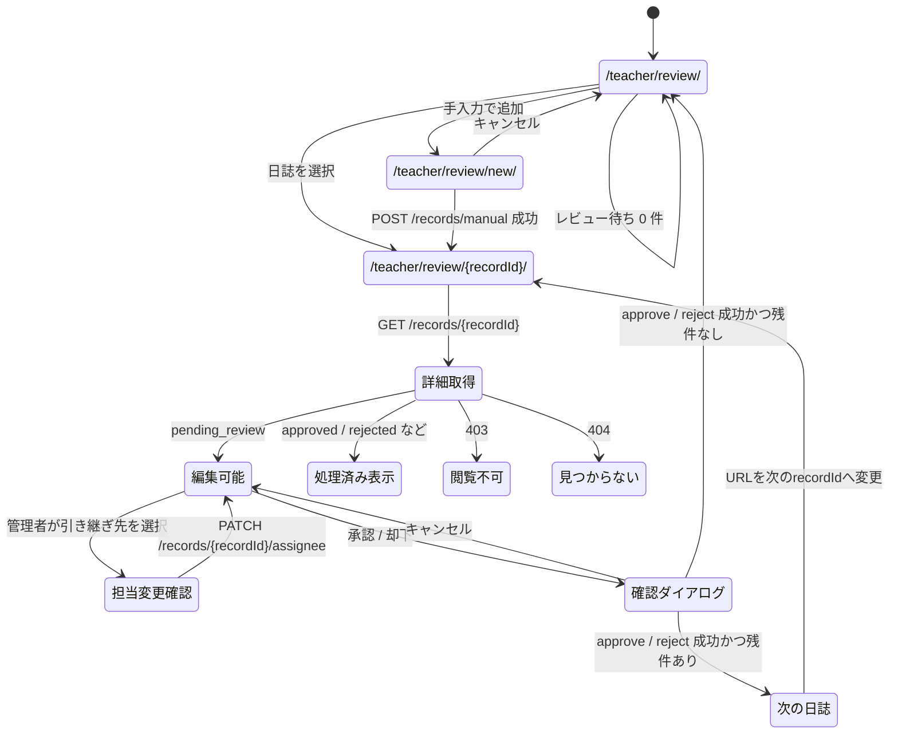

日誌詳細は一覧取得結果から探索せず、`GET /api/v1/records/{record_id}` で取得します。これにより、一覧の取得上限外にある日誌でも直接 URL、再読み込み、Back、Forwardから復元できます。

承認時の本文、会話のきっかけ、園児、配信予定時刻の編集、および承認・却下前の確認ダイアログは現行仕様を維持します。先生管理者はレビュー待ちに限り、同じ園の有効な先生へ担当を変更できます。一般の先生は自分の担当日誌だけを表示し、引き継ぎ後は新しい担当先生の一覧へ移ります。

## 5. routeごとのデータ取得

| route | 主な入場時処理 |
| --- | --- |
| `/teacher/` | ホーム用のレビュー・通知・招待件数を取得 |
| `/teacher/review/` | レビュー待ち一覧を取得 |
| `/teacher/review/{recordId}/` | `GET /records/{recordId}` で日誌を単体取得 |
| `/teacher/review/new/` | 手入力に必要な園児一覧・園設定を取得 |
| `/teacher/records/` | `GET /records` を履歴条件付きで取得 |
| `/teacher/notifications/` | `GET /notifications` |
| `/teacher/audio-jobs/` | `GET /audio-jobs` と `GET /recorder/sessions` |
| `/teacher/children/` | 園児、連携状況、招待状況を取得 |
| `/teacher/voice-consent/` | `GET /voice-consent/me` |
| `/teacher/settings/` | 選択中の園設定を表示 |
| `/teacher/teachers/` | `GET /teachers` |
| `/teacher/devices/` | `GET /edge-devices` |
| `/teacher/readiness/` | `GET /readiness`。503 JSON を正常な診断結果として扱う |
| `/teacher/audit/` | `GET /audit-events` |

更新操作の成功後は、共有の `InvalidationScope` を通して影響する route のデータを無効化します。例えば日誌の承認後は、レビュー一覧だけでなくホームの件数、通知状況、ナビゲーションバッジも再取得対象にします。

## 6. 権限による遷移差分

| 項目 | 先生 (`teacher`) | 先生管理者 (`school_admin`) |
| --- | --- | --- |
| 園の設定・先生管理・録音端末・稼働準備・操作履歴 | ナビを描画しない。直接 URL はホームへ移動 | 利用可能 |
| 日誌詳細 | 自分の記録だけ取得可能 | 同じ園の記録を取得可能 |
| レビュー待ち日誌の担当変更 | 不可 | 同じ園の有効な先生へ変更可能 |
| 園児の登録・編集・退園・復帰 | 不可 | 利用可能 |
| 記録履歴・操作履歴の CSV | 非表示 | 利用可能 |
| 通知の再送・取消・再予定・Notion同期 | 不可 | 利用可能 |
| 先生の権限変更・無効化・復帰 | 不可 | 自分自身を除いて利用可能 |

## 7. 一度きりの秘密と画面離脱

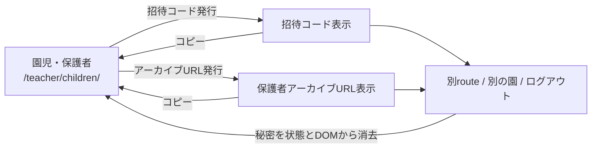

端末 API キー、招待コード、保護者 URL は URL、永続 store、ログへ入れません。現行と同じ園変更・ログアウト・次回の発行／再発行時の消去を必須とし、route 離脱時の消去を追加する場合は独立したセキュリティ改善として実装・テストします。

## 8. 保護者用アーカイブ

保護者用 URL は `/guardian/#ssa_...` のままです。`#ssa_...` は SvelteKit の route parameter ではなく資格情報として扱います。

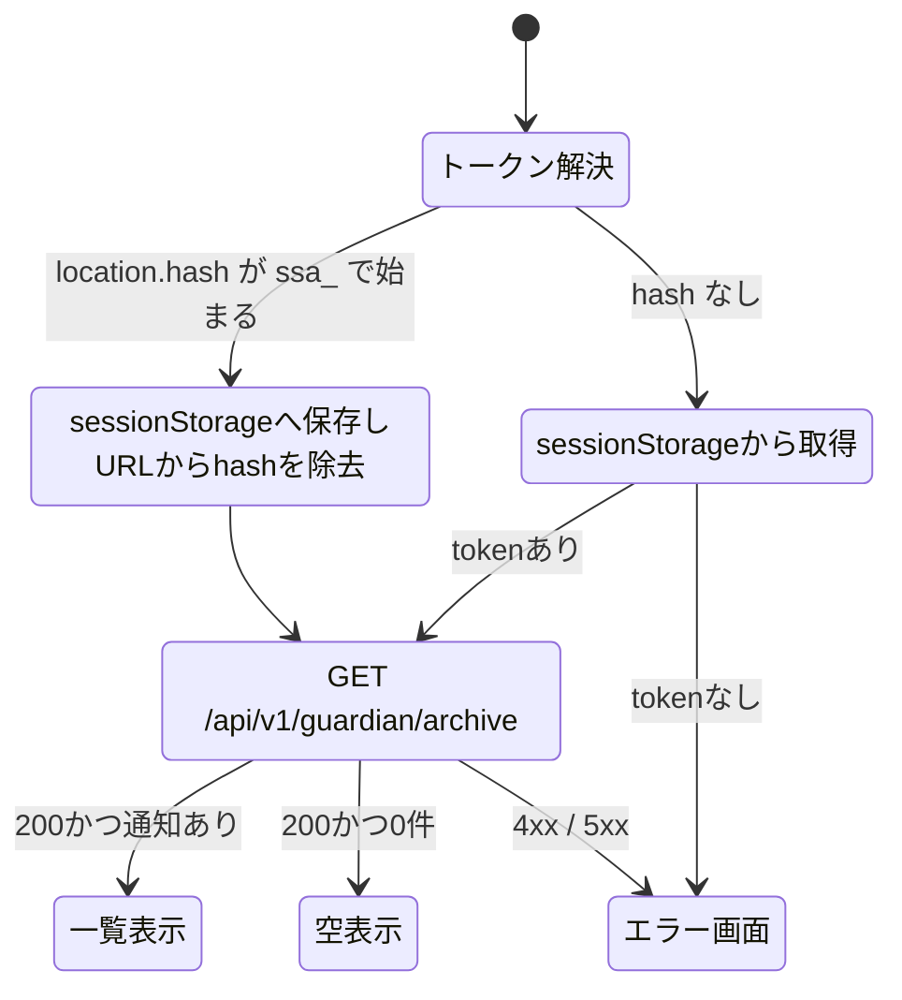

hash は API 呼び出し前にアドレスバーから消し、失敗時は sessionStorage の token も消去します。`no-referrer` の指定を維持します。

## 9. 実装・検証状況

- route ごとの取得、園切り替え、共有 invalidation、一般先生と管理者の DOM 差分を実装済みです。
- 401、403、404、readiness 503、timeout と空状態を日本語で表示します。
- 日誌の直接 URL、reload、Back、Forward、保護者 hash 除去を Playwright で確認しています。
- keyboard、フォーカス、mobile reflow、重大な axe 違反がないことを自動確認しています。
- サイドパネルとモバイルナビのバッジ表示、0 件の非表示、権限差分を自動確認しています。
- 実運用環境へのデプロイ、実サービスを使う smoke test、ロールバック image tag の記録は未完了です。

---

## 参考: 移行前の現行実装

移行前のフロントエンドは、ビルド工程を持たない素の HTML/CSS/JavaScript で構成された 2 つの静的アプリでした。
ファイルは `app/web/` と `app/guardian/` にロールバック用として保持していますが、現在はマウントされていません。

マウント先とディレクトリの対応は [architecture/frontend.md](architecture/frontend.md) にあります。

先生用アプリは単一ページ内で `hidden` 属性を切り替える SPA で、URL ルーティング（History API / ハッシュ）は使っていません。
そのため「画面遷移」はすべて `state.activeView` の変化と、それに紐づく DOM の表示切り替えを指します（`app/web/app.js` の `changeView()`）。

---

### 1. 起動から認証までの遷移

`start()` が `GET /api/v1/auth/config` を呼び、`auth_mode` によって初期状態が分岐します。

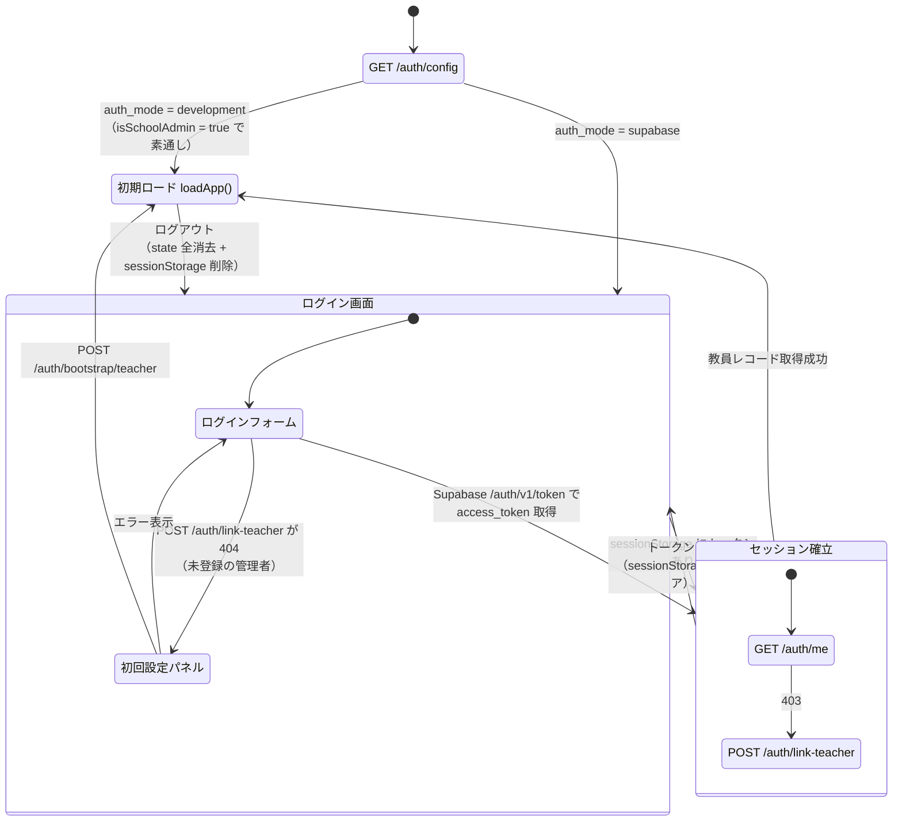

#### 認証まわりの要点

- アクセストークンの保持場所は [architecture/auth.md](architecture/auth.md) の「先生の認証」にあります。
- ログインはブラウザから Supabase の `POST /auth/v1/token?grant_type=password` を直接叩き、
  取得した JWT を `Authorization: Bearer` で自前 API に渡します。API 側は Supabase にトークン検証を委譲します。
- `auth_mode=development` ではログイン画面自体を表示せず、`isSchoolAdmin = true` で全機能が開きます（ローカル開発専用）。
- 初回設定パネル（bootstrap）は、Supabase 上のユーザーは存在するが `teachers` に行がない場合だけ表示されます。

#### アプリ本体を開いた直後の初期ロード

```
loadApp()
  └ GET /schools            … 園が 0 件なら「園がまだ登録されていません」で中断
     ├ 並列取得
     │   ├ GET /records                        （レビュー待ち）
     │   ├ GET /notifications                  （通知状況）
     │   ├ GET /audio-jobs                     （音声処理状況）
     │   ├ GET /teachers                       （先生管理）
     │   ├ GET /voice-consent/me               （声紋同意）
     │   ├ GET /voiceprint/me                   （登録済み声紋）
     │   └ GET /line/link-invitations/active   （招待コード）
     └ GET /edge-devices                       （録音端末）
```

---

### 2. 先生用アプリのビュー遷移

サイドバーのナビゲーションボタン（`data-view`）がハブになっており、
どのビューからでも他のすべてのビューへ 1 ホップで移動できます。

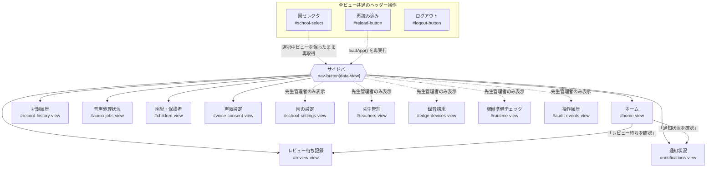

#### ホームのサマリー

ホームは 4 つのカウンタ（レビュー待ち / 送信待ち / 送信済み / LINE連携待ち）と、
レビュー・通知への導線ボタンだけを持つダッシュボードです。独自のデータ取得は行わず、
`loadApp()` が取得済みの `state` を描画します。

#### ビューに入ったときの再取得

`changeView()` はビュー表示の切り替えに加えて、ビューごとに最新データを取り直します。

| ビュー | 入場時の処理 |
| --- | --- |
| ホーム | なし（`loadApp()` の結果を描画） |
| レビュー待ち記録 | なし（同上） |
| 園児・保護者 | なし（同上） |
| 通知状況 | `GET /notifications` |
| 記録履歴 | `GET /records`（履歴条件つき） |
| 音声処理状況 | `GET /audio-jobs` と `GET /recorder/sessions` |
| 声紋設定 | `GET /voice-consent/me` と `GET /voiceprint/me` |
| 録音端末 | `GET /edge-devices` |
| 園の設定 | 再描画のみ（フェッチなし） |
| 稼働準備チェック | `GET /readiness` |
| 操作履歴 | `GET /audit-events` |

取得中は `#loading-indicator` が `aria-live="polite"` で表示され、失敗時は `#notice` にエラーが出ます。

#### 権限による表示差分

`state.isSchoolAdmin`（`teachers.role === "school_admin"`）で表示が変わります。

| 項目 | 先生 (`teacher`) | 先生管理者 (`school_admin`) |
| --- | --- | --- |
| 園の設定・先生管理・録音端末・稼働準備チェック・操作履歴 | ナビ・ビューごと DOM から除去 | 表示 |
| 園児の新規登録フォーム | 非表示（案内文のみ） | 表示 |
| 招待コード発行 / LINE連携解除 / 園児の編集・アーカイブ・復帰 | 不可 | 可 |
| 記録履歴・操作履歴の CSV 書き出し | 非表示 | 表示 |
| 通知の再送 / 取り消し / 再スケジュール / Notion 同期 | 不可 | 可 |
| 先生の権限変更 / 無効化 / 復帰 | 不可 | 可（自分自身は除く） |

先生管理者専用の 5 ビューは `applySchoolAdminVisibility()` が一括で扱います。
一般の先生では `hidden` を立てるだけでなく、ナビボタンとビュー本体をコメントノードと差し替えて
DOM から外すため、開発者ツールで属性を消しても現れません（`state.isSchoolAdmin` が真になれば元の位置へ戻します）。
`changeView()` も一般の先生からの専用ビュー要求をホームへ倒すので、
管理者がログアウトした直後に別の先生がログインしても、前の画面が残りません。

---

### 3. レビュー待ち記録ビューの内部遷移

このビューだけは左のリストと右のフォームで状態が分かれます。

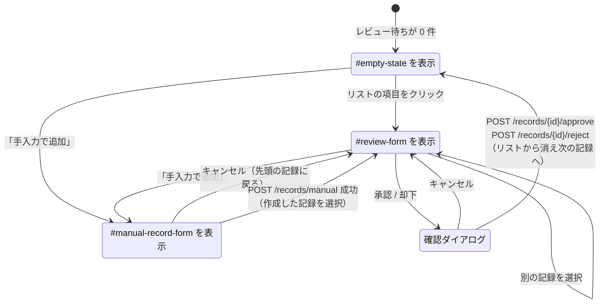

- 承認時は本文・会話のきっかけ・園児・配信予定時刻を編集したうえで送信します。
- 承認すると API 側で `notifications` 行が作られます。保護者の LINE 未連携なら `waiting_guardian_link`、
  連携済みなら `pending` になり、送信ワーカーが配信します。
- けがの記録は即時配信、成長の記録は園の `digest_time` に合わせた次回配信時刻が既定値になります。

---

### 4. 確認ダイアログ

破壊的・不可逆な操作は `<dialog id="confirmation-dialog">` のモーダルを挟みます（`showModal()`）。
`Promise` を返す `confirmAction()` で実装され、キャンセル・ESC・背景クリックはすべて「実行しない」に倒れます。

対象となる主な操作:

- 記録の承認・却下
- 園児のアーカイブ・復帰、LINE 連携の解除
- 先生の権限変更・無効化・復帰
- 通知の再送・取り消し・再スケジュール
- 録音端末の APIキー再発行・無効化
- 記録履歴 / 操作履歴の CSV 書き出し

---

### 5. 園児・保護者ビューの資格情報表示

一度しか表示できない資格情報は、専用の結果パネルに出したあとクリアされます。

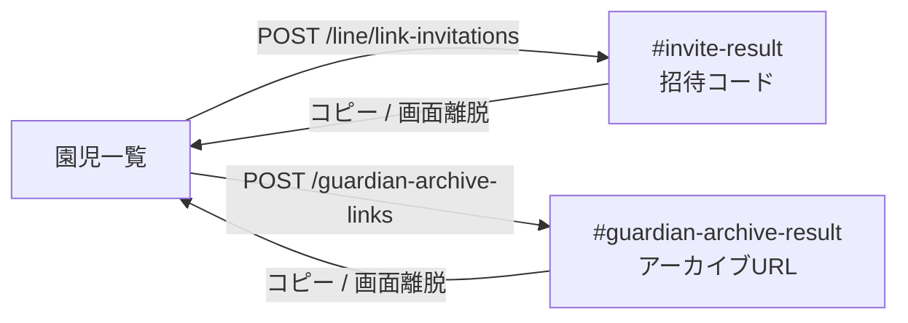

- 招待コードは発行のたびに以前の未使用コードが失効します。再表示はできません。
- アーカイブ URL も同様に一度きりの表示で、`#ssa_...` のフラグメントを含みます。

---

### 6. 保護者用アーカイブ画面（`/guardian`）

ログインを持たない単一画面です。園から配布された URL のフラグメントがそのまま資格情報になります。

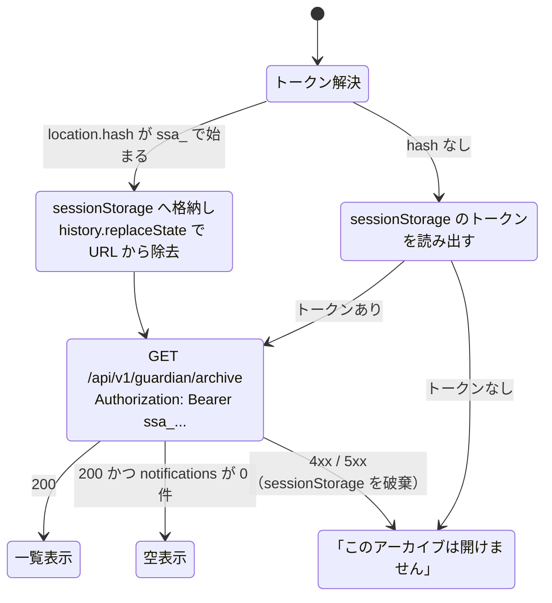

表示できる範囲・有効期限・`no-referrer` の指定は、トークンの性質として
[architecture/auth.md](architecture/auth.md) の「保護者アーカイブのトークン」にまとめています。

---

### 参照

- 先生用アプリ: `app/web/index.html`, `app/web/app.js`, `app/web/styles.css`
- 保護者用アプリ: `app/guardian/index.html`, `app/guardian/app.js`, `app/guardian/styles.css`
- 現行の Svelte 静的配信: `app/main.py`, `app/frontend_dist/`
- フロントエンドの実装方針: [architecture/frontend.md](architecture/frontend.md)
- 認証の分岐: [architecture/auth.md](architecture/auth.md)
- 技術構成の索引: [architecture.md](architecture.md)
