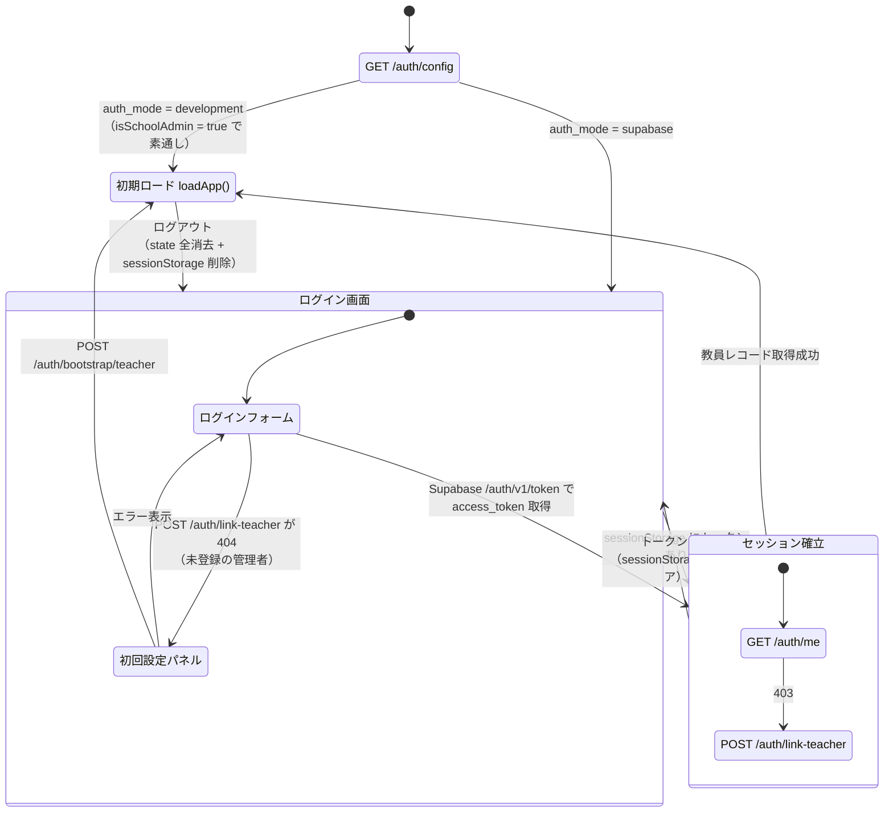
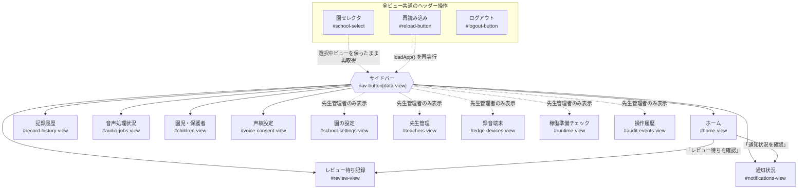
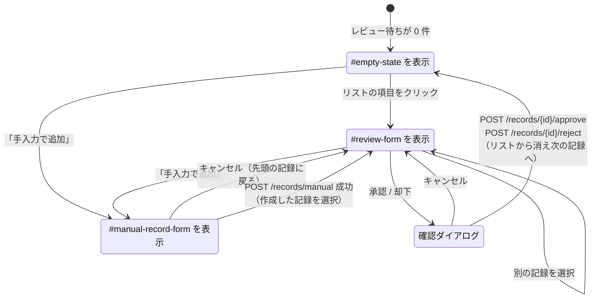
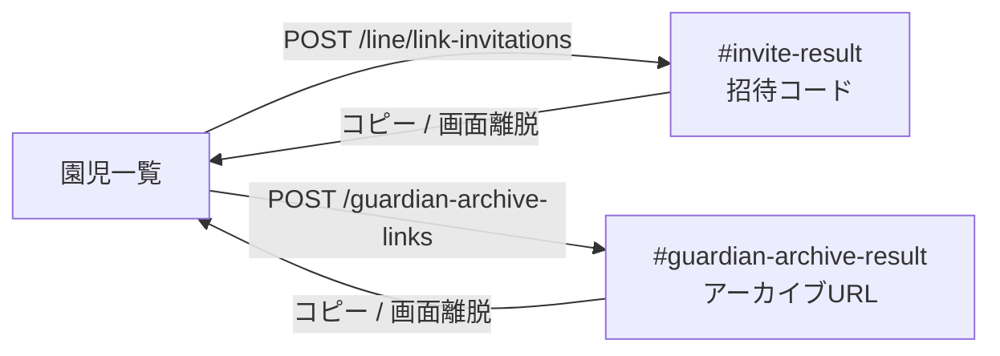
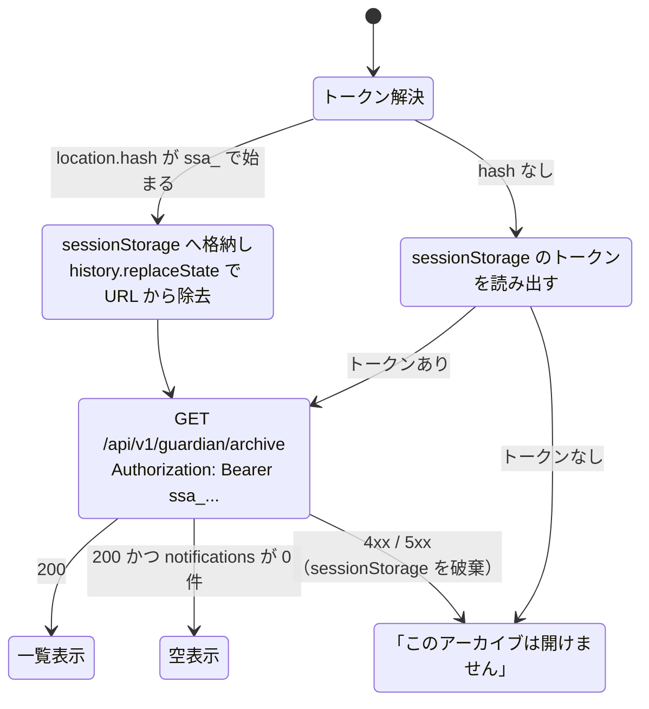

# 画面遷移図

Small Step のフロントエンドは、ビルド工程を持たない素の HTML/CSS/JavaScript で構成された 2 つの静的アプリです。
FastAPI が `StaticFiles` としてマウントしています（`app/main.py`）。

| マウントパス | ディレクトリ | 対象利用者 |
| --- | --- | --- |
| `/teacher` | `app/web/` | 先生・先生管理者 |
| `/guardian` | `app/guardian/` | 保護者（配信アーカイブ閲覧のみ） |

先生用アプリは単一ページ内で `hidden` 属性を切り替える SPA で、URL ルーティング（History API / ハッシュ）は使っていません。
そのため「画面遷移」はすべて `state.activeView` の変化と、それに紐づく DOM の表示切り替えを指します（`app/web/app.js` の `changeView()`）。

---

## 1. 起動から認証までの遷移

`start()` が `GET /api/v1/auth/config` を呼び、`auth_mode` によって初期状態が分岐します。



### 認証まわりの要点

- アクセストークンは `sessionStorage`（キー `small-step.access-token`）に保持します。タブを閉じると破棄されます。
- ログインはブラウザから Supabase の `POST /auth/v1/token?grant_type=password` を直接叩き、
  取得した JWT を `Authorization: Bearer` で自前 API に渡します。API 側は Supabase にトークン検証を委譲します。
- `auth_mode=development` ではログイン画面自体を表示せず、`isSchoolAdmin = true` で全機能が開きます（ローカル開発専用）。
- 初回設定パネル（bootstrap）は、Supabase 上のユーザーは存在するが `teachers` に行がない場合だけ表示されます。

### アプリ本体を開いた直後の初期ロード

```
loadApp()
  └ GET /schools            … 園が 0 件なら「園がまだ登録されていません」で中断
     ├ 並列取得
     │   ├ GET /records                        （レビュー待ち）
     │   ├ GET /notifications                  （通知状況）
     │   ├ GET /audio-jobs                     （音声処理状況）
     │   ├ GET /teachers                       （先生管理）
     │   ├ GET /voice-consent/me               （声紋設定）
     │   └ GET /line/link-invitations/active   （招待コード）
     └ GET /edge-devices                       （録音端末）
```

---

## 2. 先生用アプリのビュー遷移

サイドバーのナビゲーションボタン（`data-view`）がハブになっており、
どのビューからでも他のすべてのビューへ 1 ホップで移動できます。



### ホームのサマリー

ホームは 4 つのカウンタ（レビュー待ち / 送信待ち / 送信済み / LINE連携待ち）と、
レビュー・通知への導線ボタンだけを持つダッシュボードです。独自のデータ取得は行わず、
`loadApp()` が取得済みの `state` を描画します。

### ビューに入ったときの再取得

`changeView()` はビュー表示の切り替えに加えて、ビューごとに最新データを取り直します。

| ビュー | 入場時の処理 |
| --- | --- |
| ホーム | なし（`loadApp()` の結果を描画） |
| レビュー待ち記録 | なし（同上） |
| 園児・保護者 | なし（同上） |
| 通知状況 | `GET /notifications` |
| 記録履歴 | `GET /records`（履歴条件つき） |
| 音声処理状況 | `GET /audio-jobs` |
| 声紋設定 | `GET /voice-consent/me` |
| 録音端末 | `GET /edge-devices` |
| 園の設定 | 再描画のみ（フェッチなし） |
| 稼働準備チェック | `GET /readiness` |
| 操作履歴 | `GET /audit-events` |

取得中は `#loading-indicator` が `aria-live="polite"` で表示され、失敗時は `#notice` にエラーが出ます。

### 権限による表示差分

`state.isSchoolAdmin`（`teachers.role === "school_admin"`）で表示が変わります。

| 項目 | 先生 (`teacher`) | 先生管理者 (`school_admin`) |
| --- | --- | --- |
| 園の設定・先生管理・録音端末・稼働準備チェック・操作履歴 | ナビ・ビューごと DOM から除去 | 表示 |
| 園児の新規登録フォーム | 非表示（案内文のみ） | 表示 |
| 招待コード発行 / LINE連携解除 / 園児の編集・アーカイブ・復帰 | 不可 | 可 |
| 記録履歴・操作履歴の CSV 書き出し | 非表示 | 表示 |
| 通知の再送 / 取り消し / 再スケジュール / Notion 同期 | 不可 | 可 |
| 先生の権限変更 / 無効化 / 復帰 | 不可 | 可（自分自身は除く） |

先生管理者専用の 5 ビューは `applySchoolAdminVisibility()` が一括で扱います。
一般の先生では `hidden` を立てるだけでなく、ナビボタンとビュー本体をコメントノードと差し替えて
DOM から外すため、開発者ツールで属性を消しても現れません（`state.isSchoolAdmin` が真になれば元の位置へ戻します）。
`changeView()` も一般の先生からの専用ビュー要求をホームへ倒すので、
管理者がログアウトした直後に別の先生がログインしても、前の画面が残りません。

---

## 3. レビュー待ち記録ビューの内部遷移

このビューだけは左のリストと右のフォームで状態が分かれます。



- 承認時は本文・会話のきっかけ・園児・配信予定時刻を編集したうえで送信します。
- 承認すると API 側で `notifications` 行が作られます。保護者の LINE 未連携なら `waiting_guardian_link`、
  連携済みなら `pending` になり、送信ワーカーが配信します。
- けがの記録は即時配信、成長の記録は園の `digest_time` に合わせた次回配信時刻が既定値になります。

---

## 4. 確認ダイアログ

破壊的・不可逆な操作は `<dialog id="confirmation-dialog">` のモーダルを挟みます（`showModal()`）。
`Promise` を返す `confirmAction()` で実装され、キャンセル・ESC・背景クリックはすべて「実行しない」に倒れます。

対象となる主な操作:

- 記録の承認・却下
- 園児のアーカイブ・復帰、LINE 連携の解除
- 先生の権限変更・無効化・復帰
- 通知の再送・取り消し・再スケジュール
- 録音端末の APIキー再発行・無効化
- 記録履歴 / 操作履歴の CSV 書き出し

---

## 5. 園児・保護者ビューの資格情報表示

一度しか表示できない資格情報は、専用の結果パネルに出したあとクリアされます。



- 招待コードは発行のたびに以前の未使用コードが失効します。再表示はできません。
- アーカイブ URL も同様に一度きりの表示で、`#ssa_...` のフラグメントを含みます。

---

## 6. 保護者用アーカイブ画面（`/guardian`）

ログインを持たない単一画面です。園から配布された URL のフラグメントがそのまま資格情報になります。



- 表示するのは送信済み通知の「配信日時 / 種別 / 本文 / 会話のきっかけ」だけです。音声も文字起こし原文も返しません。
- URL の有効期限（既定 168 時間）が切れるか、園が失効させると開けなくなります。
- `<meta name="referrer" content="no-referrer">` を指定し、トークンが外部へ漏れないようにしています。

---

## 参照

- 先生用アプリ: `app/web/index.html`, `app/web/app.js`, `app/web/styles.css`
- 保護者用アプリ: `app/guardian/index.html`, `app/guardian/app.js`, `app/guardian/styles.css`
- 静的マウント: `app/main.py`
- フロントエンドの実装方針: [architecture/frontend.md](architecture/frontend.md)
- 認証の分岐: [architecture/auth.md](architecture/auth.md)
- 技術構成の索引: [architecture.md](architecture.md)
