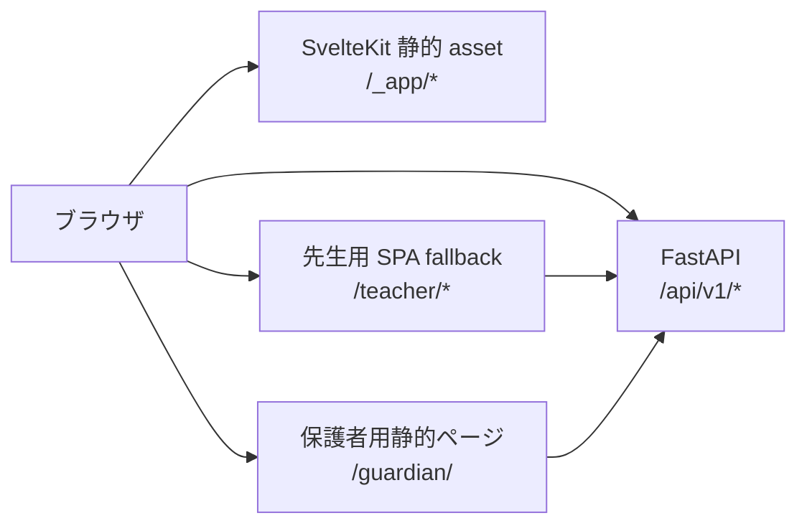
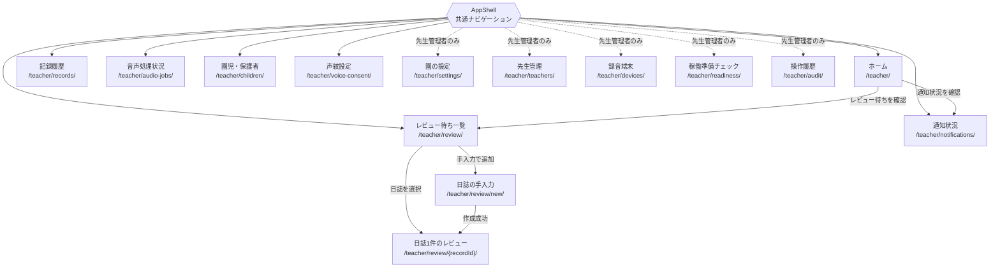
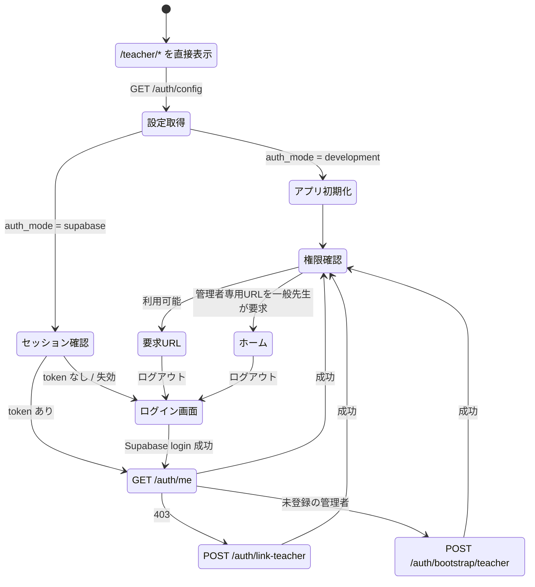
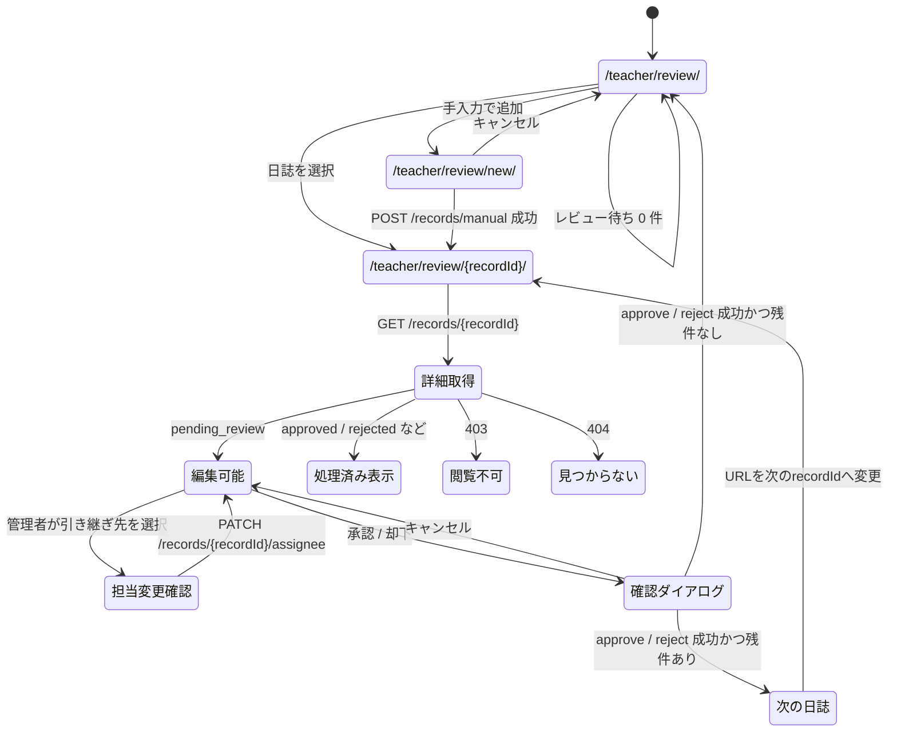
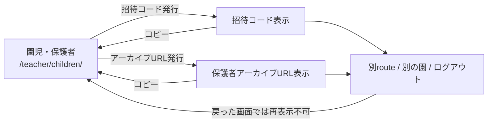
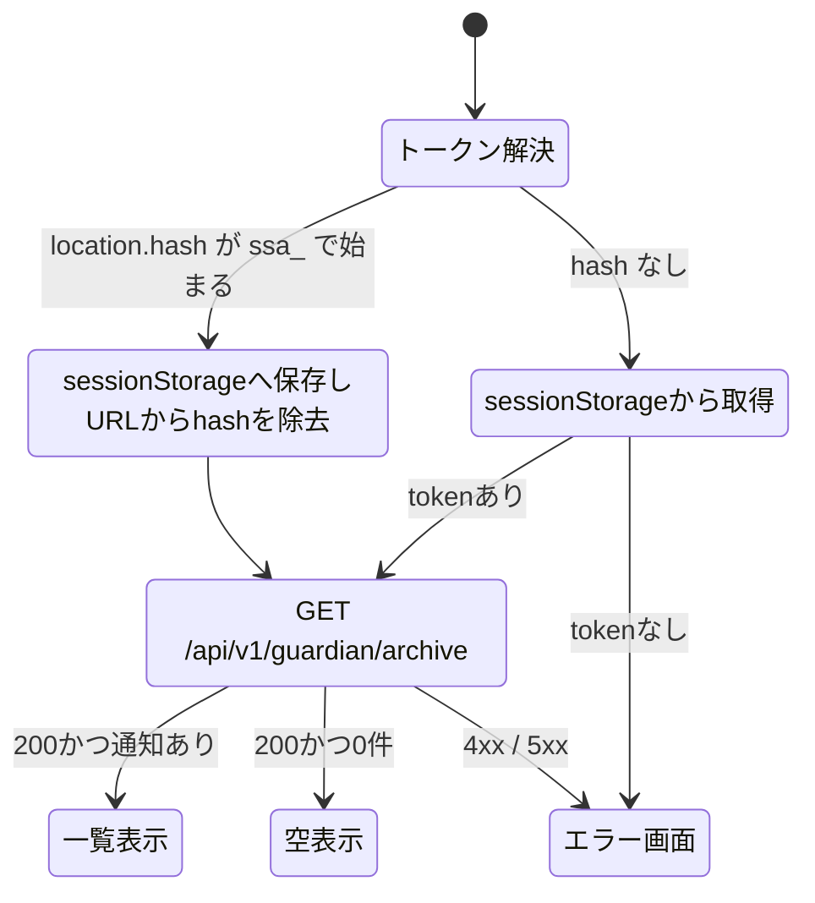

# 画面遷移図

現在の画面遷移を示します。構成は [フロントエンド仕様](architecture/frontend.md)、
利用者の操作は [使い方](usage.md)を参照してください。過去のHTML/JS画面は
[旧画面遷移](history/legacy-screen-transitions.md)へ分離しています。

## 1. 移行後の全体構成

先生用アプリは SvelteKit のファイルベースルーティングを使い、画面ごとに URL を持ちます。FastAPI は API と静的 asset を先に処理し、実在しない `/teacher/*` だけを SvelteKit の SPA fallback へ渡します。保護者用アプリは静的ページのままとし、URL の hash はルーティングではなく既存のアーカイブトークンに使います。

配信の優先順位は次のとおりです。

1. `/api/v1/*` と `/docs` を既存の FastAPI route で処理する。
2. `/_app/*` と実在する静的ファイルを返す。
3. `/guardian/` の生成済みページを返す。
4. 上記に一致しない `/teacher/*` だけを `200.html` へ fallback する。
5. 欠損 asset、API、guardian、teacher 外の不明な URL は 404 にする。

## 2. 先生用アプリのURLと画面遷移

共通の AppShell が認証、園選択、ナビゲーションを担当します。各画面は独立した URL を持ち、サイドバーから 1 ホップで移動できます。

URL には日誌の不透明な UUID だけを使用し、園児名、本文、LINE ID、token を含めません。

### 共通操作

- サイドバーは通常の link または SvelteKit の `goto` で URL を変更します。
- Back、Forward、ブックマーク、再読み込みで同じ画面を復元します。
- ナビゲーション後はページ見出しへフォーカスを移し、現在地に `aria-current="page"` を付けます。
- 園セレクタは現在の route を保って再取得します。ただし、園に属する選択状態、編集中データ、一度きりの秘密は消去します。
- 再読み込みは現在の route に必要なデータを取得し直し、全画面分を無条件に読み込みません。
- 日誌の詳細と手入力では、未保存の編集がある状態で「一覧へ戻る」操作、ページの再読み込み、タブを閉じる操作をすると確認します。サイドバーなど他の route への移動では確認しません。

### サイドパネルとモバイルナビの通知数

認証と園選択が完了すると、AppShell は `GET /api/v1/navigation-badges?school_id=...` を呼び、
デスクトップのサイドパネルとモバイルナビの両方へ同じ集計値を表示します。

| タブ | 表示する数 | 対象権限 | 表示方法 |
| --- | --- | --- | --- |
| レビュー待ち | `pending_review` の日誌 | 一般の先生は自分の担当分、先生管理者は園全体 | 通常バッジ |
| 通知状況 | 失敗、または保護者 LINE 連携待ちの通知 | 一般の先生は自分の担当分、先生管理者は園全体 | `!` 付き warning バッジ |
| 音声処理状況 | 失敗したクラウド音声ジョブ | 一般の先生は自分の担当分、先生管理者は園全体 | `!` 付き warning バッジ |
| 園児・保護者 | 在園中で、LINE 未連携かつ有効な招待コードがない園児 | 先生管理者のみ | 通常バッジ |
| 稼働準備チェック | DB、migration、有効なクラウド音声機能の blocking check | 先生管理者のみ | `!` 付き warning バッジ |

0 件のバッジは表示しません。100 件以上は見た目を `99+` に省略しますが、読み上げ用ラベルには正確な件数を
残します。園の変更、route の移動、関連する更新操作の成功後に再取得します。取得に失敗した場合は全バッジを
隠し、現在の画面とナビゲーションはそのまま利用できるようにします。

## 3. 起動・認証・直接URL表示

利用者はホームだけでなく、任意の先生用 URL から開始できます。認証前の要求 URL は `/teacher/*` 内に限って保持し、認証・認可後にその画面へ戻します。

- 認証中は管理者専用画面や日誌本文を先に描画しません。
- 一般先生が管理者専用 URL を開いた場合は `/teacher/` へ移動し、利用できない旨を案内します。
- UI の非表示や redirect は補助です。API の認可は従来どおり FastAPI が行います。
- ログアウト時は token、API 応答、編集中状態、一度きりの秘密、復帰先 URL を消去します。

## 4. レビュー待ち日誌の遷移

現行の「左の一覧と右のフォームを同じ URL で切り替える」構造を、一覧・日誌詳細・手入力の 3 route に分けます。

日誌詳細は一覧取得結果から探索せず、`GET /api/v1/records/{record_id}` で取得します。これにより、一覧の取得上限外にある日誌でも直接 URL、再読み込み、Back、Forwardから復元できます。

承認時の本文、会話のきっかけ、園児、配信予定時刻の編集、および承認・却下前の確認ダイアログは現行仕様を維持します。先生管理者はレビュー待ちに限り、同じ園の有効な先生へ担当を変更できます。一般の先生は自分の担当日誌だけを表示し、引き継ぎ後は新しい担当先生の一覧へ移ります。

## 5. routeごとのデータ取得

| route | 主な入場時処理 |
| --- | --- |
| `/teacher/` | ホーム用のレビュー・通知・招待件数を取得 |
| `/teacher/review/` | レビュー待ち一覧を取得 |
| `/teacher/review/{recordId}/` | `GET /records/{recordId}` で日誌を単体取得 |
| `/teacher/review/new/` | 手入力に必要な園児一覧・園設定を取得 |
| `/teacher/records/` | `GET /records` を履歴条件付きで取得 |
| `/teacher/notifications/` | `GET /notifications` |
| `/teacher/audio-jobs/` | `GET /audio-jobs` と `GET /recorder/sessions` |
| `/teacher/children/` | 園児、連携状況、招待状況を取得 |
| `/teacher/voice-consent/` | `GET /voice-consent/me` |
| `/teacher/settings/` | 選択中の園設定を表示 |
| `/teacher/teachers/` | `GET /teachers` |
| `/teacher/devices/` | `GET /edge-devices` |
| `/teacher/readiness/` | `GET /readiness`。503 JSON を正常な診断結果として扱う |
| `/teacher/audit/` | `GET /audit-events` |

更新操作の成功後は、共有の `InvalidationScope` を通して影響する route のデータを無効化します。例えば日誌の承認後は、レビュー一覧だけでなくホームの件数、通知状況、ナビゲーションバッジも再取得対象にします。

## 6. 権限による遷移差分

| 項目 | 先生 (`teacher`) | 先生管理者 (`school_admin`) |
| --- | --- | --- |
| 園の設定・先生管理・録音端末・稼働準備・操作履歴 | ナビを描画しない。直接 URL はホームへ移動 | 利用可能 |
| 日誌詳細 | 自分の記録だけ取得可能 | 同じ園の記録を取得可能 |
| レビュー待ち日誌の担当変更 | 不可 | 同じ園の有効な先生へ変更可能 |
| 園児の登録・編集・退園・復帰 | 不可 | 利用可能 |
| 記録履歴・操作履歴の CSV | 非表示 | 利用可能 |
| 通知の再送・取消・再予定・Notion同期 | 不可 | 利用可能 |
| 先生の権限変更・無効化・復帰 | 不可 | 自分自身を除いて利用可能 |

## 7. 一度きりの秘密と画面離脱

端末APIキー、招待コード、発行した保護者URLは先生画面のroute URL・永続store・ログへ入れません。
発行時の画面状態だけに保持し、園変更・ログアウト・次回の発行／再発行で消去します。
保護者が受け取るURLのフラグメントと、保護者ページのsessionStorageは下記の別契約です。

## 8. 保護者用アーカイブ

保護者用 URL は `/guardian/#ssa_...` のままです。`#ssa_...` は SvelteKit の route parameter ではなく資格情報として扱います。

hashはAPI呼び出し前にアドレスバーから消し、無効なtokenはsessionStorageからも消去します。`no-referrer` の指定を維持します。

## 録音PWAの画面遷移

`/rec/` はSvelteKitとは別の録音アプリです。本人ログイン→待機→録音／一時停止→送信／受付→処理結果の順で進みます。
連続モードは60秒区間を確定・自動送信しながら録音画面を維持し、手動モードは停止後に送信または破棄を選びます。
受付済みの記録ができたときだけ `/teacher/review/{recordId}/` へのリンクを表示し、先生による確認へ進みます。
離脱後・再読み込み後の結果は先生用の音声処理状況で確認します。
詳細は [録音の使い方](recorder-usage.md)、[録音画面仕様](architecture/frontend.md#独立録音pwa)を参照します。

## 9. 検証する範囲

- route ごとの取得、園切り替え、共有 invalidation、一般先生と管理者の DOM 差分を実装済みです。
- 401、403、404、readiness 503、timeout と空状態を日本語で表示します。
- 日誌の直接URL、reload、Back、Forward、保護者hash除去はPlaywrightの確認対象です。
- keyboard、フォーカス、mobile reflow、重大なaxe違反を自動検査します。
- バッジ表示、0件の非表示、権限差分を自動検査します。
- 配備先のデプロイ・実サービスの確認・復旧は [実機・外部サービス確認](operations/acceptance.md)で別途記録します。

---
